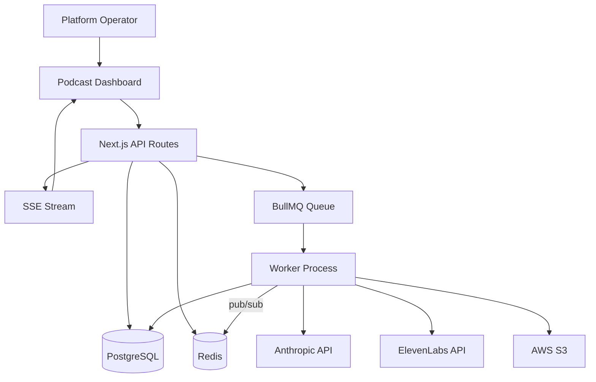
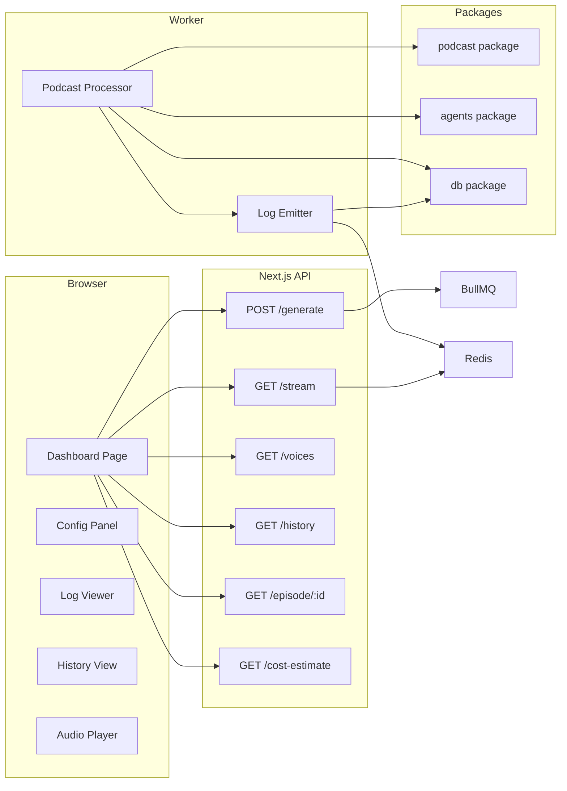
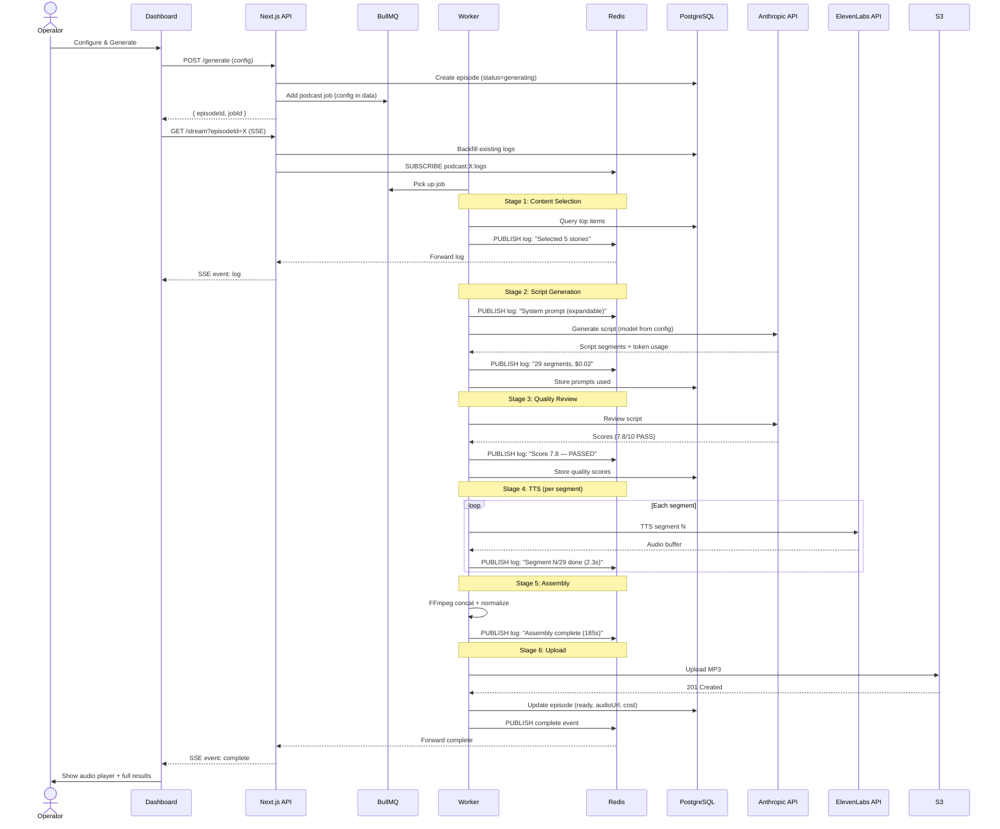
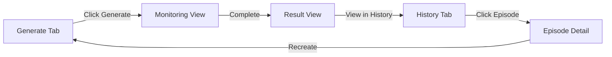
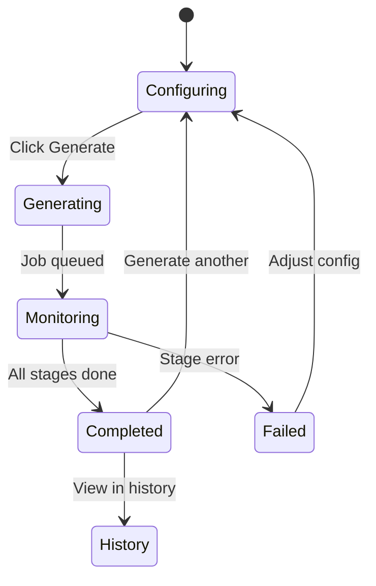

# Solution Design Document

## Validation Checklist

### CRITICAL GATES (Must Pass)

- [x] All required sections are complete
- [x] No [NEEDS CLARIFICATION] markers remain
- [x] Architecture pattern is clearly stated with rationale
- [x] **All architecture decisions confirmed by user**
- [x] Every interface has specification

### QUALITY CHECKS (Should Pass)

- [x] All context sources are listed with relevance ratings
- [x] Project commands are discovered from actual project files
- [x] Constraints -> Strategy -> Design -> Implementation path is logical
- [x] Every component in diagram has directory mapping
- [x] Error handling covers all error types
- [x] Quality requirements are specific and measurable
- [x] Component names consistent across diagrams
- [x] A developer could implement from this design

---

## Constraints

CON-1 **Technology Stack**: Next.js 15 App Router, TypeScript 5.7.2 strict mode, Tailwind CSS, BullMQ/Redis, PostgreSQL with Drizzle ORM, pnpm 8.6.0 monorepo. All new code must integrate with the existing turborepo structure.

CON-2 **No External UI Libraries**: The admin frontend uses custom-built components (no shadcn, no Radix). All new UI components must follow the existing design system: dark cyberpunk theme with `bg-surface`, `text-accent`, and the established color palette.

CON-3 **Single Operator**: The dashboard serves one admin user. This eliminates the need for multi-user state management, WebSockets, or concurrent editing. Server-Sent Events (SSE) for real-time updates is sufficient.

CON-4 **No Mocking**: All validation must use real ElevenLabs API, real Anthropic API, real S3 uploads, real data. No placeholder endpoints, no fake audio, no simulated logs.

CON-5 **API Key Limitations**: The operator's Anthropic API key may not support all models (known issue: works with Haiku but possibly not Sonnet/Opus). Model selection must gracefully handle unavailable models.

CON-6 **Sequential TTS**: ElevenLabs requires sequential segment processing with `previous_request_ids` for voice continuity. This is the pipeline's primary bottleneck (60-145s for a 10-min episode).

CON-7 **Budget Control**: Existing $5/pipeline-run budget cap. Opus models cost ~25x more than Haiku per token. Cost estimation must be surfaced before generation starts.

## Implementation Context

### Required Context Sources

#### Documentation Context
```yaml
- doc: docs/specs/001-podcast-pipeline-dashboard/product-requirements.md
  relevance: CRITICAL
  why: "11 features defined with acceptance criteria — every design decision must trace back to a PRD requirement"

- doc: specs/finish-full-stack/design.md
  relevance: HIGH
  why: "Existing design decisions including polling vs WebSocket rationale, admin auth patterns"
```

#### Code Context
```yaml
- file: apps/worker/src/processors/podcast.ts
  relevance: CRITICAL
  why: "6-stage podcast pipeline processor — must be extended with logging, configurable model/voice, and progress events"

- file: packages/podcast/src/tts.ts
  relevance: CRITICAL
  why: "ElevenLabs TTS integration — must expose per-segment progress and support configurable voice settings"

- file: packages/agents/src/prompts/podcast-script.ts
  relevance: CRITICAL
  why: "AI prompts — must be surfaced in UI and made style-configurable"

- file: apps/web/src/app/admin/podcast/page.tsx
  relevance: HIGH
  why: "Existing admin podcast UI (556 lines) — will be significantly redesigned"

- file: apps/web/src/app/api/admin/podcast/generate/route.ts
  relevance: HIGH
  why: "Generation trigger endpoint — must accept expanded configuration (model, voices, style)"

- file: packages/db/src/schema/episodes.ts
  relevance: HIGH
  why: "Episode and transcript schemas — must be extended with new tables for logs and config"

- file: packages/podcast/src/assembler.ts
  relevance: MEDIUM
  why: "FFmpeg audio assembly — logging integration point for assembly progress"

- file: packages/podcast/src/r2-upload.ts
  relevance: MEDIUM
  why: "S3 upload — logging integration point"

- file: apps/web/src/middleware.ts
  relevance: MEDIUM
  why: "Admin auth middleware — SSE routes must pass through auth"

- file: packages/db/src/schema/config.ts
  relevance: MEDIUM
  why: "Config table — may store default voice/model preferences"
```

#### External APIs
```yaml
- service: Anthropic Messages API
  doc: https://docs.anthropic.com/en/api/messages
  relevance: CRITICAL
  why: "Model selection (Haiku/Sonnet/Opus), token counting, cost calculation"

- service: ElevenLabs Text-to-Speech API
  doc: https://elevenlabs.io/docs/api-reference/text-to-speech
  relevance: CRITICAL
  why: "Voice listing, TTS generation, voice settings (stability, similarity, speed, style)"

- service: ElevenLabs Voices API
  doc: https://elevenlabs.io/docs/api-reference/get-voices
  relevance: HIGH
  why: "GET /v1/voices — lists available voices for operator's account with preview URLs"
```

### Implementation Boundaries

- **Must Preserve**: Existing 6-stage pipeline architecture, BullMQ job processing, S3 upload pattern, admin auth (iron-session + JWT), existing API response format (`{ success, data?, error? }`)
- **Can Modify**: Podcast processor (add logging/config), TTS module (add progress callbacks), generation API route (accept expanded config), admin podcast page (full redesign), database schema (add new tables)
- **Must Not Touch**: Pipeline processor (ingest/score/dedup stages), newsletter processor, subscriber system, mobile app API, source fetchers

### External Interfaces

#### System Context Diagram



#### Interface Specifications

```yaml
# Inbound Interfaces
inbound:
  - name: "Admin Dashboard"
    type: HTTPS
    format: REST + SSE
    authentication: iron-session cookie
    data_flow: "Configuration, generation triggers, log streaming, job history"

# Outbound Interfaces
outbound:
  - name: "Anthropic Messages API"
    type: HTTPS
    format: REST (JSON)
    authentication: API Key (x-api-key header)
    data_flow: "Script generation, quality review"
    criticality: CRITICAL

  - name: "ElevenLabs TTS API"
    type: HTTPS
    format: REST (JSON/binary)
    authentication: API Key (xi-api-key header)
    data_flow: "Voice listing, TTS generation, voice preview"
    criticality: CRITICAL

  - name: "AWS S3"
    type: HTTPS
    format: AWS SDK (PutObject)
    authentication: IAM credentials
    data_flow: "Audio file upload"
    criticality: HIGH

# Data Interfaces
data:
  - name: "PostgreSQL"
    type: PostgreSQL
    connection: Connection Pool (postgres-js)
    data_flow: "Episodes, transcripts, logs, config persistence"

  - name: "Redis"
    type: Redis
    connection: IORedis
    data_flow: "BullMQ job queue + pub/sub for real-time log streaming"
```

### Project Commands

```bash
# Core Commands (discovered from package.json files)
Install: pnpm install
Dev:     pnpm dev (turborepo: runs all apps concurrently)
Build:   pnpm build (turborepo: builds all packages)
Lint:    pnpm lint

# Web App
Dev:     cd apps/web && pnpm dev (Next.js dev server)
Build:   cd apps/web && pnpm build

# Worker
Dev:     cd apps/worker && pnpm dev (tsx watch src/index.ts)
Types:   cd apps/worker && pnpm check-types (tsc --noEmit)

# Database
Generate: cd packages/db && pnpm drizzle-kit generate
Push:     cd packages/db && pnpm drizzle-kit push
Studio:   cd packages/db && pnpm drizzle-kit studio
```

## Solution Strategy

- **Architecture Pattern**: Modular layered extension of existing monorepo. New functionality is added as extensions to existing packages (podcast, agents, db, web) rather than new packages. The dashboard is a new admin page that uses new API routes backed by extended database schema.

- **Integration Approach**: The podcast processor is extended with a logging/event system that writes to a new `podcast_logs` table AND publishes to Redis pub/sub. The Next.js API layer adds SSE endpoints that subscribe to Redis channels. The frontend replaces polling with EventSource for real-time updates. Configuration is passed through the generation API and propagated to the worker via BullMQ job data.

- **Justification**: This approach minimizes new moving parts. Redis pub/sub is already available (IORedis installed for BullMQ). SSE is natively supported in Next.js 15. The existing modular package structure (podcast, agents, db) naturally accommodates the extensions. No new infrastructure is needed.

- **Key Decisions**:
  1. SSE over polling for real-time logs (100ms latency vs 3-10s)
  2. Redis pub/sub as the cross-process bridge (worker → API → browser)
  3. Database-backed log persistence (logs survive connection drops)
  4. Configuration passed via BullMQ job data (no separate config channel)
  5. Voice listing cached in Redis with 1-hour TTL (avoid repeated ElevenLabs API calls)

## Building Block View

### Components



### Directory Map

**Component**: apps/web (Next.js frontend + API)
```
apps/web/src/
├── app/
│   └── admin/
│       └── podcast/
│           ├── page.tsx                    # MODIFY: Complete redesign with tabbed interface
│           ├── components/
│           │   ├── config-panel.tsx         # NEW: Model, voice, style, duration config
│           │   ├── voice-selector.tsx       # MODIFY: Extended with preview + settings sliders
│           │   ├── voice-preview.tsx        # MODIFY: Real audio preview via ElevenLabs
│           │   ├── model-selector.tsx       # NEW: Haiku/Sonnet/Opus selector with cost hints
│           │   ├── style-selector.tsx       # NEW: Preset styles + custom editor
│           │   ├── log-viewer.tsx           # NEW: Real-time SSE log display
│           │   ├── log-entry.tsx            # NEW: Single log entry component (collapsible)
│           │   ├── stage-progress.tsx       # NEW: 6-stage progress bar with timing
│           │   ├── script-viewer.tsx        # NEW: Full script display with all segments
│           │   ├── cost-breakdown.tsx       # NEW: Token/character cost display
│           │   ├── job-history.tsx          # NEW: Paginated job history list
│           │   ├── episode-detail.tsx       # NEW: Full episode inspection view
│           │   └── generation-monitor.tsx   # NEW: Live generation monitoring (wraps log + stage)
│           └── hooks/
│               ├── use-log-stream.ts        # NEW: EventSource hook for SSE
│               ├── use-voices.ts            # NEW: Fetch and cache ElevenLabs voices
│               └── use-episode-history.ts   # NEW: Paginated episode fetching
│   └── api/
│       └── admin/
│           └── podcast/
│               ├── generate/route.ts        # MODIFY: Accept expanded config (model, voices, style)
│               ├── status/route.ts          # MODIFY: Return enriched status with logs
│               ├── stream/route.ts          # NEW: SSE endpoint for real-time logs
│               ├── voices/route.ts          # NEW: Proxy ElevenLabs voices API (cached)
│               ├── voice-preview/route.ts   # NEW: Generate voice preview audio
│               ├── history/route.ts         # NEW: Paginated episode history
│               ├── episode/[id]/route.ts    # NEW: Full episode detail with logs
│               └── cost-estimate/route.ts   # NEW: Pre-generation cost estimate
```

**Component**: apps/worker (BullMQ processor)
```
apps/worker/src/
├── processors/
│   └── podcast.ts                          # MODIFY: Accept config from job data, emit log events
├── lib/
│   └── log-emitter.ts                      # NEW: Redis pub/sub + DB log writer
```

**Component**: packages/podcast
```
packages/podcast/src/
├── tts.ts                                  # MODIFY: Add per-segment progress callback
├── assembler.ts                            # MODIFY: Add assembly progress callback
├── r2-upload.ts                            # (no change)
└── script-parser.ts                        # (no change)
```

**Component**: packages/agents
```
packages/agents/src/
├── prompts/
│   └── podcast-script.ts                   # MODIFY: Style-parameterized prompt builder
├── budget.ts                               # MODIFY: Add cost estimation (pre-generation)
└── models.ts                               # NEW: Model registry with pricing info
```

**Component**: packages/db
```
packages/db/src/
├── schema/
│   ├── episodes.ts                         # MODIFY: Add model, style, costUsd columns to episodes
│   ├── podcast-logs.ts                     # NEW: podcast_logs table
│   └── podcast-configs.ts                  # NEW: podcast_configs table (presets)
├── queries/
│   ├── episodes.ts                         # MODIFY: Add history queries, cost aggregation
│   └── podcast-logs.ts                     # NEW: Log insertion and retrieval queries
└── migrations/                             # NEW: Migration for schema changes
```

**Component**: packages/shared
```
packages/shared/src/
├── types/
│   └── podcast.ts                          # MODIFY: Add PodcastGenerationConfig, LogEntry, ModelInfo types
```

### Interface Specifications

#### Data Storage Changes

```yaml
# New table: podcast_logs
Table: podcast_logs (NEW)
  id: uuid (PK, default gen_random_uuid())
  episodeId: uuid (FK → episodes.id, indexed)
  stage: text (content_select|script_gen|quality_review|tts|assembly|upload)
  severity: text (info|warn|error)
  message: text
  metadata: jsonb (nullable) — stage-specific data (tokens, costs, API responses)
  createdAt: timestamp (default now(), indexed)

# New table: podcast_configs (presets)
Table: podcast_configs (NEW)
  id: uuid (PK, default gen_random_uuid())
  name: text
  model: text (default "claude-haiku-4-5-20251001")
  targetDurationMinutes: integer (default 10)
  style: text (default "professional")
  customStylePrompt: text (nullable)
  voiceConfig: jsonb (VoiceConfig type)
  isActive: boolean (default false) — for scheduled generation
  createdAt: timestamp
  updatedAt: timestamp

# Modify table: episodes
Table: episodes (MODIFY)
  ADD COLUMN: model text (nullable) — which Claude model was used
  ADD COLUMN: style text (nullable) — style preset name
  ADD COLUMN: customStylePrompt text (nullable) — custom style instructions if used
  ADD COLUMN: costUsd real (nullable) — total generation cost
  ADD COLUMN: configSnapshot jsonb (nullable) — full config used (for replay)
  ADD COLUMN: promptsUsed jsonb (nullable) — { systemPrompt, userPrompt } for transparency
  ADD COLUMN: qualityScores jsonb (nullable) — all review attempt scores
```

#### Internal API Changes

```yaml
# Modified endpoint
Endpoint: Generate Podcast
  Method: POST
  Path: /api/admin/podcast/generate
  Auth: iron-session (requireAdminFromRequest)
  Request:
    digestId: string (uuid, required)
    targetDurationMinutes: 5 | 10 | 15 | 20 (required)
    model: string (optional, default "claude-haiku-4-5-20251001")
    voiceConfig: VoiceConfig (optional, default Brian+Sarah)
    style: string (optional, default "professional")
    customStylePrompt: string (optional, only when style="custom")
  Response:
    success:
      episodeId: string (uuid)
      jobId: string
    error:
      error: string
      details: string (optional)

# New endpoint
Endpoint: Stream Podcast Logs (SSE)
  Method: GET
  Path: /api/admin/podcast/stream?episodeId={id}
  Auth: iron-session cookie (validated before stream starts)
  Response: text/event-stream
    event: log
    data: { id, stage, severity, message, metadata, createdAt }

    event: stage_update
    data: { stage, status, startedAt?, completedAt? }

    event: complete
    data: { episodeId, status, audioUrl, durationSeconds, costUsd }

    event: error
    data: { message, stage?, details? }

# New endpoint
Endpoint: List ElevenLabs Voices
  Method: GET
  Path: /api/admin/podcast/voices
  Auth: iron-session
  Response:
    success:
      voices: Array<{ voiceId, name, category, previewUrl, labels }>
    error:
      error: string

# New endpoint
Endpoint: Voice Preview
  Method: POST
  Path: /api/admin/podcast/voice-preview
  Auth: iron-session
  Request:
    voiceId: string (required)
    text: string (optional, default sample text)
    settings: { stability, similarityBoost, speed, style } (optional)
  Response: audio/mpeg (binary stream)

# New endpoint
Endpoint: Episode History
  Method: GET
  Path: /api/admin/podcast/history?page={n}&limit={n}
  Auth: iron-session
  Response:
    success:
      episodes: Array<{
        id, title, status, model, style, costUsd,
        durationSeconds, audioUrl, createdAt
      }>
      total: number
      page: number
      limit: number

# New endpoint
Endpoint: Episode Detail
  Method: GET
  Path: /api/admin/podcast/episode/{id}
  Auth: iron-session
  Response:
    success:
      episode: { ...full episode data }
      transcript: { segments, fullText }
      logs: Array<LogEntry>
      config: PodcastGenerationConfig (from configSnapshot)

# New endpoint
Endpoint: Cost Estimate
  Method: POST
  Path: /api/admin/podcast/cost-estimate
  Auth: iron-session
  Request:
    model: string
    targetDurationMinutes: number
    voiceConfig: VoiceConfig
  Response:
    success:
      estimatedCost: {
        anthropic: { inputTokens, outputTokens, cost }
        elevenlabs: { characters, cost }
        total: number
      }
      warning: string (optional, e.g. "Opus costs ~25x more than Haiku")
```

#### Application Data Models

```pseudocode
ENTITY: PodcastGenerationConfig (NEW)
  FIELDS:
    digestId: string (uuid)
    targetDurationMinutes: 5 | 10 | 15 | 20
    model: string (model ID)
    voiceConfig: VoiceConfig
    style: "professional" | "casual" | "technical" | "news_brief" | "custom"
    customStylePrompt: string | null

ENTITY: LogEntry (NEW)
  FIELDS:
    id: string (uuid)
    episodeId: string (uuid)
    stage: PodcastStage
    severity: "info" | "warn" | "error"
    message: string
    metadata: Record<string, unknown> | null
    createdAt: Date

ENTITY: ModelInfo (NEW)
  FIELDS:
    id: string (model API ID)
    name: string (display name)
    tier: "fast" | "balanced" | "premium"
    inputCostPer1M: number (USD)
    outputCostPer1M: number (USD)
    maxOutputTokens: number

ENTITY: Episode (MODIFIED)
  FIELDS:
    + model: string | null (NEW)
    + style: string | null (NEW)
    + customStylePrompt: string | null (NEW)
    + costUsd: number | null (NEW)
    + configSnapshot: PodcastGenerationConfig | null (NEW)
    + promptsUsed: { systemPrompt: string, userPrompt: string } | null (NEW)
    + qualityScores: Array<{ attempt: number, scores: Record<string, number>, overall: number, passed: boolean }> | null (NEW)

ENTITY: PodcastConfig (NEW — preset)
  FIELDS:
    id: string (uuid)
    name: string
    model: string
    targetDurationMinutes: number
    style: string
    customStylePrompt: string | null
    voiceConfig: VoiceConfig
    isActive: boolean
    createdAt: Date
    updatedAt: Date
```

#### Integration Points

```yaml
# Inter-Component Communication
- from: Worker (podcast processor)
  to: Redis (pub/sub)
  protocol: Redis PUBLISH
  endpoints: "podcast:{episodeId}:logs" channel
  data_flow: "Real-time log entries as JSON messages"

- from: Next.js API (SSE route)
  to: Redis (pub/sub)
  protocol: Redis SUBSCRIBE
  endpoints: "podcast:{episodeId}:logs" channel
  data_flow: "Receives log entries, forwards to browser via SSE"

- from: Worker (podcast processor)
  to: PostgreSQL
  protocol: Drizzle ORM
  endpoints: podcast_logs table insert
  data_flow: "Persistent log storage (parallel to Redis pub/sub)"

- from: Next.js API (voices route)
  to: ElevenLabs API
  protocol: HTTPS REST
  endpoints: GET /v1/voices
  data_flow: "Available voices list, cached in Redis for 1 hour"

- from: Next.js API (voice preview route)
  to: ElevenLabs API
  protocol: HTTPS REST
  endpoints: POST /v1/text-to-speech/{voiceId}
  data_flow: "Short audio preview for voice selection"
```

### Implementation Examples

#### Example: Log Emitter (Cross-Process Bridge)

**Why this example**: The log emitter is the core architectural innovation — it bridges the worker process and the browser via Redis pub/sub while simultaneously persisting to PostgreSQL. Understanding this pattern is critical for implementation.

```typescript
// lib/log-emitter.ts — Worker-side log emission
import { Redis } from "ioredis";
import { db } from "@ai-digest/db";
import { podcastLogs } from "@ai-digest/db/schema";

interface LogEvent {
  episodeId: string;
  stage: string;
  severity: "info" | "warn" | "error";
  message: string;
  metadata?: Record<string, unknown>;
}

function createLogEmitter(redis: Redis) {
  return {
    async emit(event: LogEvent): Promise<void> {
      const entry = { ...event, id: crypto.randomUUID(), createdAt: new Date().toISOString() };

      // Parallel: persist to DB + publish to Redis
      await Promise.all([
        db.insert(podcastLogs).values(entry),
        redis.publish(`podcast:${event.episodeId}:logs`, JSON.stringify(entry)),
      ]);
    },
  };
}
```

#### Example: SSE Endpoint Pattern

**Why this example**: SSE in Next.js 15 App Router uses the Web Streams API, which is non-obvious. This shows the exact pattern for subscribing to Redis and streaming to the browser.

```typescript
// api/admin/podcast/stream/route.ts — SSE endpoint
export async function GET(request: NextRequest) {
  const authError = await requireAdminFromRequest(request);
  if (authError) return authError;

  const episodeId = request.nextUrl.searchParams.get("episodeId");
  if (!episodeId) return NextResponse.json({ error: "episodeId required" }, { status: 400 });

  const subscriber = new Redis(REDIS_URL);
  const encoder = new TextEncoder();

  const stream = new ReadableStream({
    start(controller) {
      // Send existing logs from DB first (backfill)
      void backfillLogs(episodeId, controller, encoder);

      // Subscribe to real-time updates
      void subscriber.subscribe(`podcast:${episodeId}:logs`);
      subscriber.on("message", (_channel, message) => {
        controller.enqueue(encoder.encode(`event: log\ndata: ${message}\n\n`));
      });

      // Clean up on disconnect
      request.signal.addEventListener("abort", () => {
        void subscriber.unsubscribe();
        void subscriber.quit();
        controller.close();
      });
    },
  });

  return new Response(stream, {
    headers: {
      "Content-Type": "text/event-stream",
      "Cache-Control": "no-cache",
      Connection: "keep-alive",
    },
  });
}
```

#### Example: Style-Parameterized Prompt

**Why this example**: The prompt system currently has hardcoded style instructions. This shows how style presets inject tone-specific instructions into the existing prompt structure.

```typescript
// Style presets that modify the system prompt
const STYLE_PRESETS: Record<string, string> = {
  professional: "Maintain a polished, authoritative tone. Use industry terminology precisely. Structure discussions with clear thesis statements and supporting evidence.",
  casual: "Keep the conversation relaxed and approachable. Use everyday language, occasional humor, and relatable analogies. Feel free to express genuine reactions.",
  technical: "Dive deep into technical details. Discuss implementation specifics, trade-offs, and architectural decisions. Assume the audience has engineering background.",
  news_brief: "Be concise and punchy. Lead with the most impactful news. Keep segments short (30-60 seconds each). Focus on facts over analysis.",
};

function buildStyledSystemPrompt(basePrompt: string, style: string, customPrompt?: string): string {
  const styleInstructions = style === "custom" && customPrompt
    ? customPrompt
    : STYLE_PRESETS[style] ?? STYLE_PRESETS.professional;

  return `${basePrompt}\n\n## Style Instructions\n${styleInstructions}`;
}
```

## Runtime View

### Primary Flow: Podcast Generation with Full Transparency

1. Operator configures generation: selects digest, model, voices, style, duration
2. Dashboard sends `POST /api/admin/podcast/generate` with full config
3. API validates config, creates episode record (with `configSnapshot`), enqueues BullMQ job
4. Dashboard opens `EventSource` to `GET /api/admin/podcast/stream?episodeId={id}`
5. SSE endpoint backfills any existing logs from DB, then subscribes to Redis channel
6. Worker picks up job, creates LogEmitter for the episode
7. Each pipeline stage emits log entries (Redis pub/sub + DB insert)
8. Browser receives log entries via SSE in real-time (<100ms latency)
9. On completion: worker emits "complete" event with final episode data
10. Dashboard displays: full script, audio player, cost breakdown, quality scores



### Error Handling

- **Invalid config (bad model, invalid voice ID)**: API returns 400 with specific validation error before job creation. Dashboard shows inline error on the config panel.
- **Anthropic API failure (rate limit, auth error)**: Worker emits error log with HTTP status + response body. Episode status set to "failed". Dashboard shows red error indicator on the failed stage with full error message.
- **ElevenLabs rate limit (429)**: Worker retries with exponential backoff (existing pattern). Each retry emits a warn log: "Rate limited, retrying in 2s (attempt 2/3)". Dashboard shows yellow warning on TTS stage.
- **Quality review fails all attempts**: Worker emits warn log with best score. Stage marked "warn" (not "failed"). Generation continues with current script. Dashboard shows yellow indicator.
- **S3 upload failure**: Worker emits error log. Episode status "failed". Dashboard shows red error on upload stage.
- **SSE connection dropped**: Browser EventSource auto-reconnects (built-in behavior). On reconnect, SSE endpoint backfills missed logs from database (logs are persisted).
- **Redis connection failure**: Log emitter falls back to DB-only writes (skip Redis publish). Dashboard falls back to polling.

### Complex Logic: Pre-Generation Cost Estimation

```
ALGORITHM: Estimate Generation Cost
INPUT: model, targetDurationMinutes, voiceConfig
OUTPUT: { anthropic: { inputTokens, outputTokens, cost }, elevenlabs: { characters, cost }, total }

1. LOOKUP model pricing from MODEL_REGISTRY
2. ESTIMATE input tokens:
   - System prompt: ~800 tokens (constant)
   - User prompt: ~200 tokens per story
   - Story count: STORY_COUNT_MAP[targetDurationMinutes]
   - Total input: 800 + (200 * storyCount) + 500 (overhead)
3. ESTIMATE output tokens:
   - Words per minute: ~150
   - Total words: targetDurationMinutes * 150
   - Tokens per word: ~1.3
   - Total output: targetDurationMinutes * 150 * 1.3
   - Add quality review: ~500 tokens per attempt * 2 attempts
4. CALCULATE Anthropic cost:
   - inputCost = (inputTokens / 1_000_000) * model.inputCostPer1M
   - outputCost = (outputTokens / 1_000_000) * model.outputCostPer1M
5. ESTIMATE ElevenLabs cost:
   - Characters = targetDurationMinutes * 150 * 5 (avg chars/word)
   - Cost = characters * $0.30 / 1000 (Pro plan rate)
6. RETURN { anthropic: { inputTokens, outputTokens, cost: inputCost + outputCost }, elevenlabs: { characters, cost }, total: anthropicCost + elevenLabsCost }
```

## Deployment View

### Single Application Deployment

No change to existing deployment. The dashboard is part of the existing Next.js app and worker process.

- **Environment**: Local development (PostgreSQL, Redis, Node.js)
- **New Configuration**: No new environment variables required (existing `ANTHROPIC_API_KEY`, `ELEVENLABS_API_KEY`, `S3_*` credentials are sufficient)
- **Dependencies**: No new npm packages required. Uses existing `ioredis` for pub/sub, Web Streams API for SSE (built into Node.js/Next.js).
- **Performance**: SSE adds one persistent connection per monitoring session. Redis pub/sub adds negligible overhead to the worker.

### Database Migration

- New migration adds: `podcast_logs` table, `podcast_configs` table, new columns on `episodes` table
- Migration is additive-only (no column removals or type changes)
- Can be applied without downtime

## Cross-Cutting Concepts

### Pattern Documentation

```yaml
# Existing patterns used
- pattern: Admin API route auth pattern (requireAdminFromRequest)
  relevance: CRITICAL
  why: "All new API routes must use the same auth pattern"

- pattern: BullMQ job data passing (queue.add with typed data)
  relevance: HIGH
  why: "Generation config passed to worker via job data"

- pattern: Drizzle JSONB with $type<T>() for typed JSON columns
  relevance: HIGH
  why: "configSnapshot, promptsUsed, qualityScores columns"

- pattern: Custom UI components (bg-surface, text-accent, rounded-lg cards)
  relevance: HIGH
  why: "All new UI components must match cyberpunk design system"

# New patterns created
- pattern: Redis pub/sub log emitter (worker → Redis → SSE → browser)
  relevance: CRITICAL
  why: "Core real-time communication pattern for log streaming"

- pattern: SSE with DB backfill (send persisted logs first, then stream new ones)
  relevance: HIGH
  why: "Handles connection drops and late-joining clients"
```

### User Interface & UX

**Information Architecture:**
- Navigation: New `/admin/podcast` page replaces existing one (same sidebar link)
- Content Organization: Tabbed interface — "Generate" tab (config + monitor) and "History" tab (past episodes)
- User Flows: Configure → Generate → Monitor → Review → Iterate

**Design System:**
- Components: Extend existing custom components (Card, Button, Input, Badge, Progress)
- New components: LogViewer (scrollable log panel), StageProgress (horizontal stage indicator with timing), VoiceSelector (dropdown with preview), CodeBlock (for prompts/scripts)
- Colors: Use existing palette — `accent` for active states, `success` for completed stages, `warning` for quality review warnings, `destructive` for errors
- Typography: Geist Sans for UI, Geist Mono for log entries and code/prompts

**Interaction Design:**
- State Management: Local component state (consistent with existing admin pages)
- Feedback: SSE-driven real-time updates replace polling spinners. Log entries animate in. Stages transition with color changes.
- Accessibility: Keyboard-navigable tabs, ARIA labels on stage indicators, screen reader announcements for stage transitions

#### UI Visualization Guide

**Generate Tab Layout:**
```
┌────────────────────────────────────────────────────────────────┐
│  Podcast Dashboard                                              │
│  ┌─────────────┐ ┌──────────────┐                              │
│  │  Generate    │ │   History    │                              │
│  └─────────────┘ └──────────────┘                              │
│                                                                 │
│  ┌─────────────────────────────────────────────────────────────┐│
│  │ Configuration                                                ││
│  │ ┌──────────┐ ┌───────────┐ ┌──────────┐ ┌─────────────┐   ││
│  │ │  Model   │ │  Duration │ │  Style   │ │   Digest    │   ││
│  │ │ ▼ Haiku  │ │  ▼ 10min  │ │▼ Profes. │ │ ▼ Today's   │   ││
│  │ └──────────┘ └───────────┘ └──────────┘ └─────────────┘   ││
│  │                                                              ││
│  │ Voices                                                       ││
│  │ ┌──────────────────────┐ ┌──────────────────────┐          ││
│  │ │ Host A: ▼ Brian      │ │ Host B: ▼ Sarah      │          ││
│  │ │ [▶ Preview]          │ │ [▶ Preview]           │          ││
│  │ │ Stability: ━━━━━○─── │ │ Stability: ━━━━━○─── │          ││
│  │ │ Similarity: ━━━━○─── │ │ Similarity: ━━━━○─── │          ││
│  │ └──────────────────────┘ └──────────────────────┘          ││
│  │                                                              ││
│  │ Est. Cost: $0.08 (Anthropic: $0.02, ElevenLabs: $0.06)     ││
│  │                                              [Generate ▶]   ││
│  └─────────────────────────────────────────────────────────────┘│
│                                                                 │
│  ┌─────────────────────────────────────────────────────────────┐│
│  │ Pipeline Progress                                            ││
│  │ ● Content ─── ● Script ─── ● Review ─── ◐ TTS ─── ○ Asm ──○ Upload ││
│  │ (2.1s)        (8.3s)       (4.1s)      12/29                ││
│  └─────────────────────────────────────────────────────────────┘│
│                                                                 │
│  ┌─────────────────────────────────────────────────────────────┐│
│  │ Live Log                                              [⟲ Scroll] ││
│  │ ─────────────────────────────────────────────────────────── ││
│  │ 14:32:01 [content] Selected 5 stories                      ││
│  │ 14:32:01 [content]  • "GPT-5 Released..." (score: 0.92)    ││
│  │ 14:32:03 [script]  Calling claude-haiku-4-5 (est. 2100 in) ││
│  │ 14:32:03 [script]  ▸ System prompt (tap to expand)         ││
│  │ 14:32:03 [script]  ▸ User prompt (tap to expand)           ││
│  │ 14:32:11 [script]  29 segments, 1847 out tokens, $0.02     ││
│  │ 14:32:11 [review]  Attempt 1/3: Score 7.8/10 — PASSED      ││
│  │ 14:32:14 [tts]     Segment 1/29 (Host A, 45 chars) — 2.3s  ││
│  │ 14:32:16 [tts]     Segment 2/29 (Host B, 62 chars) — 2.1s  ││
│  │ ...                                                          ││
│  └─────────────────────────────────────────────────────────────┘│
└────────────────────────────────────────────────────────────────┘
```

**History Tab Layout:**
```
┌────────────────────────────────────────────────────────────────┐
│  ┌─────────────┐ ┌──────────────┐                              │
│  │  Generate    │ │   History ●  │                              │
│  └─────────────┘ └──────────────┘                              │
│                                                                 │
│  Monthly Spend: $2.34 / $50.00                                  │
│  ━━━━━━━━━━━━━━━━━━━━━━━━━━━━━━━━━━━━━━━━━━━━━━━━━━━━━━━━━━━ │
│                                                                 │
│  ┌──────┬────────────┬────────┬──────────┬───────┬──────────┐  │
│  │ Date │ Duration   │ Model  │ Style    │ Cost  │ Status   │  │
│  ├──────┼────────────┼────────┼──────────┼───────┼──────────┤  │
│  │ 2/8  │ 10:23      │ Haiku  │ Profes.  │ $0.08 │ ● Ready  │  │
│  │ 2/8  │ 15:02      │ Opus   │ Casual   │ $1.24 │ ● Ready  │  │
│  │ 2/7  │ 5:11       │ Sonnet │ Tech     │ $0.15 │ ● Ready  │  │
│  │ 2/7  │ —          │ Haiku  │ Profes.  │ $0.01 │ ● Failed │  │
│  └──────┴────────────┴────────┴──────────┴───────┴──────────┘  │
│                                                                 │
│  ┌─────────────────────────────────────────────────────────────┐│
│  │ Episode Detail: Feb 8, 2026 — 10:23                         ││
│  │                                                              ││
│  │ [▶ Play]  ━━━━━━━━━━━━━━━━━━━━━━━━━━━━━━━  3:24 / 10:23    ││
│  │                                                              ││
│  │ Config: Haiku | Brian + Sarah | Professional | 10 min        ││
│  │ Cost: $0.08 (Anthropic: $0.02 | ElevenLabs: $0.06)         ││
│  │ Quality: 7.8/10 (passed on attempt 1)                       ││
│  │                                                              ││
│  │ ▸ System Prompt (tap to expand)                              ││
│  │ ▸ User Prompt (tap to expand)                                ││
│  │ ▸ Full Script (29 segments)                                  ││
│  │ ▸ Pipeline Logs (47 entries)                                 ││
│  │                                                              ││
│  │ [Recreate with these settings]                               ││
│  └─────────────────────────────────────────────────────────────┘│
└────────────────────────────────────────────────────────────────┘
```

**Screen Flows:**


**Component States:**


### System-Wide Patterns

- **Security**: All new API routes use `requireAdminFromRequest()` guard. SSE endpoint validates session before starting stream. Voice preview proxied through API (ElevenLabs API key never exposed to browser). Secrets redacted from log entries.
- **Error Handling**: API routes return `{ success: false, error: "message" }` consistently. Worker errors emit log entries before updating episode status. SSE reconnection handled by EventSource (automatic).
- **Performance**: Voice list cached in Redis (1-hour TTL). Logs written in parallel (DB + Redis). Log viewer uses virtualized scrolling for large log sets (>100 entries). Cost estimate is a lightweight calculation (no API calls).
- **Logging/Auditing**: Every pipeline event persisted to `podcast_logs` table. Episode `configSnapshot` preserves the exact configuration used. Prompt texts stored for full reproducibility.

## Architecture Decisions

- [x] ADR-1 **SSE over Polling for Real-Time Logs**: Use Server-Sent Events instead of the current 3s polling
  - Rationale: SSE provides <100ms latency vs 3-10s with polling. Single persistent connection vs repeated requests. Redis pub/sub (already available via IORedis) bridges worker → API naturally. EventSource auto-reconnects on disconnect.
  - Trade-offs: One persistent HTTP connection per monitoring session. Falls back to polling if Redis is unavailable.
  - Alternatives rejected: WebSocket (bidirectional not needed, adds complexity), Long Polling (SSE is strictly better for server→client streaming)
  - User confirmed: **Yes (2026-02-08)**

- [x] ADR-2 **Redis Pub/Sub for Cross-Process Communication**: Worker publishes log events to Redis channels, SSE endpoints subscribe
  - Rationale: IORedis already installed for BullMQ. Pub/sub is zero-config — no new infrastructure. Channel-per-episode isolation is clean. Messages are fire-and-forget (persistence handled by DB writes).
  - Trade-offs: No message guarantee (if no subscribers, messages are lost — acceptable because logs are also written to DB). Redis single point of failure (mitigated by DB fallback).
  - Alternatives rejected: BullMQ job progress events (limited API, no custom events), Direct DB polling from SSE (adds DB load, higher latency)
  - User confirmed: **Yes (2026-02-08)**

- [x] ADR-3 **Database-Backed Log Persistence with SSE Backfill**: All logs written to `podcast_logs` table AND published to Redis. SSE endpoint backfills from DB before subscribing to Redis.
  - Rationale: Logs survive Redis/connection failures. Late-joining clients (e.g., page refresh during generation) receive complete history. Enables post-generation log inspection without keeping Redis data.
  - Trade-offs: Double-write (DB + Redis) adds ~5ms per log entry. Log storage grows with usage (mitigated by episode lifecycle — logs tied to episodes).
  - User confirmed: **Yes (2026-02-08)**

- [x] ADR-4 **Configuration via BullMQ Job Data**: Generation config (model, voices, style) passed as part of the BullMQ job payload, not stored in a separate config channel or environment variables.
  - Rationale: Each generation is independent — config travels with the job. No race conditions. Config snapshot stored on episode record for replay. Worker reads config from job data, no external lookups needed.
  - Trade-offs: Job payload size increases (~2KB per job — negligible). Worker must accept and validate config from job data.
  - User confirmed: **Yes (2026-02-08)**

- [x] ADR-5 **Extend Existing Podcast Page (Not New Route)**: The new dashboard replaces `/admin/podcast` rather than creating a new route like `/admin/podcast-dashboard`.
  - Rationale: The existing page is a simpler version of the same feature. Replacing it avoids confusion (two podcast pages). Same sidebar link, same URL. Backward-compatible — the page just has more features.
  - Trade-offs: Larger component file (mitigated by extracting into sub-components). No way to access the old simple page (acceptable — the new one is strictly better).
  - User confirmed: **Yes (2026-02-08)**

- [x] ADR-6 **Custom UI Components (No External Library)**: Continue building with the existing custom component system rather than introducing shadcn/ui or Radix.
  - Rationale: Existing admin pages use custom components with a consistent cyberpunk theme. Introducing a new library would create visual inconsistency and increase bundle size. The needed components (tabs, sliders, code blocks) are straightforward to build.
  - Trade-offs: More custom code to maintain. No automatic accessibility (must implement ARIA manually).
  - User confirmed: **Yes (2026-02-08)**

- [x] ADR-7 **Model Registry as Code Constant**: Available models and their pricing defined as a TypeScript constant in `packages/agents/src/models.ts`, not fetched from Anthropic API at runtime.
  - Rationale: Anthropic has no "list models" API. Model pricing is semi-stable and documented. A code constant is simple, type-safe, and deployable. Can be updated when new models are released.
  - Trade-offs: Must be manually updated when Anthropic changes pricing. Doesn't auto-discover new models.
  - User confirmed: **Yes (2026-02-08)**

## Quality Requirements

- **Performance**: SSE log events must appear in the browser within 200ms of the worker emitting them. Voice list API must respond within 500ms (cached) or 3s (cold fetch). Cost estimate must respond within 100ms (no API calls).
- **Usability**: Log viewer must handle 500+ entries without visible lag (virtualized scrolling). Voice preview must play within 2s of clicking preview. All configuration options must have sensible defaults so the operator can "just click Generate" with zero configuration.
- **Security**: ElevenLabs and Anthropic API keys must never appear in log entries or browser network requests. All new endpoints authenticated via `requireAdminFromRequest()`. Voice preview rate limited to 10 requests per minute.
- **Reliability**: If SSE connection drops, EventSource reconnects automatically and backfills missed logs from DB. If Redis is unavailable, worker continues (DB-only logging) and dashboard falls back to polling. Generation must never silently fail — all errors emit log entries before status update.

## Acceptance Criteria

**PRD Feature 1: Prompt Visibility**
- [x] WHEN script generation begins, THE SYSTEM SHALL emit a log entry containing the full system prompt text (severity: info, stage: script_gen)
- [x] WHEN the user prompt is assembled, THE SYSTEM SHALL emit a log entry containing the complete user prompt including all story data
- [x] WHEN script generation completes, THE SYSTEM SHALL store the prompts in `episodes.promptsUsed` JSONB column and emit a log entry with segment count and token usage
- [x] WHEN quality review completes each attempt, THE SYSTEM SHALL emit a log entry with all sub-scores and store results in `episodes.qualityScores`

**PRD Feature 2: Model Selection**
- [x] THE SYSTEM SHALL provide a model selector dropdown populated from the MODEL_REGISTRY constant with at least Haiku, Sonnet, and Opus options
- [x] WHEN the operator selects a model, THE SYSTEM SHALL pass the model ID through BullMQ job data to the worker
- [x] WHEN the worker processes the job, THE SYSTEM SHALL use the specified model for both script generation and quality review
- [x] IF a model is unavailable (API error), THEN THE SYSTEM SHALL emit an error log and fail the episode with a clear error message

**PRD Feature 3: Voice Configuration with Preview**
- [x] WHEN the operator opens the voice selector, THE SYSTEM SHALL fetch available voices from `/api/admin/podcast/voices` (cached from ElevenLabs API)
- [x] WHEN the operator clicks preview, THE SYSTEM SHALL generate a short audio sample via `/api/admin/podcast/voice-preview` using the selected voice and settings
- [x] WHEN the operator adjusts voice settings (stability, similarity, speed, style), THE SYSTEM SHALL include these settings in the voice preview and generation requests

**PRD Feature 4: Real-Time Log Streaming**
- [x] WHEN a generation starts, THE SYSTEM SHALL open an SSE connection to `/api/admin/podcast/stream?episodeId={id}`
- [x] WHEN any pipeline event occurs, THE SYSTEM SHALL emit a log entry within 200ms to the browser via Redis pub/sub → SSE
- [x] WHEN the TTS stage processes a segment, THE SYSTEM SHALL emit a log entry "Segment N of M completed" with elapsed time
- [x] WHEN an API call completes, THE SYSTEM SHALL log endpoint, status code, response time, and relevant metadata
- [x] WHEN the SSE connection drops, THE SYSTEM SHALL reconnect automatically and backfill missed logs from the database

**PRD Feature 5: Cost Tracking**
- [x] WHEN a generation completes, THE SYSTEM SHALL display cost breakdown: Anthropic (input tokens x rate + output tokens x rate) and ElevenLabs (characters x rate)
- [x] THE SYSTEM SHALL display cumulative monthly spend on the History tab
- [x] WHEN the operator configures a generation, THE SYSTEM SHALL display a pre-generation cost estimate

**PRD Feature 6: Job History and Replay**
- [x] THE SYSTEM SHALL provide a paginated history view at `/api/admin/podcast/history` showing all past episodes sorted by creation date
- [x] WHEN the operator clicks an episode, THE SYSTEM SHALL display complete details: config, prompts, script, quality scores, cost, logs, and audio player
- [x] WHEN the operator clicks "Recreate", THE SYSTEM SHALL populate the generation form with the past episode's `configSnapshot`

**PRD Feature 7: Style/Tone Selection**
- [x] THE SYSTEM SHALL provide at least 4 style presets: Professional, Casual, Technical Deep-Dive, News Brief
- [x] WHEN a style is selected, THE SYSTEM SHALL inject style-specific instructions into the system prompt
- [x] WHEN "Custom" is selected, THE SYSTEM SHALL display a text editor pre-filled with the default style instructions

**PRD Feature 8: Full Script Editor (Should-Have)**
- [x] WHEN a script is generated, THE SYSTEM SHALL display all segments as editable fields (speaker and text)
- [x] WHEN the operator edits segments and regenerates, THE SYSTEM SHALL re-synthesize only modified segments

**PRD Feature 9: Pipeline Stage Timing Analytics (Should-Have)**
- [x] WHEN a generation completes, THE SYSTEM SHALL display per-stage timing (start, end, duration) derived from log timestamps
- [x] THE SYSTEM SHALL compute average stage durations from the episode history

**Error Handling Criteria**
- [x] WHEN the operator submits invalid config, THE SYSTEM SHALL return 400 with specific validation errors without creating a job
- [x] WHEN an API call fails during generation, THE SYSTEM SHALL emit an error log with full details and set episode status to "failed"
- [x] WHEN the Redis connection fails, THE SYSTEM SHALL fall back to DB-only logging and the dashboard SHALL fall back to polling

## Risks and Technical Debt

### Known Technical Issues

- Anthropic API key may not support Sonnet/Opus models (documented in project MEMORY.md). Must verify during implementation and gracefully disable unavailable models in the UI.
- Existing `processPodcast` function has a "fake Job wrapper" for backward compatibility. This should be cleaned up to use direct BullMQ job processing.
- Console-based logging throughout worker code (50+ `console.log` calls). Should eventually be replaced with structured logging, but this is out of scope.
- S3 upload has no retry logic (throws SDK errors directly). Should add retry, but out of scope.

### Technical Debt

- Voice IDs are hardcoded in `podcast.ts` (lines 43, 48). This spec moves them to configuration — resolves existing debt.
- Model name hardcoded to `claude-haiku-4-5-20251001` in multiple places. This spec parameterizes it — resolves existing debt.
- Budget tracker hardcoded at $5 in podcast processor. Should be configurable per-generation or from config table.
- The `processPodcast` legacy wrapper function can be removed once all callers use BullMQ jobs directly.

### Implementation Gotchas

- **Strict TypeScript**: `noUncheckedIndexedAccess` is enabled. Array access returns `T | undefined`. Must use type assertions or null checks on all array operations.
- **Drizzle JSONB defaults**: Using `.default({})` with `$type<T>()` fails if `{}` doesn't satisfy `T`. New JSONB columns must use nullable instead of default empty objects.
- **pnpm workspace isolation**: Any package importing `drizzle-orm` must list it as its own dependency — transitive deps don't resolve for TypeScript.
- **Worker .env.local**: The worker needs `.env.local` sourced manually (Next.js auto-loads it, `tsx` does not). New env vars must be added to worker's environment.
- **Zombie worker processes**: Old worker processes from previous sessions may race for jobs. Always `pkill -f "tsx.*src/index"` before starting the worker.
- **SSE in Next.js App Router**: SSE routes must use the `runtime = 'nodejs'` (default). Edge runtime doesn't support IORedis. The response must use `new Response(stream)`, not `NextResponse`.
- **Redis subscriber connection**: Each SSE connection needs its own Redis subscriber (can't share connections in SUBSCRIBE mode). Must clean up subscribers on client disconnect to avoid connection leaks.

## Glossary

### Domain Terms

| Term | Definition | Context |
|------|------------|---------|
| Episode | A single generated podcast audio file with its associated metadata, script, and configuration | The primary output entity of the pipeline |
| Digest | A curated collection of AI news items for a specific date | Input data source for podcast script generation |
| Pipeline Stage | One of 6 sequential processing steps in podcast generation | content_select, script_gen, quality_review, tts, assembly, upload |
| Quality Review | AI-powered evaluation of generated scripts scored 1-10 across 7 dimensions | Pass threshold: 7/10, max 3 attempts |
| Voice Config | Settings for ElevenLabs TTS including voice ID, stability, similarity boost, speed, and style | Configurable per speaker (Host A / Host B) |
| Style Preset | Predefined tone/style instructions injected into the AI system prompt | Professional, Casual, Technical Deep-Dive, News Brief, Custom |
| Config Snapshot | Complete generation configuration stored on the episode record for replay/audit | Enables "Recreate with these settings" feature |

### Technical Terms

| Term | Definition | Context |
|------|------------|---------|
| SSE (Server-Sent Events) | HTTP streaming protocol for server-to-client real-time updates | Used for live log streaming during generation |
| Redis Pub/Sub | Redis messaging pattern where publishers send to channels and subscribers receive | Bridge between worker process and SSE endpoints |
| BullMQ | Node.js job queue built on Redis | Manages podcast generation jobs with concurrency control |
| Log Emitter | Worker-side module that writes logs to DB and publishes to Redis simultaneously | Core of the real-time transparency system |
| Backfill | Loading persisted log entries from DB when SSE connection starts or reconnects | Ensures no log entries are missed |
| EventSource | Browser API for consuming SSE streams with automatic reconnection | Client-side counterpart to SSE endpoints |

### API/Interface Terms

| Term | Definition | Context |
|------|------------|---------|
| MODEL_REGISTRY | TypeScript constant mapping model IDs to display names, pricing, and capabilities | Source of truth for model selector UI and cost estimation |
| configSnapshot | JSONB column on episodes storing the exact PodcastGenerationConfig used | Enables replay and audit of past generations |
| podcast:{episodeId}:logs | Redis pub/sub channel name pattern | One channel per active generation for isolated log streaming |
| voice_preview | Short TTS sample generated on-demand for voice selection | Uses ElevenLabs API with operator-selected settings |
