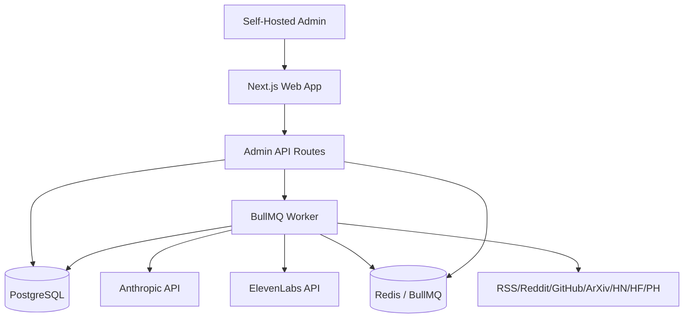
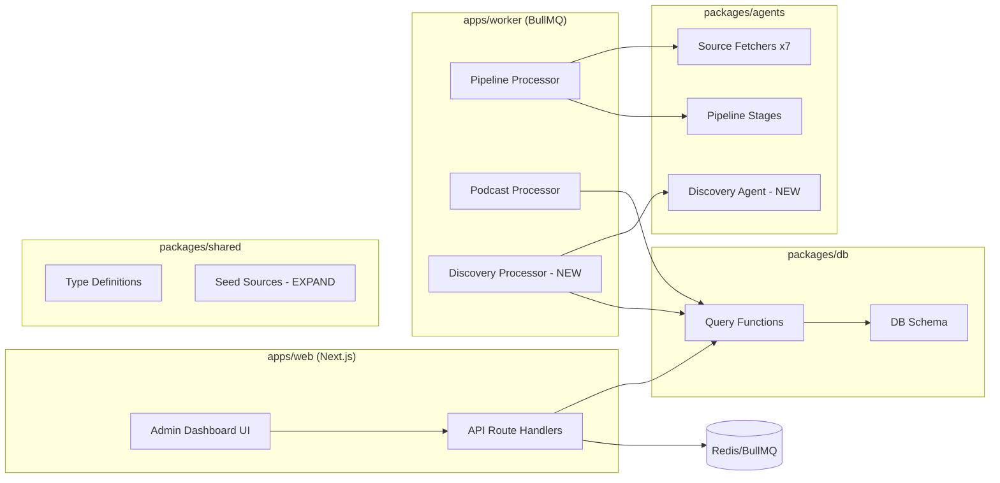
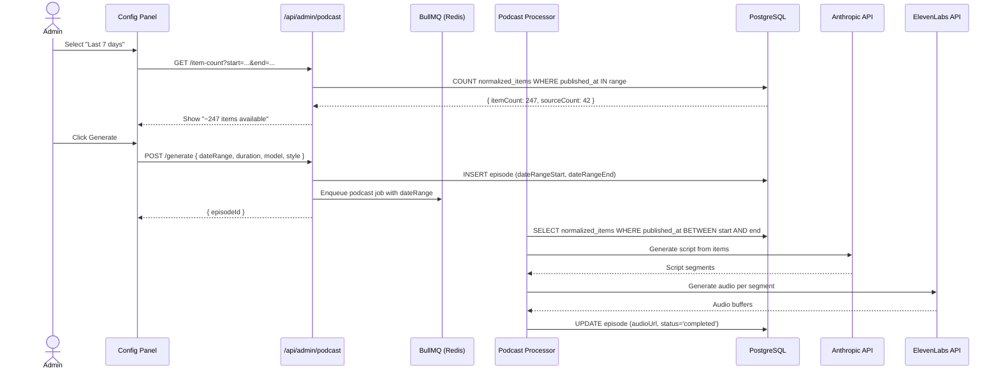
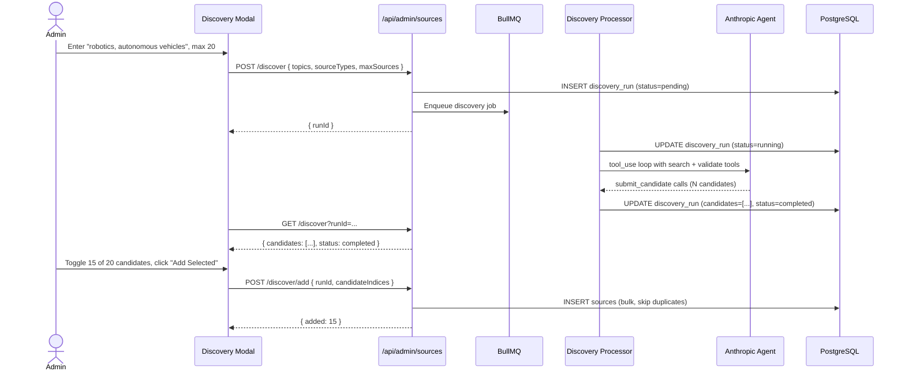
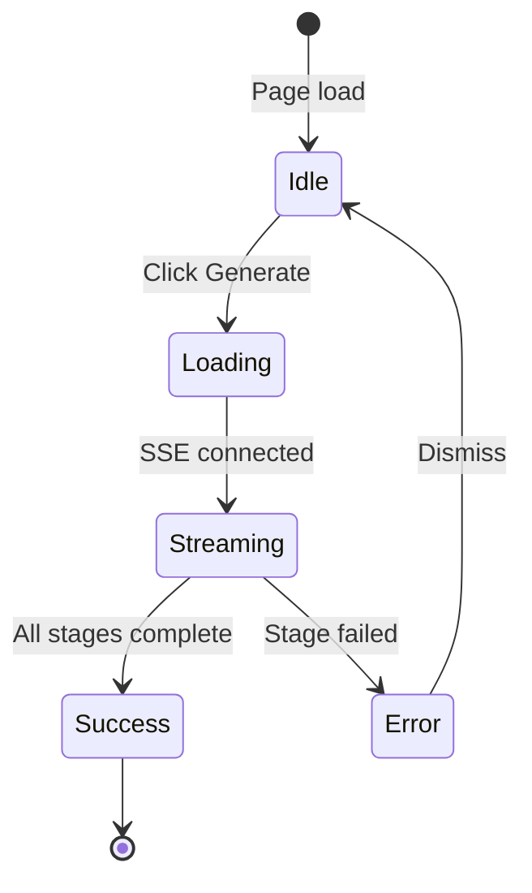

# Solution Design Document

## Validation Checklist

### CRITICAL GATES (Must Pass)

- [x] All required sections are complete
- [x] No [NEEDS CLARIFICATION] markers remain
- [x] Architecture pattern is clearly stated with rationale
- [ ] **All architecture decisions confirmed by user**
- [x] Every interface has specification

### QUALITY CHECKS (Should Pass)

- [x] All context sources are listed with relevance ratings
- [x] Project commands are discovered from actual project files
- [x] Constraints → Strategy → Design → Implementation path is logical
- [x] Every component in diagram has directory mapping
- [x] Error handling covers all error types
- [x] Quality requirements are specific and measurable
- [x] Component names consistent across diagrams
- [x] A developer could implement from this design

---

## Constraints

CON-1 **Tech Stack**: TypeScript 5.7.2 strict mode (`noUncheckedIndexedAccess`), pnpm 8.6.0, Node v25.5.0, Next.js (App Router), BullMQ workers, Drizzle ORM, PostgreSQL
CON-2 **Validation**: Functional validation only — Playwright browser + cURL against real services. No mocks, no unit tests, no test doubles per project constitution
CON-3 **Security**: API keys encrypted at rest (AES-256-GCM), masked in UI (last 4 chars only), never logged. Single-admin model (iron-session)
CON-4 **Cost**: Users supply own Anthropic + ElevenLabs keys. Must show cost estimates before generation. ElevenLabs free tier limits apply
CON-5 **Performance**: Pipeline with 50+ sources must complete in <30 minutes. Parallel fetching with per-source timeouts. Story count mapping still applies regardless of time window size
CON-6 **Backwards Compatibility**: Existing episodes reference `digest_id` via FK. Must preserve this relationship while making it optional for time-window-based generation

## Implementation Context

### Required Context Sources

#### Documentation Context
```yaml
- doc: docs/specs/002-podcast-sources-timewindow/product-requirements.md
  relevance: CRITICAL
  why: "PRD defines all features, acceptance criteria, and edge cases"

- doc: CONSTITUTION.md
  relevance: HIGH
  why: "Mandates functional validation approach (Playwright + cURL, no mocks)"
```

#### Code Context
```yaml
- file: packages/db/src/schema/sources.ts
  relevance: CRITICAL
  why: "Sources table schema — bulk insert, health monitoring columns"

- file: packages/db/src/schema/normalized-items.ts
  relevance: CRITICAL
  why: "Content table with publishedAt for time window queries, compositeScore for ranking"

- file: packages/db/src/schema/episodes.ts
  relevance: CRITICAL
  why: "Episodes table with digestId FK that must become optional"

- file: packages/db/src/schema/config.ts
  relevance: HIGH
  why: "Key-value config store — will store encrypted API keys"

- file: apps/worker/src/processors/podcast.ts
  relevance: CRITICAL
  why: "PodcastJobData interface and content selection logic — must be extended for time window"

- file: packages/shared/src/seed-sources.ts
  relevance: HIGH
  why: "Current 21 seed sources — must expand to 50+"

- file: packages/shared/src/types/source-config.ts
  relevance: HIGH
  why: "SourceConfig interface for all 7 fetcher types"

- file: packages/shared/src/types/podcast.ts
  relevance: HIGH
  why: "PodcastGenerationConfig type — must add time window fields"

- file: apps/web/src/app/admin/podcast/components/config-panel.tsx
  relevance: MEDIUM
  why: "UI component that submits generation config — add time window selector"

- file: apps/web/src/app/admin/sources/page.tsx
  relevance: MEDIUM
  why: "Sources admin page — add discovery button, health indicators"
```

#### External APIs
```yaml
- service: Anthropic API
  doc: https://docs.anthropic.com/en/docs
  relevance: HIGH
  why: "Script generation and AI source discovery agent"

- service: ElevenLabs API
  doc: https://elevenlabs.io/docs/api-reference
  relevance: HIGH
  why: "TTS synthesis for podcast audio"
```

### Implementation Boundaries

- **Must Preserve**: Existing podcast generation flow (digestId-based), existing episodes table FK integrity, existing API route structure, existing source CRUD operations
- **Can Modify**: PodcastJobData interface, PodcastGenerationConfig type, seed-sources.ts, podcast processor content selection logic, config-panel UI
- **Must Not Touch**: Authentication/session system (iron-session), email/newsletter package, mobile app, TTS audio pipeline (parseScript → generateSegmentAudio → assembleEpisode)

### External Interfaces

#### System Context Diagram



#### Interface Specifications

```yaml
inbound:
  - name: "Admin Web Dashboard"
    type: HTTP/HTTPS
    format: REST (Next.js API routes)
    authentication: iron-session (admin@digest.ai)
    data_flow: "Configuration, podcast generation, source management"

outbound:
  - name: "Anthropic API"
    type: HTTPS
    format: REST (Messages API)
    authentication: API Key (user-supplied or env)
    data_flow: "Script generation, AI source discovery, quality scoring"
    criticality: HIGH

  - name: "ElevenLabs API"
    type: HTTPS
    format: REST (Text-to-Speech)
    authentication: API Key (user-supplied or env)
    data_flow: "Voice synthesis"
    criticality: HIGH

  - name: "External Content Sources (50+)"
    type: HTTPS
    format: RSS/JSON/GraphQL
    authentication: Varies (mostly unauthenticated, PH requires token)
    data_flow: "News/content ingestion"
    criticality: MEDIUM

data:
  - name: "PostgreSQL (ai_digest_dev)"
    type: PostgreSQL
    connection: Drizzle ORM connection pool
    data_flow: "All application state"

  - name: "Redis"
    type: Redis
    connection: IORedis
    data_flow: "Job queues (BullMQ), SSE log streaming (Pub/Sub)"
```

### Project Commands

```bash
# Core Commands
Install: pnpm install
Dev:     pnpm dev                    # starts all apps via turborepo
Build:   pnpm build                  # builds all packages + apps
Lint:    pnpm lint
TypeCheck: pnpm -r exec tsc --noEmit # per-package type checking

# Database
Migrate: pnpm --filter @ai-digest/db run push    # drizzle-kit push
Seed:    pnpm --filter @ai-digest/db run seed     # custom seed script

# Worker
Worker:  pnpm --filter worker run dev              # starts BullMQ worker
Kill:    pkill -f "tsx.*src/index"                  # clear zombie workers

# Web
Web:     pnpm --filter web run dev -- --port 3001   # Next.js dev server
```

## Solution Strategy

- **Architecture Pattern**: Layered monorepo with feature-flag extension. New features are additive — they extend existing interfaces rather than replacing them. The time window feature adds an optional `dateRange` to PodcastJobData while keeping `digestId` as a fallback. Source expansion is purely additive (more seed data). Discovery agent runs as a new BullMQ job type.

- **Integration Approach**: Each feature integrates at the same layers used by existing functionality:
  - **Schema layer** (packages/db): New columns, optional FK relaxation, new table for API keys
  - **Type layer** (packages/shared): Extended interfaces and new types
  - **Worker layer** (apps/worker): New processor for discovery agent, modified podcast content selection
  - **API layer** (apps/web/api): New endpoints for time window, bulk operations, discovery, API keys
  - **UI layer** (apps/web/components): New components in existing admin pages

- **Justification**: This additive approach minimizes risk — existing podcast generation continues to work unchanged. New features are opt-in through the UI. The monorepo structure means all changes are atomic and type-checked across packages.

- **Key Decisions**:
  1. Time window queries `normalized_items.published_at` directly rather than through `digest_items` junction table — this decouples podcast content from the daily digest concept
  2. API keys stored in the existing `config` table (key-value store) with AES-256-GCM encryption — no new table needed
  3. Discovery agent runs as a BullMQ job to avoid HTTP timeouts, results stored in a new `discovery_runs` table
  4. Seed sources expanded in `seed-sources.ts` (code change) — the seed script merges by URL/config to avoid duplicates

## Building Block View

### Components



### Directory Map

**Package**: packages/shared
```
packages/shared/src/
├── seed-sources.ts           # MODIFY: Expand from 21 → 55+ sources
├── types/
│   ├── podcast.ts            # MODIFY: Add dateRange to PodcastGenerationConfig
│   ├── source-config.ts      # NO CHANGE: SourceConfig is flexible enough
│   ├── index.ts              # MODIFY: Export new types
│   └── discovery.ts          # NEW: Discovery types (DiscoveryRun, DiscoveryCandidate)
# NOTE: No crypto.ts here — node:crypto is server-only, see packages/db
```

**Package**: packages/db
```
packages/db/src/
├── schema/
│   ├── episodes.ts           # MODIFY: Make digestId nullable, add dateRangeStart/dateRangeEnd
│   ├── sources.ts            # NO CHANGE: Schema already has health columns
│   ├── config.ts             # NO CHANGE: Will store encrypted API keys as-is
│   ├── discovery-runs.ts     # NEW: Discovery run tracking table
│   └── index.ts              # MODIFY: Export new schema
├── queries/
│   ├── sources.ts            # MODIFY: Add bulkCreate, getSourceHealth
│   ├── episodes.ts           # MODIFY: Update for optional digestId
│   ├── config.ts             # MODIFY: Add getApiKey, setApiKey (with encryption)
│   ├── discovery.ts          # NEW: Discovery run CRUD
│   ├── normalized-items.ts   # MODIFY: Add getItemsByDateRange query
│   └── index.ts              # MODIFY: Export new queries
├── crypto.ts                 # NEW: AES-256-GCM encrypt/decrypt (server-only, uses node:crypto)
└── migrations/               # Generated by drizzle-kit push
```

**Package**: packages/agents
```
packages/agents/src/
├── discovery/
│   ├── agent.ts              # NEW: AI discovery agent using Anthropic tool_use
│   ├── validators.ts         # NEW: Source validation (fetch test, staleness check)
│   └── index.ts              # NEW: Export discovery functions
└── index.ts                  # MODIFY: Export discovery module
```

**App**: apps/worker
```
apps/worker/src/
├── processors/
│   ├── podcast.ts            # MODIFY: PodcastJobData + content selection for dateRange
│   └── discovery.ts          # NEW: BullMQ processor for discovery jobs
└── index.ts                  # MODIFY: Register discovery queue
```

**App**: apps/web
```
apps/web/src/app/
├── admin/
│   ├── podcast/
│   │   └── components/
│   │       ├── config-panel.tsx        # MODIFY: Add time window selector
│   │       └── time-window-picker.tsx  # NEW: Preset + custom date range component
│   ├── sources/
│   │   ├── page.tsx                    # MODIFY: Add discovery button, health indicators
│   │   └── components/
│   │       ├── discovery-modal.tsx     # NEW: Topic input, progress, results table
│   │       ├── source-health.tsx       # NEW: Health indicator component
│   │       └── import-export.tsx       # NEW: JSON import/export UI
│   └── config/
│       └── page.tsx                    # MODIFY: Add API Keys section
├── api/admin/
│   ├── sources/
│   │   ├── bulk/route.ts              # NEW: POST bulk insert/import
│   │   ├── export/route.ts            # NEW: GET JSON export
│   │   └── discover/route.ts          # NEW: POST trigger discovery, GET results
│   ├── podcast/
│   │   ├── generate/route.ts          # MODIFY: Accept dateRange in body
│   │   └── item-count/route.ts        # NEW: GET item count for date range
│   └── config/
│       ├── api-keys/route.ts          # NEW: GET/PUT API key management
│       └── api-keys/test/route.ts     # NEW: POST test API key validity
```

### Interface Specifications

#### Data Storage Changes

```yaml
Table: episodes (MODIFY)
  MODIFY COLUMN: digest_id uuid → uuid NULLABLE (drop NOT NULL, keep FK)
  ADD COLUMN: date_range_start timestamp (nullable)
  ADD COLUMN: date_range_end timestamp (nullable)
  CONSTRAINT: CHECK (digest_id IS NOT NULL OR (date_range_start IS NOT NULL AND date_range_end IS NOT NULL))
  NOTE: Drizzle ORM schema does not support CHECK constraints natively.
        Must apply via raw SQL after `drizzle-kit push`:
        ALTER TABLE episodes ADD CONSTRAINT episodes_content_source_check
          CHECK (digest_id IS NOT NULL OR (date_range_start IS NOT NULL AND date_range_end IS NOT NULL));

Table: discovery_runs (NEW)
  id: uuid PRIMARY KEY DEFAULT gen_random_uuid()
  status: text NOT NULL DEFAULT 'pending'  -- pending | running | completed | failed | timeout
  topics: text[] NOT NULL
  source_types: text[] NOT NULL DEFAULT '{}'
  max_sources: integer NOT NULL DEFAULT 20
  candidates: jsonb DEFAULT '[]'  -- DiscoveryCandidate[]
  added_source_ids: uuid[] DEFAULT '{}'
  error: text
  started_at: timestamp
  completed_at: timestamp
  created_at: timestamp NOT NULL DEFAULT now()
```

#### Internal API Changes

```yaml
Endpoint: Generate Podcast (MODIFY)
  Method: POST
  Path: /api/admin/podcast/generate
  Request:
    digestId: string (OPTIONAL — was required)
    targetDurationMinutes: number, required
    model: string, optional
    voiceConfig: VoiceConfig, optional
    style: string, optional
    customStylePrompt: string, optional
    + dateRange: { start: string (ISO), end: string (ISO) }, optional
  Validation:
    - Either digestId OR dateRange must be provided (not both, not neither)
    - dateRange.start must be before dateRange.end
    - dateRange.end clamped to now() if in future
  Response: { episodeId: string }

Endpoint: Bulk Import Sources
  Method: POST
  Path: /api/admin/sources/bulk
  Request:
    sources: Array<{ name: string, type: SourceType, config: SourceConfig, enabled?: boolean }>
  Response:
    success: { added: number, skipped: number, errors: string[] }

Endpoint: Export Sources
  Method: GET
  Path: /api/admin/sources/export
  Response: JSON file download with Content-Disposition header
    Array<{ name: string, type: string, config: SourceConfig, enabled: boolean }>

Endpoint: Trigger Discovery
  Method: POST
  Path: /api/admin/sources/discover
  Request:
    topics: string[] (e.g. ["robotics", "computer vision"])
    sourceTypes: string[] (e.g. ["rss", "reddit", "github"])
    maxSources: number (10-50, default 20)
  Response: { runId: string, estimatedCostUsd: number }
  Notes: estimatedCostUsd based on maxSources * avg tool_use tokens (~$0.05/source).
         UI must display cost estimate and require confirmation before starting.

Endpoint: Get Discovery Results
  Method: GET
  Path: /api/admin/sources/discover?runId=<uuid>
  Response: DiscoveryRun object with candidates array

Endpoint: Add Discovered Sources
  Method: POST
  Path: /api/admin/sources/discover/add
  Request:
    runId: string
    candidateIndices: number[] (indices of candidates to add)
  Response: { added: number, sourceIds: string[] }

Endpoint: Get API Keys
  Method: GET
  Path: /api/admin/config/api-keys
  Response:
    anthropic: { configured: boolean, lastFour: string | null }
    elevenlabs: { configured: boolean, lastFour: string | null }

Endpoint: Set API Key
  Method: PUT
  Path: /api/admin/config/api-keys
  Request:
    provider: "anthropic" | "elevenlabs"
    key: string
  Response: { success: boolean, lastFour: string }

Endpoint: Test API Key
  Method: POST
  Path: /api/admin/config/api-keys/test
  Request:
    provider: "anthropic" | "elevenlabs"
    key: string
  Response: { valid: boolean, error?: string }

Endpoint: Item Count for Date Range
  Method: GET
  Path: /api/admin/podcast/item-count?start=<ISO>&end=<ISO>
  Response: { itemCount: number, sourceCount: number }
  Notes: Dedicated read-only endpoint, separate from generate (POST-only)
```

#### Application Data Models

```pseudocode
ENTITY: PodcastJobData (MODIFIED)
  FIELDS:
    episodeId: string
    ~ digestId: string | null (CHANGED: was required, now optional)
    targetDurationMinutes: number
    model?: string
    voiceConfig?: VoiceConfig
    style?: string
    customStylePrompt?: string
    + dateRange?: { start: string; end: string } (NEW)

ENTITY: PodcastGenerationConfig (MODIFIED)
  FIELDS:
    ~ digestId: string | null (CHANGED: was required, now optional)
    targetDurationMinutes: 5 | 10 | 15 | 20 | 25 | 30 | 45 | 60
    model: string
    voiceConfig: VoiceConfig
    style: PodcastStyle
    customStylePrompt: string | null
    + dateRange: { start: string; end: string } | null (NEW)

ENTITY: DiscoveryRun (NEW)
  FIELDS:
    id: string
    status: "pending" | "running" | "completed" | "failed" | "timeout"
    topics: string[]
    sourceTypes: string[]
    maxSources: number
    candidates: DiscoveryCandidate[]
    addedSourceIds: string[]
    error: string | null
    startedAt: Date | null
    completedAt: Date | null
    createdAt: Date

ENTITY: DiscoveryCandidate (NEW)
  FIELDS:
    name: string
    type: SourceType
    config: SourceConfig
    url: string
    validationStatus: "reachable" | "unreachable" | "stale" | "unvalidated"
    lastUpdated: string | null
    description: string
    isDuplicate: boolean
    duplicateOfId: string | null
```

#### Integration Points

```yaml
Inter-Component Communication:
  - from: apps/web (API routes)
    to: apps/worker (BullMQ)
    protocol: BullMQ job queue (Redis)
    endpoints: podcast-generation queue, discovery queue (NEW)
    data_flow: "Job data with time window config or discovery params"

  - from: apps/worker
    to: apps/web (SSE clients)
    protocol: Redis Pub/Sub → SSE
    endpoints: podcast:logs:<episodeId>, discovery:logs:<runId> (NEW)
    data_flow: "Real-time progress logs"

External System Integration:
  - service: Anthropic API
    integration: "Worker reads API key from DB first, falls back to process.env.ANTHROPIC_API_KEY"
    critical_data: [script_generation_prompt, discovery_agent_tools]

  - service: ElevenLabs API
    integration: "Worker reads API key from DB first, falls back to process.env.ELEVENLABS_API_KEY"
    critical_data: [tts_requests, voice_previews]

  - service: External Content Sources
    integration: "50+ sources fetched via 7 fetcher types during pipeline runs"
    critical_data: [rss_feeds, api_responses, scraped_content]
```

### Implementation Examples

#### Example: Time Window Content Selection

**Why this example**: The core behavioral change — how content selection switches from digest-based to date-range-based querying while preserving the existing fallback.

```typescript
// In apps/worker/src/processors/podcast.ts
// Modified content selection logic
// NOTE: Must add `lte` to existing drizzle-orm imports alongside gte, and, isNull, desc

import { ..., lte } from "@ai-digest/db"; // Add lte to existing import

async function selectContent(
  jobData: PodcastJobData,
  storyCount: number
): Promise<PodcastTopicItem[]> {
  let topItems;

  if (jobData.dateRange) {
    // NEW: Time window mode — query by published_at date range
    topItems = await db.query.normalizedItems.findMany({
      where: and(
        isNull(normalizedItems.duplicateOf),
        gte(normalizedItems.compositeScore, 0.3),
        gte(normalizedItems.publishedAt, new Date(jobData.dateRange.start)),
        lte(normalizedItems.publishedAt, new Date(jobData.dateRange.end))
      ),
      orderBy: [desc(normalizedItems.compositeScore)],
      limit: storyCount,
    });
  } else {
    // EXISTING: Fallback to current behavior (all scored items)
    topItems = await db.query.normalizedItems.findMany({
      where: and(
        isNull(normalizedItems.duplicateOf),
        gte(normalizedItems.compositeScore, 0.3)
      ),
      orderBy: [desc(normalizedItems.compositeScore)],
      limit: storyCount,
    });
  }

  return topItems.map(item => ({
    title: item.title,
    summary: item.summary,
    source: item.source,
    topics: item.categories,
    compositeScore: item.compositeScore ?? 0,
  }));
}
```

#### Example: API Key Encryption

**Why this example**: Security-critical implementation — must use proper AES-256-GCM with per-key IV, not a simple cipher.

```typescript
// In packages/db/src/crypto.ts (server-only — node:crypto unavailable in browser bundles)
import { randomBytes, createCipheriv, createDecipheriv } from "node:crypto";

const ALGORITHM = "aes-256-gcm";
const KEY_ENV = "API_KEY_ENCRYPTION_SECRET"; // 32-byte hex in env

export function encryptApiKey(plaintext: string): string {
  const key = Buffer.from(process.env[KEY_ENV]!, "hex");
  const iv = randomBytes(16);
  const cipher = createCipheriv(ALGORITHM, key, iv);
  const encrypted = Buffer.concat([cipher.update(plaintext, "utf8"), cipher.final()]);
  const authTag = cipher.getAuthTag();
  // Format: iv:authTag:ciphertext (all base64)
  return [iv, authTag, encrypted].map(b => b.toString("base64")).join(":");
}

export function decryptApiKey(token: string): string {
  const key = Buffer.from(process.env[KEY_ENV]!, "hex");
  const [ivB64, tagB64, dataB64] = token.split(":");
  const decipher = createDecipheriv(ALGORITHM, key, Buffer.from(ivB64, "base64"));
  decipher.setAuthTag(Buffer.from(tagB64, "base64"));
  return decipher.update(Buffer.from(dataB64, "base64")) + decipher.final("utf8");
}
```

#### Example: Discovery Agent Tool Use

**Why this example**: The AI discovery agent uses Anthropic's `tool_use` feature to iteratively search and validate sources — the tool schema must be carefully designed.

```typescript
// In packages/agents/src/discovery/agent.ts
const DISCOVERY_TOOLS: Anthropic.Tool[] = [
  {
    name: "web_search",
    description: "Search the web for content sources, blogs, and feeds related to a query. Returns URLs and descriptions.",
    input_schema: {
      type: "object",
      properties: {
        query: { type: "string", description: "Web search query (e.g., 'robotics RSS feeds', 'AI research blogs atom feed')" },
        max_results: { type: "number", description: "Max results to return (default 10)" },
      },
      required: ["query"],
    },
  },
  {
    name: "search_rss_feeds",
    description: "Search for RSS feeds at a specific domain or URL pattern. Tries common feed paths (/feed, /rss, /atom.xml).",
    input_schema: {
      type: "object",
      properties: {
        domain: { type: "string", description: "Domain to probe for RSS feeds (e.g., 'openai.com')" },
        topic: { type: "string", description: "Topic context for result ranking" },
      },
      required: ["domain"],
    },
  },
  {
    name: "validate_source",
    description: "Test if a source URL is reachable and recently updated",
    input_schema: {
      type: "object",
      properties: {
        url: { type: "string", description: "URL to validate" },
        type: { type: "string", enum: ["rss", "reddit", "github", "arxiv"] },
      },
      required: ["url", "type"],
    },
  },
  {
    name: "submit_candidate",
    description: "Submit a validated source as a discovery candidate",
    input_schema: {
      type: "object",
      properties: {
        name: { type: "string" },
        type: { type: "string", enum: ["rss", "reddit", "github", "arxiv", "hackernews", "huggingface", "producthunt"] },
        config: { type: "object" },
        url: { type: "string" },
        description: { type: "string" },
      },
      required: ["name", "type", "config", "url", "description"],
    },
  },
];
```

## Runtime View

### Primary Flow: Podcast Generation with Time Window

1. Admin opens Podcast Dashboard → Generate tab
2. Admin selects time window preset or custom date range
3. System shows live item count via GET `/api/admin/podcast/item-count?start=...&end=...`
4. Admin configures duration, model, style, voices
5. Admin clicks Generate → POST `/api/admin/podcast/generate` with `dateRange`
6. API creates episode row (with `dateRangeStart`/`dateRangeEnd`, nullable `digestId`)
7. API enqueues BullMQ job with `dateRange` in PodcastJobData
8. Worker picks up job → content selection queries `normalized_items` by `published_at` range
9. Remaining stages (script gen → quality → TTS → assembly → upload) proceed unchanged
10. SSE stream delivers real-time progress to UI



### Secondary Flow: AI Source Discovery

1. Admin clicks "Discover Sources" on Sources page
2. Modal opens → enters topics, selects source types, sets max count
3. POST `/api/admin/sources/discover` → creates discovery_run, enqueues BullMQ job
4. Worker spawns Anthropic agent with `tool_use` (web_search, search_rss_feeds, validate_source, submit_candidate)
5. Agent iteratively searches web, validates each candidate, submits results
6. Progress streamed via SSE → shown in modal
7. On completion, modal shows candidate table with validation status
8. Admin toggles candidates → clicks "Add Selected"
9. POST `/api/admin/sources/discover/add` → bulk inserts selected candidates



### Error Handling

- **No items in date range**: API returns `{ itemCount: 0 }`, UI disables Generate button, shows "No items found for this date range. Try a wider window."
- **Discovery agent timeout (>5 min)**: Worker sets `discovery_run.status = 'timeout'`, saves partial candidates. UI shows "Discovery timed out — showing partial results."
- **Invalid API key**: Test endpoint makes minimal API call (`anthropic.messages.create` with 1 token / ElevenLabs `GET /v1/voices`). Returns `{ valid: false, error: "Invalid API key" }`.
- **RSS feed unreachable during discovery**: Candidate marked as `validationStatus: 'unreachable'` — not excluded, but flagged in UI.
- **Bulk import with duplicates**: Match by source type + config URL/query. Duplicates skipped, summary returned: "12 added, 3 skipped (duplicate)".
- **Missing encryption secret**: If `API_KEY_ENCRYPTION_SECRET` env var not set, API key endpoints return 500 with "Encryption not configured. Set API_KEY_ENCRYPTION_SECRET environment variable."

## Deployment View

### Single Application Deployment
- **Environment**: Self-hosted (Docker or bare metal), single-node PostgreSQL + Redis
- **New Configuration**:
  - `API_KEY_ENCRYPTION_SECRET` (required for API key feature): 32-byte hex string. Generate with `openssl rand -hex 32`
- **Dependencies**: No new external services — all features use existing Anthropic + ElevenLabs APIs
- **Performance**: 50+ sources in pipeline run adds ~5-10 minutes vs current 5 sources. Parallel fetching with 30s per-source timeout limits blast radius.

### Database Migration
- `episodes.digest_id`: ALTER COLUMN SET NULL, ADD CHECK constraint
- `episodes.date_range_start`: ADD COLUMN timestamp nullable
- `episodes.date_range_end`: ADD COLUMN timestamp nullable
- `discovery_runs`: CREATE TABLE
- All via `drizzle-kit push` (the project uses push, not migration files)

## Cross-Cutting Concepts

### Pattern Documentation

```yaml
- pattern: BullMQ job processing with SSE streaming
  relevance: CRITICAL
  why: "Existing pattern for podcast generation; discovery agent follows same pattern"

- pattern: Drizzle ORM query with conditional where clauses
  relevance: HIGH
  why: "Time window adds conditional filtering to content selection"

- pattern: Admin API with iron-session auth + Zod validation
  relevance: HIGH
  why: "All new endpoints follow existing authenticated route pattern"
```

### User Interface & UX

**Information Architecture:**
- Time Window Selector added to existing Podcast Dashboard → Generate tab (above duration selector)
- Discovery UI added as modal triggered from Sources page
- API Key Management added as new section in existing Config page

**Interaction Design:**

```
Time Window Selector (in config-panel.tsx)
┌─────────────────────────────────────────────────┐
│  Content Window                                  │
│  ┌──────┐ ┌──────┐ ┌──────┐ ┌───────┐ ┌──────┐ │
│  │ 24h  │ │ 3d   │ │ 7d   │ │ 14d   │ │Custom│ │
│  └──────┘ └──────┘ └──────┘ └───────┘ └──────┘ │
│  ~247 items from 42 sources available            │
│                                                  │
│  [If Custom selected:]                           │
│  Start: [Feb 1, 2026]  End: [Feb 7, 2026]       │
└─────────────────────────────────────────────────┘
```

```
Source Health Indicators (in sources page)
┌─────────────────────────────────────────────────┐
│ Source Name          │ Type │ Health │ Last Fetch │
│──────────────────────┼──────┼────────┼───────────│
│ OpenAI Blog          │ RSS  │  🟢   │ 2h ago     │
│ r/MachineLearning    │ RDT  │  🟡   │ 1d (1 err) │
│ Old Stale Feed       │ RSS  │  🔴   │ 7d (3 err) │
└─────────────────────────────────────────────────┘
```

```
API Keys Section (in config page)
┌─────────────────────────────────────────────────┐
│  API Keys                                        │
│                                                  │
│  Anthropic API Key                               │
│  ┌──────────────────────────┐ ┌────┐ ┌──────┐   │
│  │ ••••••••••••••••sk-7f2a │ │Test│ │ Save │   │
│  └──────────────────────────┘ └────┘ └──────┘   │
│  ✅ Valid (tested 5 min ago)                     │
│                                                  │
│  ElevenLabs API Key                              │
│  ┌──────────────────────────┐ ┌────┐ ┌──────┐   │
│  │ (not configured)         │ │Test│ │ Save │   │
│  └──────────────────────────┘ └────┘ └──────┘   │
└─────────────────────────────────────────────────┘
```

**Component States:**



### System-Wide Patterns

- **Security**: API keys encrypted with AES-256-GCM at rest. Masked in UI responses. Never included in log messages or SSE streams. Worker reads from DB with fallback to env vars.
- **Error Handling**: All new endpoints follow existing pattern — Zod validation → try/catch → structured JSON error response with appropriate HTTP status.
- **Performance**: Time window queries use existing `idx_items_published` index on `normalized_items.published_at`. Discovery agent has 5-minute timeout with partial result saving.
- **Logging**: Discovery agent streams progress via same Redis Pub/Sub → SSE pattern used by podcast generation.

## Architecture Decisions

- [ ] ADR-1 **Time window queries normalized_items directly, not through digest_items**: Query `normalized_items.published_at` by date range, bypassing the digest → digest_items → normalized_items join path.
  - Rationale: Digests are daily snapshots — a weekly podcast needs cross-digest data. Querying normalized_items directly is simpler and more performant.
  - Trade-offs: Podcast episodes may not map 1:1 to a digest. The `episodes.digest_id` FK becomes nullable.
  - Alternatives Considered:
    - **(a) Query through digest_items across multiple digests**: JOIN digest_items → digests WHERE digest_date BETWEEN range. Rejected: requires digests to exist for every day in the range, which isn't guaranteed. Also adds unnecessary join complexity.
    - **(b) Create a new "multi-day digest" entity**: A virtual digest spanning multiple days. Rejected: over-engineering — the podcast is the output, not the digest. Would require new table and concept for no user benefit.
  - User confirmed: _Pending_

- [ ] ADR-2 **API keys in existing config table with encryption, not a new table**: Store encrypted API keys as `config.value` entries with keys like `apiKey:anthropic` and `apiKey:elevenlabs`.
  - Rationale: The config table already exists as a key-value store with JSONB values. Adding a dedicated table would be over-engineering for 2 keys.
  - Trade-offs: Requires `API_KEY_ENCRYPTION_SECRET` env var. If lost, keys must be re-entered.
  - Alternatives Considered:
    - **(a) Dedicated `api_keys` table with encrypted columns**: New table with provider, encrypted_key, iv, auth_tag columns. Rejected: over-engineering for exactly 2 keys. Would need migration for every new provider.
    - **(b) External secret management (Vault, AWS SSM)**: Enterprise-grade but requires external service dependency. Rejected: this is an open-source self-hosted project — adding Vault as a dependency would alienate the target persona.
    - **(c) Encrypted `.env` file managed via UI**: Write keys back to filesystem. Rejected: security risk (file permissions), doesn't work in containerized deployments, process restart needed.
  - User confirmed: _Pending_

- [ ] ADR-3 **Discovery agent runs as BullMQ job, not inline API handler**: Discovery can take 2-5 minutes. Running as a job prevents HTTP timeouts and allows progress streaming.
  - Rationale: Same pattern as podcast generation. BullMQ provides retry logic, timeout handling, and Redis-based progress.
  - Trade-offs: Slightly more complex flow (create job → poll/stream results) vs. simple POST → response.
  - Alternatives Considered:
    - **(a) Inline API handler with long timeout**: Set Next.js route to allow 5-min response. Rejected: breaks standard HTTP expectations, no progress visibility, Vercel/serverless deployments impose hard limits.
    - **(b) WebSocket-based streaming from API route**: Stream results directly via WS. Rejected: adds new transport protocol to the stack when SSE+Redis already exists and works for podcast streaming.
  - User confirmed: _Pending_

- [ ] ADR-4 **Seed sources expanded in code (seed-sources.ts), not database migration**: The 50+ sources are defined in TypeScript code and inserted via seed script with duplicate detection.
  - Rationale: Code-level definition is version-controlled, reviewable, and portable across deployments. Seed script runs on fresh install or on-demand.
  - Trade-offs: Updating sources requires a code change + re-seed, not just a DB update. But the discovery feature covers the dynamic case.
  - Alternatives Considered:
    - **(a) SQL migration file with INSERT statements**: Committed migration that inserts sources. Rejected: project uses `drizzle-kit push` (not migration files), and SQL INSERTs aren't idempotent without ON CONFLICT logic.
    - **(b) External JSON file loaded at runtime**: Ship `default-sources.json` loaded on first boot. Rejected: TypeScript definition provides type safety and IDE autocomplete; JSON loses both.
  - User confirmed: _Pending_

- [ ] ADR-5 **Worker reads API keys from DB first, falls back to env vars**: `getApiKey("anthropic")` checks DB (decrypts) → falls back to `process.env.ANTHROPIC_API_KEY`.
  - Rationale: Supports both self-service (DB keys) and traditional deployment (env vars). No breaking change for existing users.
  - Trade-offs: Two code paths for key resolution. Must be consistent across all key consumers (podcast processor, discovery processor, pipeline processor).
  - Alternatives Considered:
    - **(a) DB-only, no env var fallback**: Force all keys through DB. Rejected: breaking change for existing users who have working deployments with env vars. Also breaks development workflow where `.env.local` is standard.
    - **(b) Env-only, write DB keys to env at startup**: Read DB keys on worker boot, inject into `process.env`. Rejected: mutations to `process.env` are a code smell; doesn't handle key updates without restart; breaks immutability principle.
  - User confirmed: _Pending_

## Quality Requirements

- **Performance**: Time window query (7 days, 50+ sources) returns results in <500ms (leverages existing `idx_items_published` index). Seed script inserts 50+ sources in <5s. Discovery agent completes in <5 minutes or returns partial results.
- **Usability**: Time window selector shows live item count within 1s of selection change. Discovery progress updates at least every 10s. API key test completes in <5s.
- **Security**: API keys encrypted with AES-256-GCM + per-key IV. Keys never appear in logs, SSE streams, or non-masked API responses. Encryption secret required via environment variable.
- **Reliability**: Discovery agent timeout at 5 minutes saves partial results. Pipeline with 50+ sources tolerates individual source failures (existing per-source try/catch). Bulk import skips duplicates without failing the entire batch.

## Acceptance Criteria

**Time Window (PRD Feature 1)**
- [x] WHEN admin views the generation form, THE SYSTEM SHALL display a "Content Window" selector with presets: Last 24h, Last 3 days, Last 7 days, Last 14 days, Custom range
- [x] WHEN admin selects a time preset, THE SYSTEM SHALL show a live item count for that date range within 1 second
- [x] WHEN admin selects "Custom range", THE SYSTEM SHALL display date pickers and clamp end date to today if future
- [x] WHEN admin clicks Generate with a date range, THE SYSTEM SHALL query normalized_items by published_at within the range, ordered by composite_score descending
- [x] IF no items exist in the selected range, THEN THE SYSTEM SHALL disable the Generate button and show "No items found for the selected date range"
- [x] IF fewer items than story count, THEN THE SYSTEM SHALL warn but allow generation with available items

**50+ Default Sources (PRD Feature 2)**
- [x] WHEN the seed script runs on fresh install, THE SYSTEM SHALL insert at least 50 sources across all 7 fetcher types
- [x] WHEN seed runs on existing DB, THE SYSTEM SHALL skip sources that match by type + config URL/query (merge, not replace)
- [x] WHEN pipeline runs with 50+ sources, THE SYSTEM SHALL produce at least 200 normalized items

**AI Discovery (PRD Feature 3)**
- [x] WHEN admin clicks "Discover Sources", THE SYSTEM SHALL open a modal with topic input, source type checkboxes, and max source slider
- [x] WHEN discovery starts, THE SYSTEM SHALL enqueue a BullMQ job and stream progress via SSE
- [x] WHEN agent completes, THE SYSTEM SHALL display candidates with name, type, URL, validation status, and duplicate flag
- [x] WHEN admin clicks "Add Selected", THE SYSTEM SHALL bulk insert selected candidates into sources table with enabled=true
- [x] IF discovery exceeds 5 minutes, THEN THE SYSTEM SHALL save partial results and show "Discovery timed out"

**API Key Management (PRD Feature 4)**
- [x] WHEN admin views Config page, THE SYSTEM SHALL show API Keys section with masked key display (last 4 chars)
- [x] WHEN admin saves an API key, THE SYSTEM SHALL encrypt with AES-256-GCM and store in config table
- [x] WHEN admin clicks Test, THE SYSTEM SHALL validate with a minimal API call and show success/failure
- [x] WHEN worker processes a job, THE SYSTEM SHALL read keys from DB first, falling back to environment variables

**Bulk Import/Export (PRD Feature 5)**
- [x] WHEN admin clicks "Export Sources", THE SYSTEM SHALL download a JSON file of all sources
- [x] WHEN admin uploads a JSON file, THE SYSTEM SHALL add new sources and skip duplicates with summary

**Source Health (PRD Feature 6)**
- [x] THE SYSTEM SHALL display green/yellow/red health indicators based on consecutiveErrors (0=green, 1-2=yellow, 3+=red)
- [x] WHEN admin hovers over health indicator, THE SYSTEM SHALL show last error message and timestamp

## Risks and Technical Debt

### Known Technical Issues
- Current podcast processor ignores `digestId` in content selection (lines 153-160 of podcast.ts) — it already queries all scored items globally. The `digestId` on PodcastJobData is used only for the episode FK, not for filtering. This means the time window change is less disruptive than expected.
- `idx_items_published` index exists but has never been used for range queries in production — performance should be validated with 50+ sources / thousands of items.

### Technical Debt
- The `digestId` on episodes was always conceptually a "which digest spawned this" reference, not a content filter. Making it nullable formalizes this truth.
- Source health columns (`consecutiveErrors`, `lastFetchError`, `lastFetchAt`) exist in the schema but are not displayed anywhere in the UI. Feature 6 (Source Health) pays down this debt.

### Implementation Gotchas
- **Drizzle push with nullable FK**: Changing `digest_id` from NOT NULL to nullable requires Drizzle to recognize the column change. May need explicit `drizzle-kit push --force` or manual ALTER.
- **API key encryption in worker**: The worker runs as a separate process — it needs access to `API_KEY_ENCRYPTION_SECRET` env var. Must be in worker's `.env.local` or process environment.
- **Discovery agent costs**: Each discovery run uses Anthropic API tokens. With `tool_use`, costs can be $0.50-$2.00 per run. Should show estimated cost before starting.
- **Seed script idempotency**: Matching by URL/config for duplicate detection must handle edge cases (trailing slashes, query params). Normalize URLs before comparison.

## Glossary

### Domain Terms

| Term | Definition | Context |
|------|------------|---------|
| Time Window | A date range (start, end) defining which news items to include in a podcast | Replaces single-day digest as content source for podcast generation |
| Discovery Run | An AI agent session that searches for new content sources | Persisted in discovery_runs table with candidates and status |
| Seed Source | A pre-configured content source shipped with the platform | Defined in seed-sources.ts, inserted on fresh install |
| Composite Score | Weighted combination of relevance, novelty, and impact scores | Used to rank items for podcast story selection |

### Technical Terms

| Term | Definition | Context |
|------|------------|---------|
| BullMQ | Redis-based job queue library for Node.js | Used for async podcast generation and discovery jobs |
| Drizzle ORM | TypeScript-first ORM with schema-as-code | All database interactions go through Drizzle |
| SSE | Server-Sent Events — unidirectional streaming from server to client | Used for real-time log streaming during generation |
| AES-256-GCM | Authenticated encryption algorithm | Used for API key encryption at rest |

### API/Interface Terms

| Term | Definition | Context |
|------|------------|---------|
| tool_use | Anthropic API feature for agent-style tool calling | Discovery agent uses tool_use to search and validate sources |
| iron-session | Encrypted cookie-based session library | Admin authentication for all API routes |
| Content-Disposition | HTTP header triggering file download | Used in source export endpoint |
