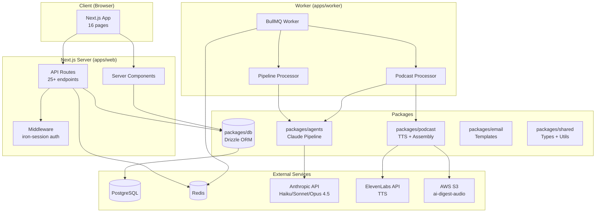
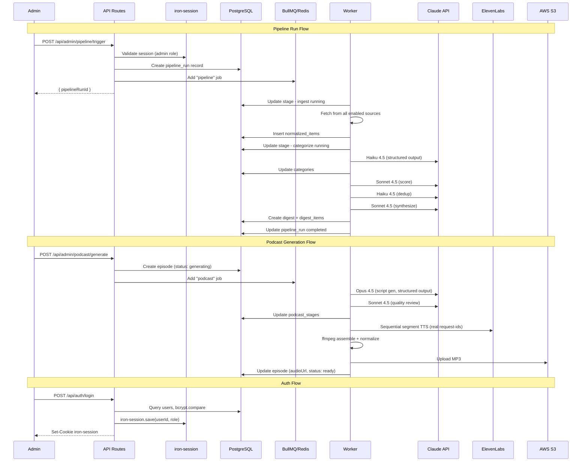
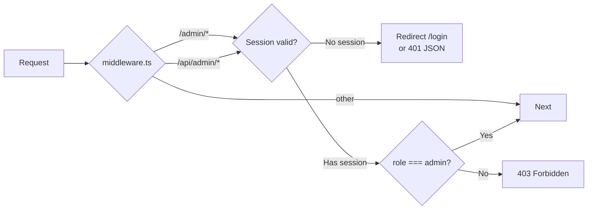
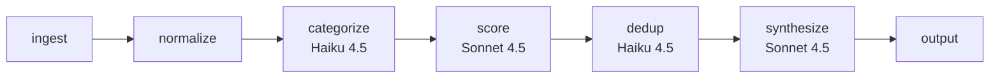
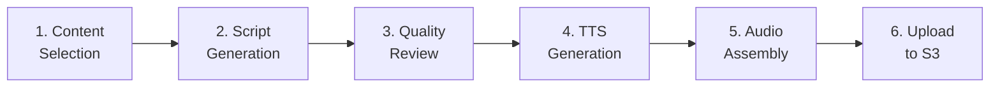
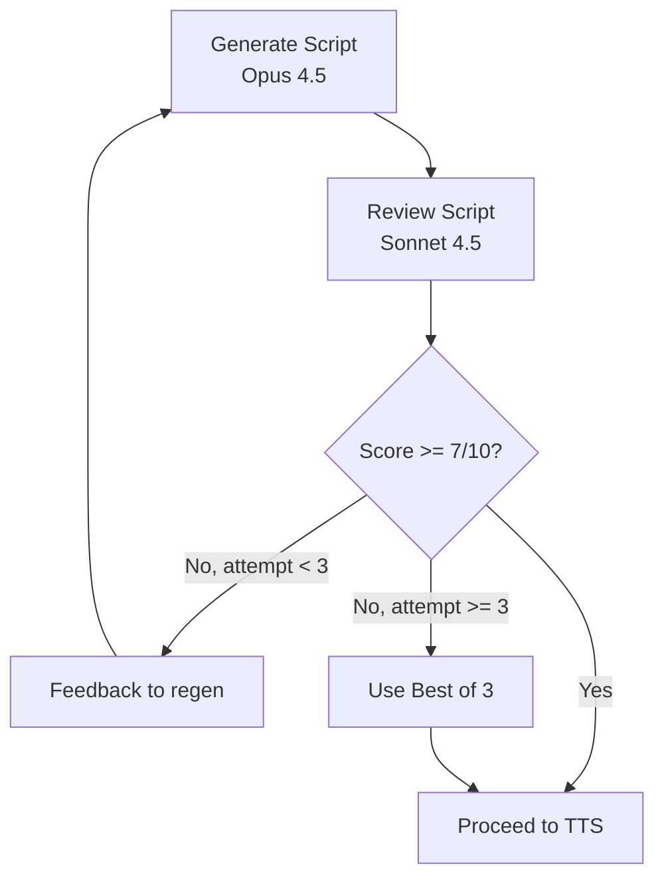
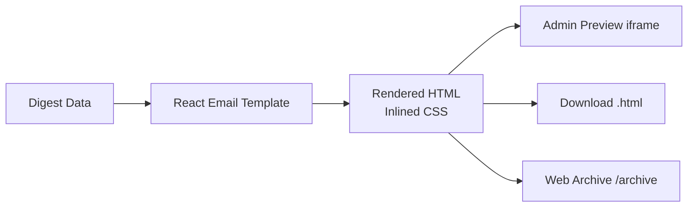

# Design: AI Digest Platform (finish-full-stack)

## Overview

Complete the AI Digest platform by: (1) replacing static `x-api-key` auth with session-based iron-session auth + users table, (2) overhauling the cyberpunk theme to flat black professional (zinc-950 palette, Geist fonts, blue-500 accent) across 49+ files, (3) fixing the pipeline to run end-to-end with real data (updated model IDs, structured outputs, prompt caching), (4) fixing the TTS bug and adding configurable podcast generation with S3 upload, (5) building out remaining admin UX (source management, pipeline monitor, config), and (6) validating everything with Playwright screenshots and cURL.

## 1. Architecture Overview



### Key Data Flows



## 2. Database Schema Changes

### 2.1 New Table: `users`

```typescript
// packages/db/src/schema/users.ts
import { pgTable, uuid, text, timestamp } from "drizzle-orm/pg-core";

export const users = pgTable("users", {
  id: uuid("id").defaultRandom().primaryKey(),
  email: text("email").notNull().unique(),
  passwordHash: text("password_hash").notNull(),
  role: text("role").notNull().default("user"), // "user" | "admin"
  createdAt: timestamp("created_at").defaultNow().notNull(),
  lastLoginAt: timestamp("last_login_at"),
});
```

### 2.2 New Table: `source_fetch_log`

```typescript
// packages/db/src/schema/source-fetch-log.ts
import { pgTable, uuid, text, timestamp, integer, index } from "drizzle-orm/pg-core";
import { sources } from "./sources";

export const sourceFetchLog = pgTable("source_fetch_log", {
  id: uuid("id").defaultRandom().primaryKey(),
  sourceId: uuid("source_id").notNull().references(() => sources.id, { onDelete: "cascade" }),
  fetchedAt: timestamp("fetched_at").defaultNow().notNull(),
  itemCount: integer("item_count").notNull().default(0),
  error: text("error"),
  durationMs: integer("duration_ms"),
}, (table) => [
  index("idx_fetch_log_source").on(table.sourceId),
  index("idx_fetch_log_fetched").on(table.fetchedAt),
]);
```

### 2.3 Modified Table: `sources` (add health columns)

```typescript
// Add to existing sources table definition:
lastFetchAt: timestamp("last_fetch_at"),
lastFetchItemCount: integer("last_fetch_item_count"),
lastFetchError: text("last_fetch_error"),
consecutiveErrors: integer("consecutive_errors").default(0).notNull(),
```

### 2.4 Modified Table: `episodes` (add podcast sub-stage tracking)

```typescript
// Add to existing episodes table definition:
targetDurationMinutes: integer("target_duration_minutes").default(10),
podcastStages: jsonb("podcast_stages").$type<PodcastStageStatus[]>(),
scriptPreview: text("script_preview"),
```

### 2.5 Modified Table: `pipeline_stages` (add cost + model tracking)

```typescript
// Add to existing pipeline_stages table definition:
modelUsed: text("model_used"),
tokensInput: integer("tokens_input"),
tokensOutput: integer("tokens_output"),
costUsd: real("cost_usd"),
```

### 2.6 Full-Text Search Index

```sql
-- Migration: add tsvector column + GIN index for search
ALTER TABLE normalized_items ADD COLUMN search_vector tsvector
  GENERATED ALWAYS AS (
    setweight(to_tsvector('english', coalesce(title, '')), 'A') ||
    setweight(to_tsvector('english', coalesce(summary, '')), 'B')
  ) STORED;

CREATE INDEX idx_items_search ON normalized_items USING GIN(search_vector);
```

### 2.7 Schema Index Update

```typescript
// packages/db/src/schema/index.ts
export { sources } from "./sources";
export { normalizedItems } from "./normalized-items";
export { digests, digestItems } from "./digests";
export { episodes, transcripts } from "./episodes";
export { subscribers } from "./subscribers";
export { pipelineRuns, pipelineStages } from "./pipeline";
export { config } from "./config";
export { users } from "./users";                    // NEW
export { sourceFetchLog } from "./source-fetch-log"; // NEW
```

## 3. Authentication Architecture

### 3.1 iron-session Setup

```typescript
// apps/web/src/lib/session.ts
import { getIronSession, type SessionOptions } from "iron-session";
import { cookies } from "next/headers";

export interface SessionData {
  userId: string;
  email: string;
  role: "user" | "admin";
  isLoggedIn: boolean;
}

export const sessionOptions: SessionOptions = {
  password: process.env.SESSION_SECRET!, // min 32 chars
  cookieName: "ai-digest-session",
  cookieOptions: {
    secure: process.env.NODE_ENV === "production",
    httpOnly: true,
    sameSite: "lax" as const,
    maxAge: 60 * 60 * 24 * 7, // 7 days default
  },
};

export async function getSession() {
  const cookieStore = await cookies();
  return getIronSession<SessionData>(cookieStore, sessionOptions);
}
```

### 3.2 Auth Middleware Chain



**Migration from x-api-key:**

| Component | Current | New |
|-----------|---------|-----|
| `middleware.ts` | Checks `x-api-key` header + `admin-token` cookie | Checks iron-session cookie |
| `admin-auth.ts` | `requireAdminFromRequest()` reads header/cookie | `requireSession()` reads iron-session |
| API routes | Call `requireAdminFromRequest(request)` | Call `requireSession()` (same guard pattern) |
| Admin pages | Cookie set by login page | Session set by `/api/auth/login` |
| ENV vars | `ADMIN_API_KEY` | `SESSION_SECRET` (new, min 32 chars) |

### 3.3 Auth API Routes

```typescript
// POST /api/auth/register
// Body: { email, password, confirmPassword }
// Response: 201 { success, data: { userId, email, role } } + Set-Cookie
// First user auto-promoted to admin

// POST /api/auth/login
// Body: { email, password, rememberMe? }
// Response: 200 { success, data: { userId, email, role } } + Set-Cookie
// rememberMe extends maxAge to 30 days

// POST /api/auth/logout
// Response: 200 { success: true } + Clear cookie

// GET /api/auth/me
// Response: 200 { success, data: { userId, email, role } }
// or 401 if no session
```

### 3.4 Password Handling

- Library: `bcryptjs` (pure JS, no native deps)
- Salt rounds: 10 (cost factor)
- Registration: `bcrypt.hash(password, 10)`
- Login: `bcrypt.compare(password, user.passwordHash)`
- Validation: min 8 chars, at least one letter + one number (Zod regex)

## 4. Theme & Design System

### 4.1 Tailwind Config (Complete Replacement)

```typescript
// apps/web/tailwind.config.ts
import type { Config } from "tailwindcss";

const config: Config = {
  content: ["./src/**/*.{ts,tsx}"],
  theme: {
    extend: {
      colors: {
        bg: "#09090B",
        surface: "#18181B",
        "surface-elevated": "#27272A",
        border: "#3F3F46",
        "border-subtle": "#27272A",
        "text-primary": "#FAFAFA",
        "text-secondary": "#A1A1AA",
        "text-muted": "#71717A",
        accent: "#3B82F6",
        "accent-hover": "#60A5FA",
        success: "#22C55E",
        warning: "#EAB308",
        destructive: "#EF4444",
      },
      fontFamily: {
        sans: ["var(--font-inter)", "Inter", "system-ui", "sans-serif"],
        display: ["var(--font-geist-sans)", "system-ui", "sans-serif"],
        mono: ["var(--font-geist-mono)", "monospace"],
      },
      borderRadius: {
        card: "6px",
        button: "8px",
        input: "6px",
      },
    },
  },
};
export default config;
```

### 4.2 CSS Variables

```css
/* apps/web/src/app/globals.css */
@tailwind base;
@tailwind components;
@tailwind utilities;

:root {
  --bg: #09090B;
  --surface: #18181B;
  --surface-elevated: #27272A;
  --border: #3F3F46;
  --text-primary: #FAFAFA;
  --text-secondary: #A1A1AA;
  --text-muted: #71717A;
  --accent: #3B82F6;
}

body {
  background-color: var(--bg);
  color: var(--text-primary);
}

@media (prefers-reduced-motion: reduce) {
  *, *::before, *::after {
    animation-duration: 0.01ms !important;
    animation-iteration-count: 1 !important;
    transition-duration: 0.01ms !important;
  }
}
```

### 4.3 Font Setup in Layout

```typescript
// apps/web/src/app/layout.tsx
import { Inter } from "next/font/google";
import localFont from "next/font/local";

const inter = Inter({
  subsets: ["latin"],
  variable: "--font-inter",
  display: "swap",
});

const geistSans = localFont({
  src: "./fonts/GeistVF.woff2",
  variable: "--font-geist-sans",
  display: "swap",
});

const geistMono = localFont({
  src: "./fonts/GeistMonoVF.woff2",
  variable: "--font-geist-mono",
  display: "swap",
});

// Usage in html tag:
// <html className={`dark ${inter.variable} ${geistSans.variable} ${geistMono.variable}`}>
// <body className="min-h-screen bg-bg text-text-primary font-sans antialiased flex flex-col">
```

### 4.4 Component Token Mapping

| Element | Old Class | New Class |
|---------|-----------|-----------|
| Page background | `bg-cyber-bg` | `bg-bg` |
| Card background | `bg-cyber-surface` | `bg-surface` |
| Modal/dropdown | `bg-cyber-overlay` | `bg-surface-elevated` |
| Card border | `border-cyber-cyan/20` | `border-border` |
| Primary text | `text-cyber-text` | `text-text-primary` |
| Secondary text | `text-cyber-text-secondary` | `text-text-secondary` |
| Link/accent | `text-cyber-cyan` | `text-accent` |
| Link hover | `hover:text-cyber-cyan` | `hover:text-accent-hover` |
| Button primary | `bg-cyber-cyan` | `bg-accent` |
| Button hover | `hover:bg-cyber-cyan/80` | `hover:bg-accent-hover` |
| Success badge | `text-cyber-green` | `text-success` |
| Warning | `text-cyber-amber` | `text-warning` |
| Error/danger | `text-cyber-magenta` | `text-destructive` |
| Box shadows | `shadow-neon-*` | (removed, use borders only) |
| Focus ring | (various) | `ring-2 ring-accent/50 ring-offset-2 ring-offset-bg` |

### 4.5 Files to Delete

| File | Reason |
|------|--------|
| `apps/web/src/components/effects/glitch-text.tsx` | No-op `<span>` wrapper |
| `apps/web/src/components/effects/neon-border.tsx` | Invisible shadow effect |
| `apps/web/src/components/effects/scanline.tsx` | Unused decorative effect |

### 4.6 Theme Migration Scope

49 files with 131 `cyber-*`/`neon-*` references. Strategy: systematic find-replace per the mapping table in 4.4, then per-file visual verification at 3 breakpoints via Playwright.

## 5. Pipeline Architecture (Enhanced)

### 5.1 Stage Configuration

```typescript
export const STAGE_CONFIG = {
  categorize: {
    model: "claude-haiku-4-5-20251001",
    batchSize: 25,
    pricing: { input: 1, output: 5 }, // $/MTok
    useStructuredOutput: true,
    usePromptCaching: true,
  },
  score: {
    model: "claude-sonnet-4-5-20250929",
    batchSize: 25,
    pricing: { input: 3, output: 15 },
    useStructuredOutput: true,
    usePromptCaching: true,
  },
  dedup: {
    model: "claude-haiku-4-5-20251001",
    pricing: { input: 1, output: 5 },
    useStructuredOutput: true,
  },
  synthesize: {
    model: "claude-sonnet-4-5-20250929",
    pricing: { input: 3, output: 15 },
    useStructuredOutput: true,
  },
  scriptGeneration: {
    model: "claude-opus-4-5-20251101",
    pricing: { input: 5, output: 25 },
    useStructuredOutput: true,
    useExtendedThinking: true,
  },
  qualityReview: {
    model: "claude-sonnet-4-5-20250929",
    pricing: { input: 3, output: 15 },
    useStructuredOutput: true,
  },
} as const;
```

### 5.2 Pipeline Stage Flow



Each stage writes to `pipeline_stages` with: status, items_processed, model_used, tokens_input, tokens_output, cost_usd.

### 5.3 Real-Time Monitor (Polling)

**Decision: Polling every 2 seconds**, not WebSocket.

Rationale: WebSocket adds complexity (connection management, reconnection, state sync). Pipeline monitor is admin-only with 1 concurrent user. Polling `GET /api/admin/pipeline/status` is simple, reliable, and sufficient.

### 5.4 Structured Outputs Migration

Replace all `JSON.parse` + regex markdown stripping with Zod schemas + `zodOutputFormat`:

```typescript
import { zodOutputFormat } from "@anthropic-ai/sdk/helpers/zod";

const response = await client.messages.create({
  model: STAGE_CONFIG.categorize.model,
  max_tokens: 4096,
  system: [{ type: "text", text: SYSTEM_PROMPT, cache_control: { type: "ephemeral" } }],
  messages: [{ role: "user", content: userPrompt }],
  output_config: { format: zodOutputFormat(CategorizeOutputSchema) },
});
// response.content[0].text is guaranteed valid JSON
```

### 5.5 Prompt Caching

Add `cache_control: { type: "ephemeral" }` to system prompts on stages that process multiple batches (categorize, score). 5-minute TTL, refreshed on use. Saves ~90% on cache hits for repeated system prompts within a pipeline run.

## 6. Podcast Generation Architecture

### 6.1 Separate BullMQ Job

Podcast runs as a **separate BullMQ job**, not inline with pipeline. Enables on-demand trigger, independent retry, configurable duration, separate progress tracking.

```typescript
// apps/worker/src/index.ts
const pipelineWorker = new Worker("pipeline", processPipelineJob, { connection });
const podcastWorker = new Worker("podcast", processPodcastJob, { connection });
```

### 6.2 Configurable Duration

| Duration | Word Count | Story Count | Segments |
|----------|-----------|-------------|----------|
| 5 min | ~750 | 3 | ~15 |
| 10 min | ~1,500 | 5 | ~25 |
| 15 min | ~2,250 | 7 | ~35 |
| 20 min | ~3,000 | 9 | ~45 |

Stored in `config` table key `podcast` as `{ targetDurationMinutes: number }`.

### 6.3 Six Sub-Stages



Each sub-stage tracked in `episodes.podcastStages` as JSON:

```typescript
interface PodcastStageStatus {
  stage: "content_select" | "script_gen" | "quality_review" | "tts" | "assembly" | "upload";
  status: "pending" | "running" | "completed" | "failed";
  startedAt?: string;
  completedAt?: string;
  metadata?: Record<string, unknown>;
}
```

### 6.4 TTS Bug Fix

**Problem:** `tts.ts` line 52: `requestId: \`seg-${segment.order}-${Date.now()}\`` generates synthetic IDs. The `previous_request_ids` parameter sends fake IDs, so voice continuity is broken.

**Fix:** Use `fetch` directly instead of SDK to access `request-id` response header:

```typescript
const response = await fetch(
  `https://api.elevenlabs.io/v1/text-to-speech/${voiceId}?output_format=mp3_44100_128`,
  {
    method: "POST",
    headers: {
      "xi-api-key": process.env.ELEVENLABS_API_KEY!,
      "Content-Type": "application/json",
    },
    body: JSON.stringify({
      text: segment.text,
      model_id: "eleven_multilingual_v2",
      voice_settings: { stability, similarity_boost, style },
      previous_request_ids: previousRequestIds.slice(-3),
    }),
  }
);
const requestId = response.headers.get("request-id") ?? `fallback-${Date.now()}`;
const audioBuffer = Buffer.from(await response.arrayBuffer());
```

### 6.5 Voice Configuration Defaults

| Role | Voice | ID | Stability | Similarity | Style |
|------|-------|----|-----------|------------|-------|
| Host A (Alex) | Brian | `nPczCjzI2devNBz1zQrb` | 0.70 | 0.75 | 0.30 |
| Host B (Jamie) | Sarah | `EXAVITQu4vr4xnSDxMaL` | 0.60 | 0.70 | 0.40 |

### 6.6 Audio Assembly Improvements

| Improvement | Implementation |
|-------------|---------------|
| Silence gaps | 300-500ms silence files between speaker turns in concat list |
| Loudness normalization | Two-pass EBU R128 targeting -16 LUFS |
| ID3 metadata | title, date, "AI Digest Podcast", Technology genre |
| Mono output | `-ac 1` for speech (halves file size) |

### 6.7 Quality Review Loop



## 7. Source Management Architecture

### 7.1 Source CRUD Flow

Existing endpoints (`GET/POST /api/admin/sources`, `GET/PATCH/DELETE /api/admin/sources/:id`) already work. Enhancements:
- Add health status computation from new columns
- Add `POST /api/admin/sources/validate` for RSS feed pre-validation
- Add seed catalog for Quick Setup wizard

### 7.2 Health Status Computation

```typescript
function computeHealthStatus(source: SourceWithHealth): "healthy" | "degraded" | "error" {
  if (source.consecutiveErrors > 3) return "error";
  if (!source.lastFetchAt) return "degraded";
  const hoursSinceFetch = (Date.now() - source.lastFetchAt.getTime()) / 3_600_000;
  if (hoursSinceFetch > 48 || source.consecutiveErrors > 0) return "degraded";
  return "healthy";
}
```

### 7.3 Seed Source Catalog

22 Phase 1 sources from `research-sources.md` stored as a JSON constant in `packages/shared/src/seed-sources.ts`. Quick Setup wizard on first admin login (0 sources exist).

## 8. Newsletter Architecture

### 8.1 Rendering Pipeline



**No email sending** (Resend deferred). Newsletter exists as:
1. HTML preview in admin iframe
2. HTML export download
3. Web-viewable archive at `/archive`

### 8.2 Email Palette Update

| Element | Old | New |
|---------|-----|-----|
| Background | `#000000` | `#09090B` |
| Card bg | `#0a0a0a` | `#18181B` |
| Text | `#f5f5f5` | `#FAFAFA` |
| Links | `#3b82f6` | `#3B82F6` (same) |
| Secondary | `#a3a3a3` | `#A1A1AA` |

## 9. API Endpoint Matrix

### 9.1 Public Endpoints (No Auth)

| Endpoint | Method | Status |
|----------|--------|--------|
| `/api/auth/register` | POST | **NEW** |
| `/api/auth/login` | POST | **NEW** |
| `/api/auth/logout` | POST | **NEW** |
| `/api/auth/me` | GET | **NEW** |
| `/api/digests` | GET | EXISTS |
| `/api/digests/:id` | GET | EXISTS |
| `/api/digests/latest` | GET | EXISTS |
| `/api/episodes` | GET | EXISTS |
| `/api/episodes/:id` | GET | EXISTS |
| `/api/search` | GET | EXISTS (needs tsvector) |
| `/api/subscribe` | POST | EXISTS |
| `/api/unsubscribe` | POST | EXISTS |

### 9.2 Admin Endpoints (Session + Admin Role)

| Endpoint | Method | Status |
|----------|--------|--------|
| `/api/admin/stats` | GET | **NEW** |
| `/api/admin/health` | GET | **NEW** |
| `/api/admin/sources` | GET/POST | EXISTS |
| `/api/admin/sources/:id` | GET/PATCH/DELETE | EXISTS |
| `/api/admin/sources/validate` | POST | **NEW** |
| `/api/admin/pipeline/trigger` | POST | EXISTS |
| `/api/admin/pipeline/status` | GET | EXISTS |
| `/api/admin/pipeline/runs` | GET | EXISTS |
| `/api/admin/config` | GET | EXISTS |
| `/api/admin/config/:key` | GET/PUT | EXISTS |
| `/api/admin/podcast/generate` | POST | **NEW** |
| `/api/admin/podcast/status` | GET | **NEW** |
| `/api/admin/podcast/preview` | GET | EXISTS (modify) |
| `/api/admin/subscribers` | GET/POST | EXISTS |
| `/api/admin/subscribers/:id` | DELETE | **NEW** |
| `/api/admin/newsletter/:digestId/html` | GET | **NEW** |

### 9.3 Standard API Response Format

```typescript
interface ApiResponse<T> {
  success: boolean;
  data?: T;
  error?: string;
  meta?: { page: number; limit: number; total: number };
}
// 400=validation, 401=no session, 403=not admin, 404=not found, 409=conflict, 500=internal
```

## 10. Technical Decisions

| Decision | Options | Choice | Rationale |
|----------|---------|--------|-----------|
| Session management | next-auth, iron-session, custom JWT | **iron-session** | Simplest for email/password. Encrypted cookie, zero DB session storage. |
| Password hashing | bcrypt, argon2, scrypt | **bcryptjs** | Pure JS (no native deps), cost factor 10, proven. |
| First admin bootstrap | Setup token, env var, auto-promote | **Auto-promote first user** | Zero config. |
| Real-time updates | WebSocket, SSE, polling | **Polling (2-3s)** | Single admin user. Simple, no WS server. |
| Search engine | tsvector, Meilisearch, Algolia | **tsvector** | Already have Postgres. No external service. |
| Podcast trigger | Inline pipeline stage, separate BullMQ job | **Separate BullMQ job** | Independent retry, on-demand, configurable duration. |
| Audio storage | S3, local, R2 | **S3** | Bucket created. Fallback: local `public/episodes/`. |
| TTS approach | SDK, raw fetch, text-to-dialogue | **Raw fetch** | Need `request-id` header for continuity. SDK lacks it. |
| Model IDs | Opus 4, Opus 4.5, Opus 4.6 | **Opus 4.5 for scripts** | $5/$25 MTok (67% cheaper than Opus 4). |
| Structured outputs | JSON.parse + regex, Zod | **Zod + zodOutputFormat** | Guaranteed valid JSON. No parse failures. |

## 11. File Structure Matrix

### 11.1 Files to CREATE

| File | Purpose |
|------|---------|
| `packages/db/src/schema/users.ts` | Users table schema |
| `packages/db/src/schema/source-fetch-log.ts` | Source fetch log schema |
| `apps/web/src/lib/session.ts` | iron-session config + helpers |
| `apps/web/src/app/api/auth/register/route.ts` | Registration endpoint |
| `apps/web/src/app/api/auth/login/route.ts` | Login endpoint |
| `apps/web/src/app/api/auth/logout/route.ts` | Logout endpoint |
| `apps/web/src/app/api/auth/me/route.ts` | Current user endpoint |
| `apps/web/src/app/(auth)/login/page.tsx` | Login page (new route group) |
| `apps/web/src/app/(auth)/register/page.tsx` | Register page |
| `apps/web/src/app/api/admin/stats/route.ts` | Dashboard stats |
| `apps/web/src/app/api/admin/health/route.ts` | Service health checks |
| `apps/web/src/app/api/admin/sources/validate/route.ts` | RSS feed validation |
| `apps/web/src/app/api/admin/podcast/generate/route.ts` | Podcast trigger |
| `apps/web/src/app/api/admin/podcast/status/route.ts` | Podcast gen status |
| `apps/web/src/app/api/admin/subscribers/[id]/route.ts` | Delete subscriber |
| `apps/web/src/app/api/admin/newsletter/[digestId]/html/route.ts` | Newsletter HTML |
| `packages/agents/src/schemas/categorize.schema.ts` | Zod schema |
| `packages/agents/src/schemas/score.schema.ts` | Zod schema |
| `packages/agents/src/schemas/dedup.schema.ts` | Zod schema |
| `packages/agents/src/schemas/synthesize.schema.ts` | Zod schema |
| `packages/agents/src/schemas/podcast-script.schema.ts` | Zod schema |
| `packages/agents/src/schemas/quality-review.schema.ts` | Zod schema |
| `packages/shared/src/seed-sources.ts` | 22 seed source definitions |
| `apps/web/src/app/fonts/GeistVF.woff2` | Geist Sans font |
| `apps/web/src/app/fonts/GeistMonoVF.woff2` | Geist Mono font |
| `specs/finish-full-stack/design-system-prompt.md` | Stitch prompt template |

### 11.2 Files to MODIFY

**Schema (5 files):**
- `packages/db/src/schema/index.ts` -- export users, sourceFetchLog
- `packages/db/src/schema/sources.ts` -- add health columns
- `packages/db/src/schema/episodes.ts` -- add targetDurationMinutes, podcastStages, scriptPreview
- `packages/db/src/schema/pipeline.ts` -- add modelUsed, tokens, costUsd to stages
- `packages/db/src/schema/normalized-items.ts` -- add search_vector (or SQL migration)

**Auth (3 files):**
- `apps/web/src/middleware.ts` -- iron-session instead of x-api-key
- `apps/web/src/lib/admin-auth.ts` -- session-based auth helpers
- `apps/web/src/lib/env.ts` -- add SESSION_SECRET, remove ADMIN_API_KEY

**Theme (49 files):** All files listed in git status with `cyber-*`/`neon-*` references:
- `apps/web/tailwind.config.ts`
- `apps/web/src/app/globals.css`
- `apps/web/src/app/layout.tsx`
- All 5 `components/ui/*.tsx` (button, badge, dialog, input, tooltip)
- All 3 `components/layout/*.tsx` (header, footer, sidebar)
- All 6 `components/digest/*.tsx`
- All 10 `components/podcast/*.tsx`
- All 3 `components/search/*.tsx`
- All 2 `components/subscribe/*.tsx`
- All 12 `components/admin/*.tsx`
- All 14 `app/**/*.tsx` page files

**Email (2 files):**
- `packages/email/src/templates/digest-email.tsx`
- `packages/email/src/templates/welcome-email.tsx`

**Pipeline (5 files):**
- `packages/agents/src/coordinator.ts` -- stage cost tracking
- `packages/agents/src/stages/categorize.ts` -- structured outputs, model update
- `packages/agents/src/stages/score.ts` -- structured outputs, model update
- `packages/agents/src/stages/dedup.ts` -- structured outputs, model update
- `packages/agents/src/stages/synthesize.ts` -- model update, prompt caching

**Podcast (4 files):**
- `apps/worker/src/processors/podcast.ts` -- separate job, duration, sub-stages
- `apps/worker/src/index.ts` -- add podcast worker queue
- `packages/podcast/src/tts.ts` -- fix request-id bug
- `packages/podcast/src/assembler.ts` -- silence gaps, loudness, ID3

**Deps (3 files):**
- `apps/web/package.json` -- add iron-session, bcryptjs, geist
- `packages/agents/package.json` -- update @anthropic-ai/sdk
- `packages/podcast/package.json` -- remove elevenlabs SDK (use fetch)

### 11.3 Files to DELETE

| File | Reason |
|------|--------|
| `apps/web/src/components/effects/glitch-text.tsx` | Unused no-op |
| `apps/web/src/components/effects/neon-border.tsx` | Invisible shadow |
| `apps/web/src/components/effects/scanline.tsx` | Unused decorative |

## 12. Stitch Design Workflow

### 12.1 Design System Prompt

```
[DESIGN SYSTEM]
Theme: Flat black professional. Clean, sophisticated, no decorative effects.
Background: dark charcoal (#09090B / zinc-950). Cards/surfaces: (#18181B / zinc-900).
Elevated surfaces (modals, dropdowns): (#27272A / zinc-800).
Borders: subtle zinc (#3F3F46 / zinc-700), 1px solid. No box shadows.
Typography: Geist Sans for headings (semibold 600), Inter for body (regular 400 / medium 500),
Geist Mono for code/numbers/timestamps.
Type scale: h1=30px, h2=24px, h3=20px, body=14px, small=12px.
Accent color: blue (#3B82F6) for links, buttons, active states. Hover: #60A5FA.
Success: #22C55E. Warning: #EAB308. Destructive: #EF4444.
Text: near-white (#FAFAFA) primary, medium gray (#A1A1AA) secondary, dim gray (#71717A) muted.
No glow, no neon, no scanlines, no gradients on backgrounds.
Spacing: 8px base grid. Radius: 6px cards, 8px buttons, 6px inputs.
Focus: 2px blue-500/50 ring with zinc-950 offset.
Reference: Linear, Vercel Dashboard, Raycast.

[SCREEN]
{screen-specific description}
```

### 12.2 Generation Order

| # | Screen | Device | Model | Priority |
|---|--------|--------|-------|----------|
| 1 | Digest Feed (home) | DESKTOP | PRO | P0 |
| 2 | Digest Feed (mobile) | MOBILE | PRO | P0 |
| 3 | Digest Detail | DESKTOP | PRO | P0 |
| 4 | Podcast Player | DESKTOP | FLASH | P0 |
| 5 | Podcast Player (mobile) | MOBILE | FLASH | P0 |
| 6 | Episode Library | DESKTOP | FLASH | P0 |
| 7 | Admin Dashboard | DESKTOP | FLASH | P0 |
| 8 | Admin Pipeline Monitor | DESKTOP | FLASH | P0 |
| 9 | Admin Podcast Settings | DESKTOP | FLASH | P0 |
| 10 | Search Results | DESKTOP | FLASH | P1 |
| 11 | Admin Sources | DESKTOP | FLASH | P1 |
| 12 | Admin Config | DESKTOP | FLASH | P1 |
| 13 | Login / Register | DESKTOP | FLASH | P1 |
| 14 | Newsletter Archive | DESKTOP | FLASH | P1 |
| 15 | Email Template | AGNOSTIC | FLASH | P1 |

PRO for first 3 (establish DNA), FLASH for rest.

## 13. Validation Protocol

### 13.1 Frontend Validation

For each of 16 pages at 3 breakpoints (375x812, 768x1024, 1440x900):
1. `browser_navigate` to URL
2. `browser_resize` to breakpoint
3. `browser_take_screenshot`
4. **READ** screenshot to visually verify

**Total: 48+ screenshots minimum.**

### 13.2 API Verification

Every endpoint tested with cURL: success case + error case. Auth endpoints tested with valid + invalid tokens.

### 13.3 Pipeline Evidence

```sql
SELECT COUNT(*) FROM normalized_items WHERE id LIKE 'seed-%'; -- 0
SELECT id, status, items_ingested, cost_usd FROM pipeline_runs ORDER BY started_at DESC LIMIT 1;
SELECT stage_name, status, items_processed, model_used FROM pipeline_stages WHERE pipeline_run_id = ?;
```

### 13.4 Audio Verification

```bash
curl -I "https://ai-digest-audio.s3.us-east-1.amazonaws.com/episodes/{date}.mp3"
ffprobe -v quiet -print_format json -show_format episodes/{date}.mp3
```

### 13.5 Gate Validation Rules

| Task Type | Evidence | Method |
|-----------|----------|--------|
| Frontend page | 3 screenshots, visually inspected | Playwright |
| API endpoint | cURL success + error | Terminal |
| DB schema | psql showing columns/tables | Terminal |
| Pipeline stage | DB: status=completed, items>0 | SQL |
| Podcast | ffprobe + S3 HEAD | Terminal |
| Theme | Zero cyber-*/neon-* in grep | Terminal |
| Auth | Register + login + protected access | cURL cookies |

## 14. Error Handling

| Scenario | Handling | User Impact |
|----------|----------|-------------|
| Invalid credentials | 401 "Invalid email or password" | Retry prompt |
| Expired session | 401 redirect to /login | Re-login |
| Non-admin on /admin | 403 "Forbidden" | Access denied |
| Pipeline already running | 409 "Pipeline in progress" | Wait message |
| Claude rate limit | Exponential backoff (3 retries) | Delayed completion |
| Claude budget exceeded | Fallback to cheaper model | Slightly lower quality |
| ElevenLabs TTS failure | 3 retries, then fail segment | Episode may be shorter |
| S3 upload failure | 3 retries, fallback local | Audio still accessible |
| Invalid RSS URL | 400 validation error | Inline form error |
| Duplicate email | 409 "Account exists" | Inline form error |

## 15. TypeScript Interfaces

### 15.1 New Shared Types

```typescript
interface User {
  id: string;
  email: string;
  role: "user" | "admin";
  createdAt: Date;
  lastLoginAt: Date | null;
}

interface SourceFetchLogEntry {
  id: string;
  sourceId: string;
  fetchedAt: Date;
  itemCount: number;
  error: string | null;
  durationMs: number | null;
}

interface SourceWithHealth {
  // extends Source
  lastFetchAt: Date | null;
  lastFetchItemCount: number | null;
  lastFetchError: string | null;
  consecutiveErrors: number;
  healthStatus: "healthy" | "degraded" | "error";
}

interface PodcastStageStatus {
  stage: "content_select" | "script_gen" | "quality_review" | "tts" | "assembly" | "upload";
  status: "pending" | "running" | "completed" | "failed";
  startedAt?: string;
  completedAt?: string;
  metadata?: Record<string, unknown>;
}

interface PodcastGenerateRequest {
  digestId: string;
  targetDurationMinutes: 5 | 10 | 15 | 20;
}

interface DashboardStats {
  totalItems: number;
  totalDigests: number;
  totalEpisodes: number;
  totalSubscribers: number;
  lastPipelineRun: { status: string; startedAt: string; duration: number; itemsIngested: number; costUsd: number } | null;
  sourceHealth: { healthy: number; degraded: number; erroring: number };
}

interface ServiceHealth {
  service: string;
  status: "connected" | "configured" | "not_configured";
  latencyMs?: number;
  error?: string;
}
```

### 15.2 Zod Schemas (Pipeline)

```typescript
// CategorizeOutputSchema
z.object({ items: z.array(z.object({ id: z.string(), categories: z.array(z.string()), primaryCategory: z.string() })) });

// ScoreOutputSchema
z.object({ items: z.array(z.object({ id: z.string(), relevanceScore: z.number(), noveltyScore: z.number(), impactScore: z.number(), compositeScore: z.number(), reasoning: z.string() })) });

// PodcastScriptSchema
z.object({
  metadata: z.object({ episodeDate: z.string(), totalEstimatedDuration: z.number(), topicsCovered: z.array(z.string()), storyCount: z.number() }),
  segments: z.array(z.object({
    order: z.number(), speaker: z.enum(["Host A", "Host B"]), text: z.string(), estimatedDuration: z.number(),
    segmentType: z.enum(["intro", "topic_intro", "topic_analysis", "topic_reaction", "transition", "quick_hit", "outro"]),
    relatedStoryTitles: z.array(z.string()), emotion: z.enum(["neutral", "excited", "thoughtful", "surprised", "concerned", "amused"]),
  })),
});

// QualityReviewSchema
z.object({
  overallScore: z.number(), naturalness: z.number(), coverage: z.number(), accuracy: z.number(),
  engagement: z.number(), pacing: z.number(), transitions: z.number(), passed: z.boolean(),
  feedback: z.string(), segmentsToRevise: z.array(z.object({ segmentOrder: z.number(), issue: z.string(), suggestion: z.string() })),
});
```

## 16. Performance & Security

**Performance:**
- Pipeline cost cap: $5/run via BudgetTracker
- Public endpoints: `Cache-Control: public, max-age=300`
- DB indexes: existing + new GIN on search_vector
- Fonts: `display: "swap"`, Geist loaded locally
- LCP target: < 2.5s via SSR

**Security:**
- Passwords: bcryptjs cost 10, never logged/returned
- Sessions: HTTP-only, Secure (prod), SameSite=Lax, encrypted by iron-session
- Input validation: Zod on every endpoint
- Rate limiting: existing `applyRateLimit` + auth endpoints (10/min)
- No email enumeration: "Invalid email or password"
- Remove ADMIN_API_KEY from env after migration
- SESSION_SECRET: min 32 chars in .env.local

## 17. Existing Patterns to Follow

1. **API Response:** `{ success, data?, error?, meta? }` -- consistent across all endpoints
2. **Zod validation:** Already in subscribe, sources routes -- continue
3. **Error handling:** `try/catch` with `err instanceof Error ? err.message : String(err)`
4. **DB queries:** `import { db, queries } from "@ai-digest/db"`
5. **Auth guard:** `const err = requireAdmin(req); if (err) return err;` -- same pattern, new impl
6. **BullMQ:** `queue.add("pipeline", data)` in API, worker processes -- extend for podcast
7. **Components:** Functional, TypeScript interfaces for props
8. **Files:** kebab-case filenames, PascalCase components
9. **Imports:** `@/` alias (web app), `@ai-digest/{pkg}` (packages)

## Implementation Steps

1. Install deps: `geist`, `iron-session`, `bcryptjs` in apps/web; update `@anthropic-ai/sdk`
2. Create `users` + `source_fetch_log` schemas, modify `sources`/`episodes`/`pipeline_stages`, push with drizzle-kit
3. Implement iron-session config + auth API routes (register/login/logout/me)
4. Migrate middleware.ts and admin-auth.ts from x-api-key to iron-session
5. Build login + register pages
6. Replace tailwind.config.ts palette; update globals.css
7. Install Geist fonts, update layout.tsx with 3 font variables
8. Batch-replace all 49 files: cyber-* to semantic tokens per mapping table
9. Delete effects directory (glitch-text, neon-border, scanline)
10. Update email templates with new palette
11. Create Stitch project + generate 15 screen designs
12. Update model IDs in all agent stages to 4.5
13. Add Zod schemas for all pipeline stages
14. Migrate stages to structured outputs + prompt caching
15. Update cost tracking to current pricing
16. Build podcast generate API + separate BullMQ job
17. Fix TTS request-id bug (raw fetch)
18. Add quality review loop to podcast generation
19. Improve ffmpeg assembly (silence, loudness, ID3)
20. Update voice config defaults (Brian + Sarah)
21. Build admin stats + health endpoints
22. Build source validate endpoint
23. Build newsletter HTML render endpoint
24. Add tsvector search index + update search API
25. Build seed source catalog + Quick Setup wizard
26. Clear seed data from database
27. Run full pipeline end-to-end with real sources
28. Generate real podcast episode with TTS + S3 upload
29. Verify all 25+ API endpoints with cURL
30. Capture 48+ Playwright screenshots at 3 breakpoints
31. Verify all evidence: DB records, audio file, zero cyber-* references

## Validation

- [ ] Build and run actual application
- [ ] Test through user interface (register, login, trigger pipeline, generate podcast)
- [ ] Capture screenshots/output as evidence (48+ screenshots, cURL responses, DB queries)
- [ ] Verify evidence shows expected behavior (flat black theme, real data, working audio)
