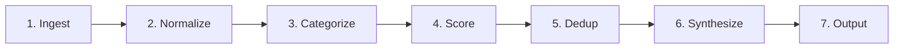
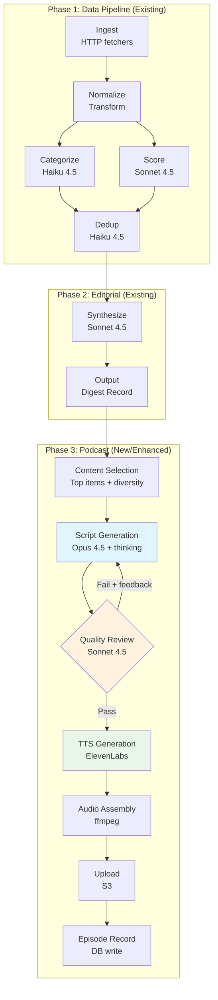
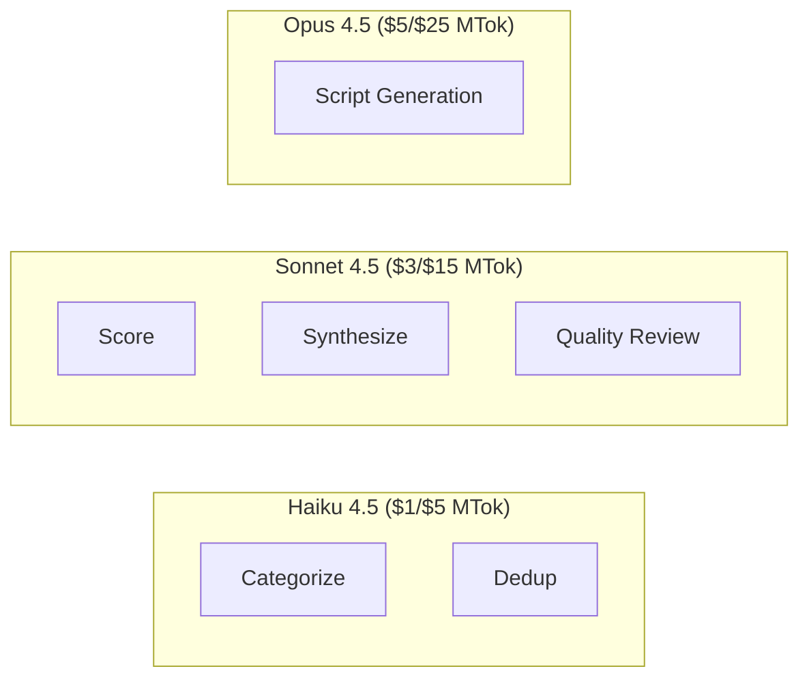
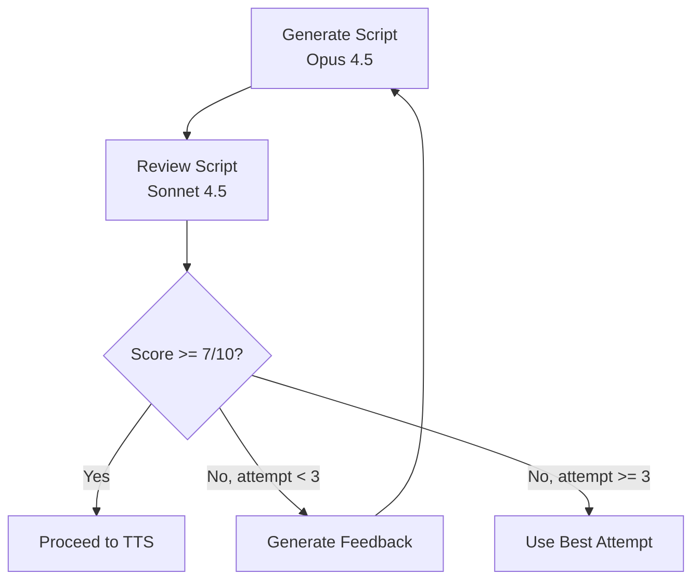
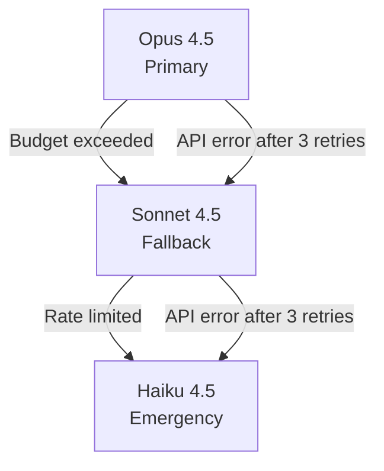
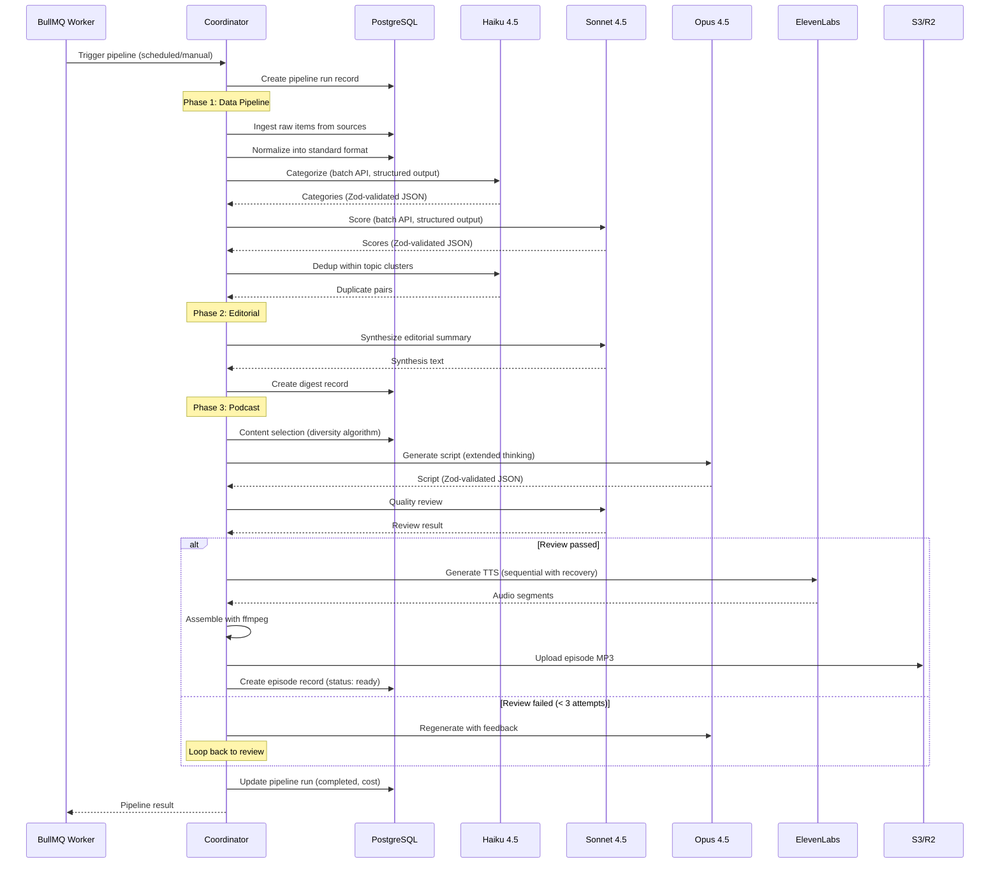

# AI Podcast Generation Pipeline -- Agent Architecture Research

> Deep research output for the AI Digest platform podcast generation system.
> Generated: 2026-02-07

---

## Table of Contents

1. [Executive Summary](#1-executive-summary)
2. [Current Architecture Analysis](#2-current-architecture-analysis)
3. [Anthropic SDK Capabilities](#3-anthropic-sdk-capabilities)
4. [Multi-Agent Pipeline Design](#4-multi-agent-pipeline-design)
5. [Podcast Script Generation Architecture](#5-podcast-script-generation-architecture)
6. [Prompt Engineering for Podcast Scripts](#6-prompt-engineering-for-podcast-scripts)
7. [Cost Analysis](#7-cost-analysis)
8. [Error Handling & Resilience](#8-error-handling--resilience)
9. [Implementation Recommendations](#9-implementation-recommendations)

---

## 1. Executive Summary

The AI Digest podcast pipeline transforms daily AI news digests into engaging two-host podcast episodes. This document provides a complete architecture for a multi-agent system that selects content, generates conversational scripts, and feeds structured output to a TTS pipeline.

### Key Architectural Decisions

| Decision | Recommendation | Rationale |
|----------|---------------|-----------|
| Model for categorization | Haiku 4.5 | Fast, cheap ($1/$5 MTok), sufficient for classification |
| Model for scoring | Sonnet 4.5 | Balanced cost/quality for nuanced judgment |
| Model for deduplication | Haiku 4.5 | Pattern matching, low complexity |
| Model for synthesis | Sonnet 4.5 | Good enough for editorial writing, 67% cheaper than Opus |
| Model for script writing | Opus 4.5 | Creative writing demands highest quality |
| Model for quality review | Sonnet 4.5 | Balanced review capability |
| Structured output method | `output_config.format` with Zod | Guaranteed JSON schema compliance, no parsing errors |
| Batch processing | Batch API for categorization/scoring | 50% cost reduction on parallelizable stages |
| Extended thinking | Adaptive thinking on Opus for script | Better creative reasoning |
| Prompt caching | System prompts cached with `cache_control` | 90% reduction on repeated system prompts |

### Estimated Per-Run Cost

| Component | Estimated Cost |
|-----------|---------------|
| Claude pipeline (all stages) | $0.08 - $0.25 |
| Claude script generation (Opus) | $0.15 - $0.40 |
| Claude quality review (Sonnet) | $0.02 - $0.05 |
| ElevenLabs TTS (15 min episode) | $1.50 - $3.00 |
| **Total per episode** | **$1.75 - $3.70** |

---

## 2. Current Architecture Analysis

### Existing Pipeline (7 Stages)

The current coordinator in `packages/agents/src/coordinator.ts` runs a linear 7-stage pipeline:



**Stage Details:**

| Stage | Model | Batch Size | JSON Parsing | Cost Tracking |
|-------|-------|-----------|--------------|---------------|
| Ingest | None (HTTP) | N/A | N/A | No |
| Normalize | None (transform) | N/A | N/A | No |
| Categorize | Sonnet 4 | 25 items | Manual `JSON.parse` with markdown stripping | Yes ($3/$15 MTok) |
| Score | Sonnet 4 | 25 items | Manual `JSON.parse` with markdown stripping | Yes ($3/$15 MTok) |
| Dedup | Haiku 4.5 | Per-topic cluster | Manual `JSON.parse` with markdown stripping | Yes ($1/$5 MTok) |
| Synthesize | Opus 4 | All top items | Text extraction only | Yes ($15/$75 MTok) |
| Output | None (DB write) | N/A | N/A | No |

### Current Podcast Pipeline

The podcast processor in `apps/worker/src/processors/podcast.ts` is a separate post-pipeline step:


### Identified Issues

1. **No structured outputs** -- All stages use manual `JSON.parse` with regex markdown stripping. This is fragile and can fail on malformed responses.
2. **Legacy model IDs** -- Using `claude-opus-4-20250514` and `claude-sonnet-4-20250514` instead of newer 4.5/4.6 models.
3. **Legacy pricing** -- Cost tracking uses Opus 4 prices ($15/$75) which are 3x the current Opus 4.5/4.6 prices ($5/$25).
4. **No prompt caching** -- System prompts are sent fresh every request, missing 90% savings on cache hits.
5. **No batch API** -- Categorization and scoring process batches sequentially; the Batch API could parallelize with 50% discount.
6. **Single-pass script generation** -- No quality review loop; script goes directly to TTS.
7. **No extended thinking** -- Creative script writing would benefit from extended thinking for better narrative structure.
8. **Sequential TTS** -- Segments are generated one at a time for cross-segment continuity, but could be parallelized per-speaker.

---

## 3. Anthropic SDK Capabilities

### 3.1 Structured Outputs (Recommended Upgrade)

Structured outputs guarantee JSON schema compliance through constrained decoding. This eliminates the current fragile `JSON.parse` + regex approach.

**TypeScript SDK with Zod:**

```typescript
import Anthropic from '@anthropic-ai/sdk';
import { z } from 'zod';
import { zodOutputFormat } from '@anthropic-ai/sdk/helpers/zod';

// Define schema with Zod
const PodcastScriptSchema = z.object({
  segments: z.array(z.object({
    order: z.number(),
    speaker: z.enum(["Host A", "Host B"]),
    text: z.string(),
    estimatedDuration: z.number(),
    segmentType: z.enum(["intro", "topic", "transition", "outro"]),
  })),
  totalEstimatedDuration: z.number(),
  topicsCovered: z.array(z.string()),
});

const client = new Anthropic();

const response = await client.messages.create({
  model: "claude-opus-4-5-20251101",
  max_tokens: 8192,
  system: PODCAST_SCRIPT_SYSTEM_PROMPT,
  messages: [{ role: "user", content: scriptPrompt }],
  output_config: {
    format: zodOutputFormat(PodcastScriptSchema),
  },
});

// Guaranteed valid JSON -- no JSON.parse errors possible
const script = JSON.parse(response.content[0].text);
```

**Key Benefits:**
- Schema compiled into grammar artifact, cached for 24 hours
- Works with Opus 4.6, Opus 4.5, Sonnet 4.5, Haiku 4.5
- Compatible with streaming, batch processing, and prompt caching
- Incompatible with citations and message prefilling

**Supported JSON Schema Features:**
- All basic types, enum, const, anyOf/allOf, $ref/$def
- String formats: date-time, date, email, uri, uuid
- `additionalProperties: false` required on all objects
- NOT supported: recursive schemas, numerical constraints (minimum/maximum), string constraints (minLength/maxLength)

### 3.2 Extended Thinking (For Script Generation)

Extended thinking gives Claude enhanced reasoning for complex creative tasks. For Opus 4.6, the recommended approach is adaptive thinking:

```typescript
// For Opus 4.6 -- adaptive thinking (recommended)
const response = await client.messages.create({
  model: "claude-opus-4-6",
  max_tokens: 16000,
  thinking: { type: "adaptive" },
  messages: [{ role: "user", content: scriptPrompt }],
  output_config: {
    format: zodOutputFormat(PodcastScriptSchema),
  },
});

// For Opus 4.5 / Sonnet 4.5 -- manual budget
const response = await client.messages.create({
  model: "claude-opus-4-5-20251101",
  max_tokens: 16000,
  thinking: {
    type: "enabled",
    budget_tokens: 10000,
  },
  messages: [{ role: "user", content: scriptPrompt }],
});
```

**Key Considerations:**
- Thinking tokens are billed at output token rates but you see only summarized thinking
- Streaming required when `max_tokens` > 21,333
- Thinking is incompatible with temperature/top_k modifications
- Grammar applies only to Claude's direct output, not thinking tags
- Budget_tokens must be less than max_tokens (unless interleaved thinking with tools)

### 3.3 Batch API (For Categorization & Scoring)

The Batch API processes up to 100,000 requests asynchronously at 50% cost reduction:

```typescript
const anthropic = new Anthropic();

// Create batch for categorization
const messageBatch = await anthropic.messages.batches.create({
  requests: uncategorizedBatches.map((batch, idx) => ({
    custom_id: `categorize-batch-${idx}`,
    params: {
      model: "claude-haiku-4-5-20251001",
      max_tokens: 4096,
      system: CATEGORIZE_SYSTEM_PROMPT,
      messages: [{ role: "user", content: buildCategorizePrompt(batch, topics) }],
      output_config: {
        format: {
          type: "json_schema",
          schema: CATEGORIZE_JSON_SCHEMA,
        },
      },
    },
  })),
});

// Poll for completion
let batch;
while (true) {
  batch = await anthropic.messages.batches.retrieve(messageBatch.id);
  if (batch.processing_status === "ended") break;
  await new Promise(resolve => setTimeout(resolve, 30_000));
}

// Stream results
for await (const result of await anthropic.messages.batches.results(messageBatch.id)) {
  if (result.result.type === "succeeded") {
    const text = result.result.message.content[0].text;
    const parsed = JSON.parse(text); // Guaranteed valid from structured outputs
    // Process results...
  }
}
```

**When to Use Batch API:**
- Categorization stage (many independent batches)
- Scoring stage (many independent batches)
- NOT for synthesis or script generation (sequential, single-request)

**Limitations:**
- Results within 24 hours (most under 1 hour)
- Max 100,000 requests or 256 MB per batch
- No streaming within batch requests
- Results available for 29 days

### 3.4 Prompt Caching (For All Stages)

Prompt caching reduces cost by 90% for repeated system prompts:

```typescript
const response = await client.messages.create({
  model: "claude-opus-4-5-20251101",
  max_tokens: 8192,
  system: [
    {
      type: "text",
      text: PODCAST_SCRIPT_SYSTEM_PROMPT,
      cache_control: { type: "ephemeral" }, // 5-minute TTL, refreshes on use
    },
  ],
  messages: [{ role: "user", content: scriptPrompt }],
});
```

**Pricing Impact:**
- Cache write: 1.25x base input price (first request)
- Cache read: 0.1x base input price (subsequent requests)
- 1-hour TTL available at 2x base input price (good for long pipeline runs)

**Applicability by Stage:**

| Stage | System Prompt Size | Cache Benefit |
|-------|-------------------|---------------|
| Categorize | ~200 tokens | Moderate (multiple batches reuse) |
| Score | ~150 tokens | Moderate (multiple batches reuse) |
| Dedup | ~150 tokens | Low (few clusters) |
| Synthesize | ~200 tokens | Low (single request) |
| Script | ~400 tokens | Low (single request) |
| Quality Review | ~300 tokens | Low (1-3 review passes) |

---

## 4. Multi-Agent Pipeline Design

### 4.1 Enhanced Pipeline Architecture



### 4.2 Model Assignment Matrix



**Rationale for each assignment:**

| Stage | Model | Why This Model |
|-------|-------|----------------|
| Categorize | Haiku 4.5 | Classification is straightforward pattern matching. Haiku achieves 90%+ of Sonnet accuracy on categorization at 3x lower cost. |
| Score | Sonnet 4.5 | Scoring requires nuanced judgment across relevance, novelty, and impact. Sonnet provides the best cost/quality balance for this. |
| Dedup | Haiku 4.5 | Duplicate detection is semantic similarity comparison. Haiku handles this well within topic clusters. |
| Synthesize | Sonnet 4.5 | Editorial synthesis benefits from strong writing but does not need Opus-level reasoning. Sonnet 4.5 at $3/$15 is 67% cheaper than Opus 4.5. |
| Script Generation | Opus 4.5 | Creative conversational writing is the hardest task. Opus produces notably more natural dialogue, better transitions, and more engaging host personalities. With the new $5/$25 pricing (down from $15/$75 on Opus 4), this is now affordable. |
| Quality Review | Sonnet 4.5 | Reviewing script quality requires good judgment but not creative generation. Sonnet is sufficient and keeps the review loop cheap. |

### 4.3 Content Selection Strategy

The content selector determines which stories from the digest make it into the podcast. This is a critical step that does not currently exist as a separate, thoughtful stage.

```typescript
interface ContentSelectionConfig {
  maxStories: number;           // Target: 5-8 stories for a 15-min episode
  minCompositeScore: number;    // Floor: 0.4 (current default)
  topicDiversityWeight: number; // 0.0-1.0, how much to penalize same-topic clustering
  recencyBoost: number;         // Boost for stories from last 24h vs older
  sourceVariety: number;        // Min unique sources represented
}
```

**Selection Algorithm:**

1. Filter to items with `compositeScore >= minScore` and `duplicateOf IS NULL`
2. Sort by composite score descending
3. Apply diversity reranking:
   - For each candidate, compute `adjustedScore = compositeScore * (1 - topicPenalty)`
   - `topicPenalty = topicDiversityWeight * (countOfSameTopicAlreadySelected / maxStories)`
4. Ensure at least `sourceVariety` distinct sources
5. Take top `maxStories` items

This ensures the podcast covers a range of topics rather than clustering on one dominant story.

### 4.4 Quality Review Loop

The quality review is a new stage that evaluates the generated script before sending it to TTS.



**Review Criteria (scored 1-10):**

| Criterion | Weight | Description |
|-----------|--------|-------------|
| Naturalness | 0.25 | Does dialogue sound like real conversation? |
| Coverage | 0.20 | Are all major stories represented? |
| Accuracy | 0.20 | Are technical details correct? |
| Engagement | 0.15 | Are there moments of genuine reaction and interest? |
| Pacing | 0.10 | Are segment durations appropriate? |
| Transitions | 0.10 | Do topic changes flow naturally? |

**Review output schema:**

```typescript
const QualityReviewSchema = z.object({
  overallScore: z.number(),        // 1-10
  naturalness: z.number(),
  coverage: z.number(),
  accuracy: z.number(),
  engagement: z.number(),
  pacing: z.number(),
  transitions: z.number(),
  passed: z.boolean(),
  feedback: z.string(),            // Specific improvement suggestions
  segmentsToRevise: z.array(z.object({
    segmentOrder: z.number(),
    issue: z.string(),
    suggestion: z.string(),
  })),
});
```

---

## 5. Podcast Script Generation Architecture

### 5.1 Script Structure

A 15-minute podcast episode follows this structure:

```
Total: ~15 minutes (900 seconds)

[INTRO]          30-60s    Host A welcomes, Host B teases top story
[SEGMENT 1]      2-3 min   Lead story (highest score)
[TRANSITION]     10-15s    Natural segue
[SEGMENT 2]      2-3 min   Second major story cluster
[TRANSITION]     10-15s    Natural segue
[SEGMENT 3]      2-3 min   Third topic area
[TRANSITION]     10-15s    Natural segue
[SEGMENT 4]      2-3 min   Emerging trend / research
[QUICK HITS]     1-2 min   Rapid-fire 2-3 smaller stories
[OUTRO]          30-60s    Key takeaways, sign-off
```

**Words-per-minute mapping:**
- Conversational speech: ~150 WPM
- 15-minute episode: ~2,250 words total
- Per segment (2.5 min avg): ~375 words
- Intro/Outro (45s avg): ~112 words each

### 5.2 Enhanced Script Output Schema

```typescript
const PodcastScriptSchema = z.object({
  metadata: z.object({
    episodeDate: z.string(),
    totalEstimatedDuration: z.number(),
    topicsCovered: z.array(z.string()),
    storyCount: z.number(),
  }),
  segments: z.array(z.object({
    order: z.number(),
    speaker: z.enum(["Host A", "Host B"]),
    text: z.string(),
    estimatedDuration: z.number(),     // seconds
    segmentType: z.enum([
      "intro",
      "topic_intro",      // Host A introduces a new topic
      "topic_analysis",   // Host B provides deeper analysis
      "topic_reaction",   // Either host reacts/adds context
      "transition",
      "quick_hit",
      "outro",
    ]),
    relatedStoryTitles: z.array(z.string()), // Which stories this references
    emotion: z.enum([
      "neutral",
      "excited",
      "thoughtful",
      "surprised",
      "concerned",
      "amused",
    ]),
  })),
});
```

**Why `emotion` field?** This feeds into ElevenLabs voice settings. The TTS pipeline can adjust stability and style parameters per-segment based on the emotional tone, producing more natural-sounding speech.

### 5.3 Voice Design

| Role | Character | Voice Style | ElevenLabs Settings |
|------|-----------|-------------|-------------------|
| Host A ("Alex") | Anchor / Interviewer | Clear, authoritative, warm. Introduces topics, asks probing questions, keeps pace. | stability: 0.55, similarity_boost: 0.80, style: 0.15 |
| Host B ("Jamie") | Analyst / Color commentator | Enthusiastic, knowledgeable, conversational. Provides context, makes connections, shares opinions. | stability: 0.45, similarity_boost: 0.75, style: 0.25 |

**Dynamic voice adjustments by emotion:**

```typescript
const emotionSettings: Record<string, Partial<VoiceSettings>> = {
  neutral:    { stability: 0.55, style: 0.10 },
  excited:    { stability: 0.40, style: 0.35 },
  thoughtful: { stability: 0.65, style: 0.05 },
  surprised:  { stability: 0.35, style: 0.30 },
  concerned:  { stability: 0.60, style: 0.15 },
  amused:     { stability: 0.40, style: 0.25 },
};
```

### 5.4 Segment Timing Budget

```typescript
interface TimingBudget {
  targetDurationMinutes: number;  // 15
  segmentBudgets: {
    intro: { min: 30, max: 60 };            // seconds
    topicSegment: { min: 120, max: 210 };   // 2-3.5 min
    transition: { min: 10, max: 20 };
    quickHits: { min: 60, max: 120 };
    outro: { min: 30, max: 60 };
  };
  maxSegments: 40;        // Safety limit
  wordsPerSecond: 2.5;    // ~150 WPM
}
```

**Duration estimation:**
Current approach: `Math.ceil(text.split(/\s+/).length / 2.5)` (from `script-parser.ts`)
This is good. Actual TTS duration varies, but 2.5 words/second is a reliable estimate for conversational English at normal speed.

---

## 6. Prompt Engineering for Podcast Scripts

### 6.1 System Prompt (Enhanced)

```typescript
export const PODCAST_SCRIPT_SYSTEM_PROMPT = `You are a world-class podcast script writer for "AI Digest Daily," an engaging AI/ML news podcast.

## Your Hosts

**Alex (Host A)** is the anchor. Alex:
- Introduces each topic clearly and concisely
- Asks probing "why does this matter?" questions
- Keeps the conversation on pace
- Summarizes key points before transitions
- Has a warm, authoritative delivery style

**Jamie (Host B)** is the analyst. Jamie:
- Provides technical context and historical perspective
- Makes connections between stories ("This reminds me of...")
- Offers informed opinions and predictions
- Uses vivid analogies to explain complex concepts
- Has an enthusiastic, knowledgeable delivery style

## Conversation Guidelines

1. **Sound natural**: Use contractions, filler words sparingly ("you know", "I mean"), incomplete thoughts that get redirected. Real conversations aren't scripted.
2. **Show genuine reactions**: "Wait, really?" / "That's actually huge" / "I didn't see that coming" / "Okay, so here's what's interesting about that..."
3. **Disagree occasionally**: Jamie and Alex don't always agree. Small, respectful disagreements make the conversation feel real.
4. **Explain for the audience**: When technical, have one host ask "Can you break that down?" and the other explain in accessible terms.
5. **Reference specifics**: Name the companies, papers, and people involved. Don't be vague.
6. **Create narrative arcs**: Each segment should have a hook, development, and payoff.
7. **Vary sentence length**: Mix short punchy reactions with longer analytical points.

## Pacing Rules

- Intro: 30-60 seconds. Alex welcomes, Jamie teases the biggest story.
- Main segments: 2-3.5 minutes each. Alternating speakers every 2-4 sentences.
- Transitions: 10-20 seconds. Natural segues, not forced.
- Quick Hits: 1-2 minutes. Rapid back-and-forth on smaller stories.
- Outro: 30-60 seconds. Key takeaways, what to watch next week.

## Output Format

Return a JSON object with metadata and an array of segments. Each segment specifies the speaker, text, estimated duration in seconds, segment type, related story titles, and emotional tone.

CRITICAL: Every segment's text must be ONLY the spoken words. No stage directions, no parentheticals, no "[laughs]" markers. The emotion field handles tone.`;
```

### 6.2 User Prompt Template (Enhanced)

```typescript
export function buildPodcastScriptPrompt(input: PodcastScriptInput): string {
  const { digestDate, synthesis, items, targetDurationMinutes } = input;

  // Group items by primary topic for the prompt
  const topicGroups: Record<string, PodcastTopicItem[]> = {};
  for (const item of items) {
    const primaryTopic = item.topics[0] ?? "General AI";
    const existing = topicGroups[primaryTopic] ?? [];
    topicGroups[primaryTopic] = [...existing, item];
  }

  // Sort topic groups by aggregate score
  const sortedTopics = Object.entries(topicGroups)
    .map(([topic, topicItems]) => ({
      topic,
      items: topicItems,
      avgScore: topicItems.reduce((sum, i) => sum + i.compositeScore, 0) / topicItems.length,
    }))
    .sort((a, b) => b.avgScore - a.avgScore);

  const topicSections = sortedTopics.map(({ topic, items: topicItems }) => {
    const itemList = topicItems
      .sort((a, b) => b.compositeScore - a.compositeScore)
      .map(i => `  - "${i.title}" [${i.source}] (score: ${i.compositeScore.toFixed(2)})\n    ${i.summary}`)
      .join("\n");
    return `### ${topic}\n${itemList}`;
  }).join("\n\n");

  return `## Episode Brief

**Date**: ${digestDate}
**Target Duration**: ${targetDurationMinutes} minutes (~${targetDurationMinutes * 150} words)
**Story Count**: ${items.length} stories across ${sortedTopics.length} topics

## Editorial Summary (for context -- do not read verbatim)
${synthesis}

## Stories by Topic (ordered by importance)
${topicSections}

## Instructions

Write a complete podcast script for a ${targetDurationMinutes}-minute episode covering these stories.

- Lead with the highest-scoring topic
- Cover at least ${Math.min(sortedTopics.length, 4)} different topics
- Include a Quick Hits section for lower-scoring but interesting stories
- Total word count should be approximately ${targetDurationMinutes * 150} words
- Ensure both hosts speak roughly equal amounts

Return the structured JSON output.`;
}
```

### 6.3 Quality Review Prompt

```typescript
export const QUALITY_REVIEW_SYSTEM_PROMPT = `You are a senior podcast producer reviewing a script for "AI Digest Daily."

Evaluate the script on these criteria (1-10 each):

1. **Naturalness**: Does the dialogue sound like a real conversation between two knowledgeable hosts? Are there natural speech patterns, reactions, and flow?
2. **Coverage**: Are the major stories from the brief adequately represented? Is anything important missing?
3. **Accuracy**: Are technical details, company names, and claims accurate based on the source material?
4. **Engagement**: Would a listener stay engaged? Are there interesting moments, surprising insights, or compelling narratives?
5. **Pacing**: Are segment durations appropriate? Is the episode neither too rushed nor too slow?
6. **Transitions**: Do topic changes flow naturally? Do the hosts acknowledge the shift?

A passing score requires an overall weighted average >= 7.0.

If the script does not pass, provide specific, actionable feedback for each segment that needs revision. Reference segment numbers directly.`;
```

### 6.4 Prompt Engineering Best Practices Applied

| Technique | Application |
|-----------|-------------|
| **Persona definition** | Two distinct host characters with defined traits and speaking styles |
| **Structured output instruction** | JSON schema provided with clear field descriptions |
| **Negative constraints** | "No stage directions, no parentheticals, no [laughs] markers" |
| **Quantity guidance** | Word count targets, duration ranges, segment counts |
| **Quality anchors** | "Sound natural: use contractions, filler words sparingly" |
| **Context separation** | Editorial summary marked "do not read verbatim" |
| **Specificity demands** | "Name the companies, papers, and people involved" |
| **Emotional range** | Emotion enum drives varied delivery |

---

## 7. Cost Analysis

### 7.1 Model Pricing (Current, February 2026)

| Model | Input (MTok) | Output (MTok) | Batch Input | Batch Output | Cache Read |
|-------|-------------|---------------|-------------|--------------|------------|
| Opus 4.6 | $5.00 | $25.00 | $2.50 | $12.50 | $0.50 |
| Opus 4.5 | $5.00 | $25.00 | $2.50 | $12.50 | $0.50 |
| Sonnet 4.5 | $3.00 | $15.00 | $1.50 | $7.50 | $0.30 |
| Haiku 4.5 | $1.00 | $5.00 | $0.50 | $2.50 | $0.10 |

**Note:** The current codebase uses Opus 4 pricing ($15/$75 MTok) -- updating to Opus 4.5/4.6 ($5/$25 MTok) provides a 67% cost reduction for the same capability.

### 7.2 Per-Stage Token Estimates

Assuming 50-80 ingested items, 15-25 top items in digest, 5-8 stories in podcast:

| Stage | Model | Input Tokens | Output Tokens | Cost (Standard) | Cost (Batch) |
|-------|-------|-------------|---------------|-----------------|--------------|
| Categorize (3 batches) | Haiku 4.5 | ~6,000 | ~2,000 | $0.016 | $0.008 |
| Score (3 batches) | Sonnet 4.5 | ~6,000 | ~2,000 | $0.048 | $0.024 |
| Dedup (5 clusters) | Haiku 4.5 | ~4,000 | ~1,500 | $0.012 | $0.006 |
| Synthesize | Sonnet 4.5 | ~3,000 | ~1,500 | $0.032 | N/A |
| Script Generation | Opus 4.5 | ~4,000 | ~4,000 | $0.120 | N/A |
| Quality Review | Sonnet 4.5 | ~5,000 | ~1,000 | $0.030 | N/A |
| **Claude Total** | | ~28,000 | ~12,000 | **$0.258** | **$0.220*** |

*Batch pricing applied only to categorize + score + dedup stages.

**With prompt caching (cache hits on subsequent batches):**
- Categorize system prompt cached: saves ~$0.004
- Score system prompt cached: saves ~$0.006
- **Practical savings from caching: ~5-10% on multi-batch stages**

### 7.3 Extended Thinking Cost

When using extended thinking for script generation:
- Thinking tokens are billed as output tokens
- Budget of 10,000 thinking tokens on Opus 4.5: +$0.25 in the worst case
- Typically uses 3,000-6,000 thinking tokens: +$0.075-$0.15
- **Script generation with thinking: ~$0.20-$0.27 total**

### 7.4 Quality Review Loop Cost

| Scenario | Review Passes | Additional Script Gen | Total Review Cost |
|----------|---------------|----------------------|-------------------|
| Pass first time | 1 | 0 | $0.03 |
| Fail once, pass second | 2 | 1 | $0.18 |
| Fail twice, use best | 3 | 2 | $0.33 |

**Expected average (80% first-pass rate): ~$0.07**

### 7.5 TTS Cost (ElevenLabs)

| Parameter | Value |
|-----------|-------|
| Episode duration | 15 minutes |
| Total words | ~2,250 |
| Total characters | ~13,500 (avg 6 chars/word) |
| Model | Multilingual v2 |
| Credit cost | 1 credit per character |
| Scale plan | $330/month for 2M credits |
| Per-character cost | $0.000165 |
| **Per-episode TTS cost** | **~$2.23** |

**Note:** At $330/month for 2M credits, you can generate ~148 episodes/month. For a daily podcast (30 episodes/month), TTS cost is effectively $330/30 = $11/episode if dedicated, or proportional if shared.

On a pay-as-you-go basis at Scale plan rates: ~$2.23 per 15-minute episode.

### 7.6 Total Cost Summary

| Component | Low Estimate | High Estimate | Average |
|-----------|-------------|---------------|---------|
| Claude stages (pipeline) | $0.08 | $0.25 | $0.15 |
| Claude script gen (Opus + thinking) | $0.15 | $0.40 | $0.25 |
| Claude quality review (1.2 passes avg) | $0.03 | $0.15 | $0.07 |
| ElevenLabs TTS | $1.50 | $3.00 | $2.23 |
| S3 storage + transfer | $0.01 | $0.03 | $0.02 |
| **Total per episode** | **$1.77** | **$3.83** | **$2.72** |
| **Monthly (30 episodes)** | **$53** | **$115** | **$82** |

### 7.7 Cost Optimization Strategies

1. **Upgrade model IDs** -- Switch from Opus 4 ($15/$75) to Opus 4.5 ($5/$25) = 67% savings on synthesis + script stages
2. **Batch API for categorize + score** -- 50% savings on those stages
3. **Prompt caching** -- 90% savings on cache hits for multi-batch stages
4. **Downgrade synthesis to Sonnet** -- Current code uses Opus for synthesis; Sonnet 4.5 produces comparable editorial quality at 40% lower cost
5. **Budget tracking with model fallback** -- If budget exceeded, fall back from Opus to Sonnet for script generation

---

## 8. Error Handling & Resilience

### 8.1 Retry Strategy

```typescript
interface RetryConfig {
  maxRetries: number;
  baseDelayMs: number;
  maxDelayMs: number;
  backoffMultiplier: number;
  retryableErrors: string[];
}

const DEFAULT_RETRY: RetryConfig = {
  maxRetries: 3,
  baseDelayMs: 1000,
  maxDelayMs: 30000,
  backoffMultiplier: 2,
  retryableErrors: [
    "overloaded_error",    // 529: API overloaded
    "api_error",           // 500: Internal server error
    "rate_limit_error",    // 429: Rate limited
    "timeout",             // Network timeout
  ],
};

async function callWithRetry<T>(
  fn: () => Promise<T>,
  config: RetryConfig = DEFAULT_RETRY
): Promise<T> {
  let lastError: unknown;
  for (let attempt = 0; attempt <= config.maxRetries; attempt++) {
    try {
      return await fn();
    } catch (error) {
      lastError = error;
      const isRetryable = error instanceof Anthropic.APIError
        && config.retryableErrors.includes(error.error?.type ?? "");
      if (!isRetryable || attempt === config.maxRetries) throw error;

      const delay = Math.min(
        config.baseDelayMs * Math.pow(config.backoffMultiplier, attempt),
        config.maxDelayMs
      );
      await new Promise(resolve => setTimeout(resolve, delay));
    }
  }
  throw lastError;
}
```

### 8.2 Model Fallback Chain



```typescript
const MODEL_FALLBACK_CHAIN: Record<string, string[]> = {
  "claude-opus-4-5-20251101": [
    "claude-opus-4-5-20251101",
    "claude-sonnet-4-5-20250929",
    "claude-haiku-4-5-20251001",
  ],
  "claude-sonnet-4-5-20250929": [
    "claude-sonnet-4-5-20250929",
    "claude-haiku-4-5-20251001",
  ],
  "claude-haiku-4-5-20251001": [
    "claude-haiku-4-5-20251001",
  ],
};

async function callWithFallback(
  preferredModel: string,
  params: Omit<MessageCreateParams, "model">,
  budget: BudgetTracker
): Promise<Message> {
  const chain = MODEL_FALLBACK_CHAIN[preferredModel] ?? [preferredModel];

  for (const model of chain) {
    const estimatedCost = estimateCost(model, params);
    if (!budget.canAfford(estimatedCost) && model === chain[0]) {
      continue; // Try cheaper fallback
    }
    try {
      return await callWithRetry(() =>
        client.messages.create({ ...params, model })
      );
    } catch {
      continue; // Try next fallback
    }
  }

  throw new Error(`All models in fallback chain exhausted for ${preferredModel}`);
}
```

### 8.3 Partial Pipeline Completion

The pipeline should save progress between stages so that a failure in stage N does not require re-running stages 1 through N-1.

```typescript
interface PipelineCheckpoint {
  pipelineRunId: string;
  completedStages: StageName[];
  lastCompletedAt: Date;
  stageOutputs: Record<StageName, unknown>;
}

async function runPipelineWithCheckpoints(
  db: Database,
  config: DigestConfig,
  existingCheckpoint?: PipelineCheckpoint
): Promise<PipelineResult> {
  const checkpoint: PipelineCheckpoint = existingCheckpoint ?? {
    pipelineRunId: "",
    completedStages: [],
    lastCompletedAt: new Date(),
    stageOutputs: {},
  };

  const stages: StageName[] = [
    "ingest", "normalize", "categorize", "score",
    "dedup", "synthesize", "output", "podcast",
  ];

  for (const stage of stages) {
    if (checkpoint.completedStages.includes(stage)) {
      console.log(`[Checkpoint] Skipping completed stage: ${stage}`);
      continue;
    }

    try {
      const result = await runStage(stage, db, config, checkpoint);
      checkpoint.completedStages = [...checkpoint.completedStages, stage];
      checkpoint.stageOutputs = { ...checkpoint.stageOutputs, [stage]: result };
      checkpoint.lastCompletedAt = new Date();
      await saveCheckpoint(db, checkpoint);
    } catch (error) {
      console.error(`[Pipeline] Stage ${stage} failed:`, error);
      await saveCheckpoint(db, checkpoint); // Save progress even on failure
      throw error; // Let BullMQ handle retry
    }
  }

  return buildResult(checkpoint);
}
```

### 8.4 Rate Limit Handling

```typescript
import Anthropic from "@anthropic-ai/sdk";

// The SDK has built-in retry for 429 errors, but we should also
// implement client-side rate limiting for batch operations
class RateLimiter {
  private readonly requestsPerMinute: number;
  private readonly timestamps: number[] = [];

  constructor(requestsPerMinute: number) {
    this.requestsPerMinute = requestsPerMinute;
  }

  async waitForSlot(): Promise<void> {
    const now = Date.now();
    // Remove timestamps older than 1 minute
    const recentTimestamps = this.timestamps.filter(
      ts => now - ts < 60_000
    );
    // Replace internal state immutably (conceptual -- class has mutable state by nature)
    this.timestamps.length = 0;
    this.timestamps.push(...recentTimestamps);

    if (this.timestamps.length >= this.requestsPerMinute) {
      const oldestInWindow = this.timestamps[0] ?? now;
      const waitMs = 60_000 - (now - oldestInWindow) + 100;
      await new Promise(resolve => setTimeout(resolve, waitMs));
    }

    this.timestamps.push(Date.now());
  }
}

// Usage in batch processing
const limiter = new RateLimiter(50); // 50 RPM for Tier 1

for (const batch of batches) {
  await limiter.waitForSlot();
  await processBatch(batch);
}
```

### 8.5 TTS Error Recovery

```typescript
async function generateTTSWithRecovery(
  segments: ScriptSegment[],
  voiceConfig: VoiceConfig
): Promise<TTSResult[]> {
  const results: TTSResult[] = [];
  const failed: { segment: ScriptSegment; error: unknown }[] = [];

  for (const segment of segments) {
    try {
      const result = await generateSegmentAudioWithRetry(segment, voiceConfig);
      results.push(result);
    } catch (error) {
      console.error(`TTS failed for segment ${segment.order}:`, error);
      failed.push({ segment, error });
    }
  }

  // Retry failed segments once more with exponential backoff
  for (const { segment } of failed) {
    await new Promise(resolve => setTimeout(resolve, 5000));
    try {
      const result = await generateSegmentAudioWithRetry(segment, voiceConfig);
      results.push(result);
    } catch (error) {
      // Generate silence placeholder rather than failing entire episode
      console.error(`TTS retry failed for segment ${segment.order}, using silence`);
      results.push(createSilenceSegment(segment));
    }
  }

  return [...results].sort((a, b) => a.order - b.order);
}
```

---

## 9. Implementation Recommendations

### 9.1 Migration Priority (Ordered by Impact)

| Priority | Change | Effort | Impact | Files Affected |
|----------|--------|--------|--------|----------------|
| **P0** | Update model IDs to 4.5 | Low | 67% cost reduction on Opus stages | `stages/*.ts`, `podcast.ts` |
| **P0** | Update cost tracking formulas | Low | Accurate budget tracking | `stages/*.ts`, `podcast.ts` |
| **P1** | Add structured outputs (Zod) | Medium | Eliminate JSON parse failures | All stages, new `schemas/` dir |
| **P1** | Add prompt caching | Low | ~10% cost reduction | All stages (add `cache_control`) |
| **P2** | Add quality review loop | Medium | Better script quality | New `stages/quality-review.ts` |
| **P2** | Enhanced content selection | Medium | Better story diversity | New `stages/content-select.ts` |
| **P3** | Batch API for categorize/score | High | 50% cost on batch stages | `stages/categorize.ts`, `stages/score.ts` |
| **P3** | Extended thinking for scripts | Low | Better creative output | `podcast.ts` |
| **P3** | Model fallback chain | Medium | Resilience to failures | New `model-router.ts` |
| **P4** | Pipeline checkpointing | High | Resume from failures | `coordinator.ts`, new checkpoint system |
| **P4** | Emotion-based TTS settings | Low | More natural audio | `tts.ts`, voice config |

### 9.2 File Structure (New/Modified)

```
packages/agents/src/
  schemas/                          # NEW: Zod schemas for all stages
    categorize.schema.ts
    score.schema.ts
    dedup.schema.ts
    synthesize.schema.ts
    podcast-script.schema.ts
    quality-review.schema.ts
  stages/
    categorize.ts                   # MODIFIED: structured outputs, batch API
    score.ts                        # MODIFIED: structured outputs, batch API
    dedup.ts                        # MODIFIED: structured outputs
    synthesize.ts                   # MODIFIED: structured outputs, model upgrade
    content-select.ts               # NEW: diversity-aware content selection
    quality-review.ts               # NEW: script quality review loop
  prompts/
    podcast-script.ts               # MODIFIED: enhanced prompts
    quality-review.ts               # NEW: review prompts
  model-router.ts                   # NEW: fallback chain + budget-aware routing
  rate-limiter.ts                   # NEW: client-side rate limiting
  coordinator.ts                    # MODIFIED: checkpointing, podcast stage

apps/worker/src/processors/
  podcast.ts                        # MODIFIED: review loop, content selection

packages/podcast/src/
  tts.ts                            # MODIFIED: emotion-based settings, recovery
```

### 9.3 Recommended Model IDs

| Purpose | Model ID | Notes |
|---------|----------|-------|
| Categorization | `claude-haiku-4-5-20251001` | Cheapest, sufficient for classification |
| Scoring | `claude-sonnet-4-5-20250929` | Balanced for nuanced judgment |
| Deduplication | `claude-haiku-4-5-20251001` | Cheapest, pattern matching |
| Synthesis | `claude-sonnet-4-5-20250929` | Downgrade from Opus 4, comparable quality |
| Script Generation | `claude-opus-4-5-20251101` | Highest quality creative writing |
| Quality Review | `claude-sonnet-4-5-20250929` | Sufficient for evaluation |

### 9.4 SDK Dependency Update

The `@anthropic-ai/sdk` package should be on version >=0.35.0 for structured outputs GA support (no beta header needed). Verify the `zod` peer dependency is installed for `zodOutputFormat` helper.

```json
{
  "dependencies": {
    "@anthropic-ai/sdk": "^0.35.0",
    "zod": "^3.23.0"
  }
}
```

### 9.5 End-to-End Flow (Recommended)



---

## References

- [Anthropic Structured Outputs Documentation](https://platform.claude.com/docs/en/build-with-claude/structured-outputs)
- [Anthropic Pricing (February 2026)](https://platform.claude.com/docs/en/about-claude/pricing)
- [Anthropic Extended Thinking](https://platform.claude.com/docs/en/build-with-claude/extended-thinking)
- [Anthropic Batch Processing](https://platform.claude.com/docs/en/build-with-claude/batch-processing)
- [Anthropic Prompt Caching](https://platform.claude.com/docs/en/build-with-claude/prompt-caching)
- [ElevenLabs API Pricing](https://elevenlabs.io/pricing/api)
- [ElevenLabs Pricing Breakdown (2026)](https://flexprice.io/blog/elevenlabs-pricing-breakdown)
- [Microsoft: Engineering a Local-First Agentic Podcast Studio](https://techcommunity.microsoft.com/blog/azuredevcommunityblog/engineering-a-local-first-agentic-podcast-studio-a-deep-dive-into-multi-agent-or/4482839)
- [Multi-Agent Systems Guide 2026](https://dev.to/eira-wexford/how-to-build-multi-agent-systems-complete-2026-guide-1io6)
- [CrewAI Podcast Generation with Multi-Agent](https://www.datacamp.com/webinars/creating-a-podcast-generation-ai-multi-agent-with-crewai)
