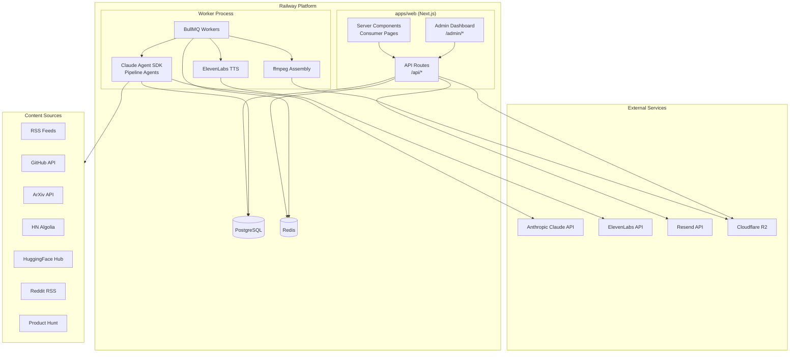
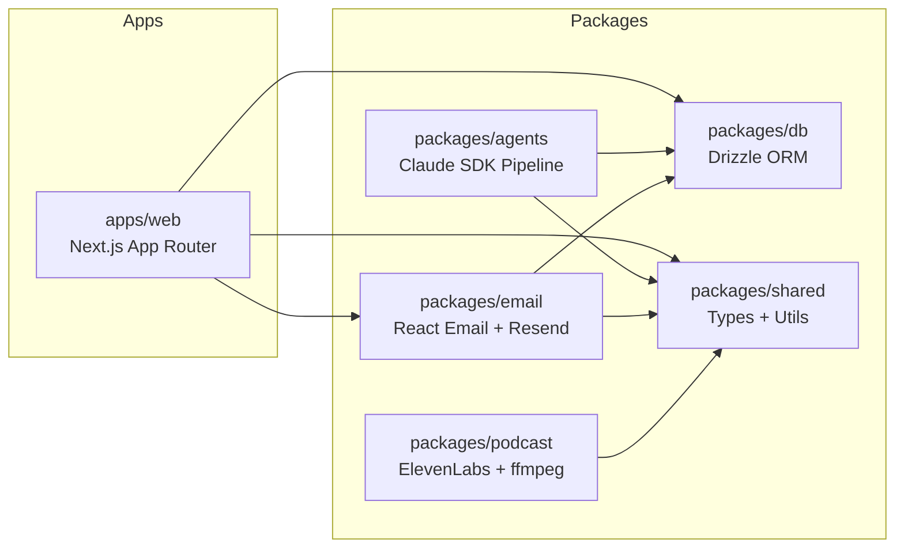
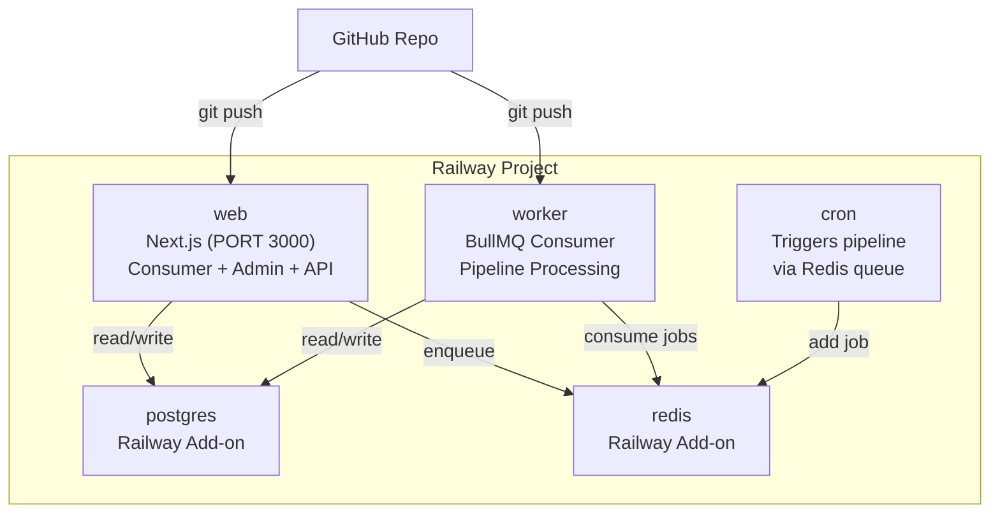
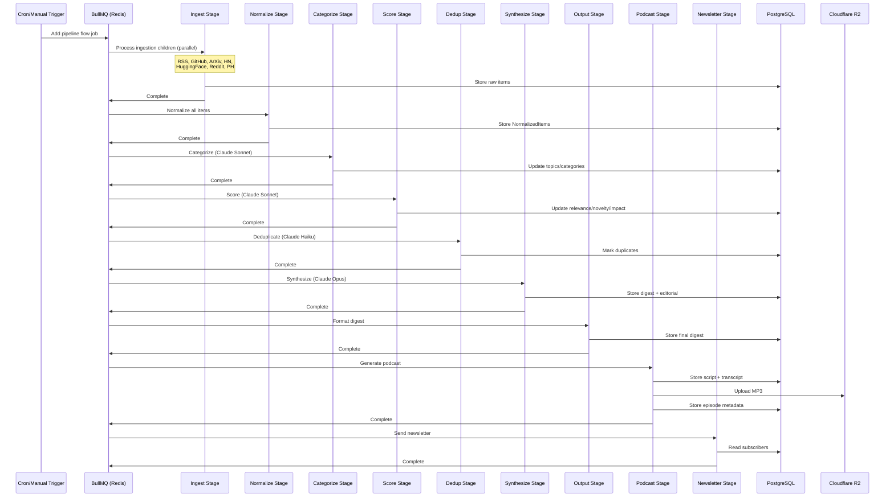
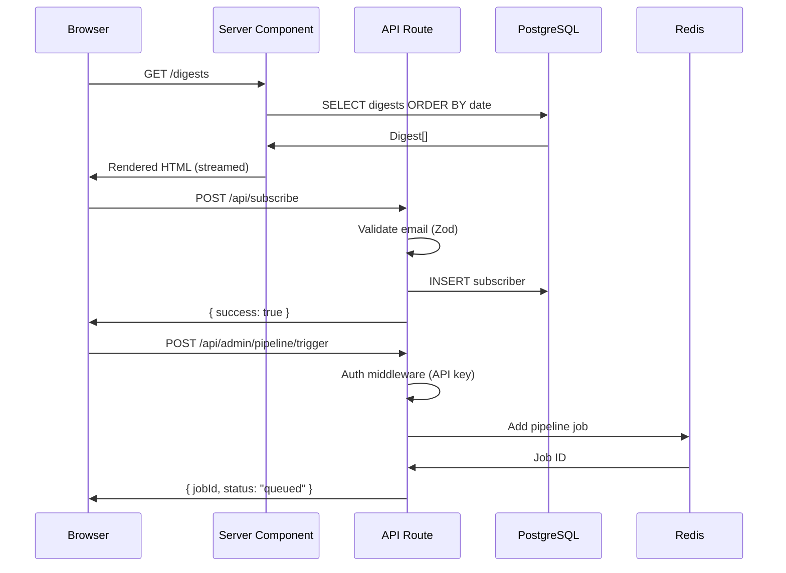
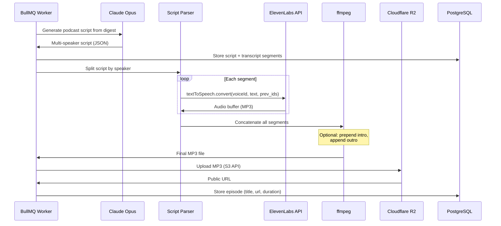
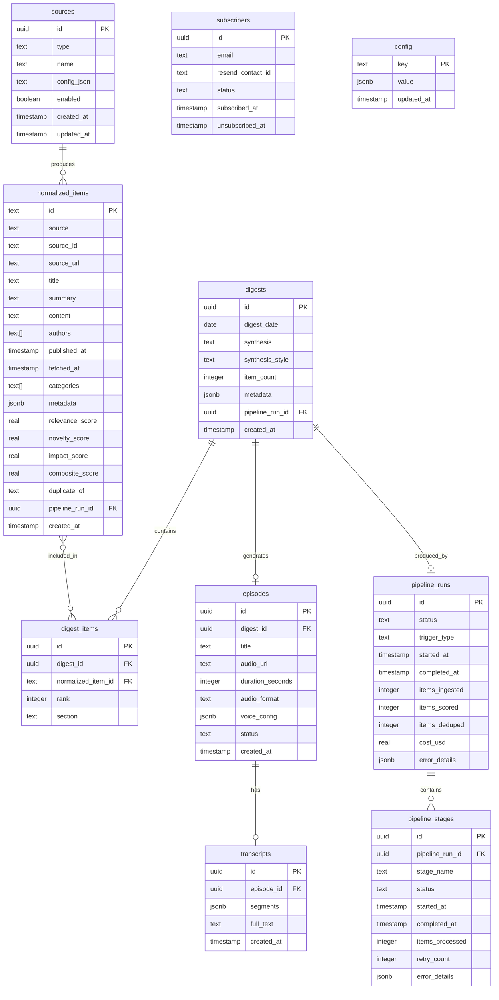

# Design: AI Digest Full-Stack Platform

## Overview

Monorepo monolith built with Next.js App Router, Turborepo packages (agents, db, email, podcast, shared), BullMQ pipeline worker, and Railway deployment. The pipeline ingests from 7 sources, analyzes via Claude Agent SDK (Haiku/Sonnet/Opus routing), generates podcasts via ElevenLabs TTS + ffmpeg, delivers cyberpunk newsletters via Resend, and serves a dark-themed web app with persistent audio player.

## Design Inputs

### Interview Responses

| Question | Answer |
|----------|--------|
| Architecture style | Monorepo monolith -- single Next.js app with shared Turborepo packages |
| Technology constraints | None -- use research-recommended stack |
| Integration approach | Minimal -- greenfield, only external APIs |
| Primary users | Both developer/admin and consumer |
| Priority tradeoffs | Feature completeness -- all P0 items ship together |
| Success criteria | All planned features functional as specified |

### Key Research Findings Informing Design

- Claude Agent SDK supports per-agent model selection + `maxBudgetUsd` cost caps
- ElevenLabs requires build-your-own podcast: script -> split -> TTS -> ffmpeg concat
- Resend + React Email for newsletter; off-black/off-white to avoid Gmail inversion
- BullMQ flows for resumable pipeline stages with per-stage retry
- Railway for persistent containers + built-in Postgres/Redis
- Cloudflare R2 zero egress fees for audio streaming
- Zustand for cross-page audio player state
- Web-only for v1 (no native mobile)

---

## Architecture

### High-Level System Architecture



### Turborepo Package Structure



### Railway Deployment Architecture



---

## Data Flow

### Pipeline Data Flow



### Web App Request Flow



### Audio Generation Flow



---

## Database Schema

### Entity Relationship



### Drizzle Schema (packages/db/src/schema/)

**`sources.ts`**
```typescript
import { pgTable, uuid, text, boolean, timestamp, jsonb } from "drizzle-orm/pg-core";

export const sources = pgTable("sources", {
  id: uuid("id").defaultRandom().primaryKey(),
  type: text("type").notNull(), // "rss" | "github" | "arxiv" | "hackernews" | "huggingface" | "reddit" | "producthunt"
  name: text("name").notNull(),
  config: jsonb("config").notNull().$type<SourceConfig>(),
  enabled: boolean("enabled").default(true).notNull(),
  createdAt: timestamp("created_at").defaultNow().notNull(),
  updatedAt: timestamp("updated_at").defaultNow().notNull(),
});
```

**`normalized-items.ts`**
```typescript
import { pgTable, text, timestamp, jsonb, real, uuid, index } from "drizzle-orm/pg-core";

export const normalizedItems = pgTable("normalized_items", {
  id: text("id").primaryKey(), // deterministic hash: source + sourceId
  source: text("source").notNull(),
  sourceId: text("source_id").notNull(),
  sourceUrl: text("source_url").notNull(),
  title: text("title").notNull(),
  summary: text("summary").notNull(),
  content: text("content"),
  authors: text("authors").array().notNull().default([]),
  publishedAt: timestamp("published_at").notNull(),
  fetchedAt: timestamp("fetched_at").defaultNow().notNull(),
  categories: text("categories").array().notNull().default([]),
  metadata: jsonb("metadata").$type<Record<string, unknown>>().default({}),
  relevanceScore: real("relevance_score"),
  noveltyScore: real("novelty_score"),
  impactScore: real("impact_score"),
  compositeScore: real("composite_score"),
  duplicateOf: text("duplicate_of"),
  pipelineRunId: uuid("pipeline_run_id"),
  createdAt: timestamp("created_at").defaultNow().notNull(),
}, (table) => [
  index("idx_items_composite_score").on(table.compositeScore),
  index("idx_items_source").on(table.source),
  index("idx_items_published").on(table.publishedAt),
  index("idx_items_pipeline_run").on(table.pipelineRunId),
]);
```

**`digests.ts`**
```typescript
export const digests = pgTable("digests", {
  id: uuid("id").defaultRandom().primaryKey(),
  digestDate: date("digest_date").notNull().unique(),
  synthesis: text("synthesis").notNull(),
  synthesisStyle: text("synthesis_style").notNull(), // "brief" | "detailed" | "editorial"
  itemCount: integer("item_count").notNull(),
  metadata: jsonb("metadata").$type<DigestMetadata>().default({}),
  pipelineRunId: uuid("pipeline_run_id"),
  createdAt: timestamp("created_at").defaultNow().notNull(),
});

export const digestItems = pgTable("digest_items", {
  id: uuid("id").defaultRandom().primaryKey(),
  digestId: uuid("digest_id").notNull().references(() => digests.id),
  normalizedItemId: text("normalized_item_id").notNull().references(() => normalizedItems.id),
  rank: integer("rank").notNull(),
  section: text("section").notNull(), // topic section name
}, (table) => [
  index("idx_digest_items_digest").on(table.digestId),
]);
```

**`episodes.ts`**
```typescript
export const episodes = pgTable("episodes", {
  id: uuid("id").defaultRandom().primaryKey(),
  digestId: uuid("digest_id").notNull().references(() => digests.id),
  title: text("title").notNull(),
  audioUrl: text("audio_url"),
  durationSeconds: integer("duration_seconds"),
  audioFormat: text("audio_format").default("mp3_44100_128"),
  voiceConfig: jsonb("voice_config").$type<VoiceConfig>(),
  status: text("status").notNull().default("pending"), // "pending" | "generating" | "ready" | "failed"
  createdAt: timestamp("created_at").defaultNow().notNull(),
});

export const transcripts = pgTable("transcripts", {
  id: uuid("id").defaultRandom().primaryKey(),
  episodeId: uuid("episode_id").notNull().references(() => episodes.id).unique(),
  segments: jsonb("segments").notNull().$type<TranscriptSegment[]>(),
  fullText: text("full_text").notNull(),
  createdAt: timestamp("created_at").defaultNow().notNull(),
});
```

**`subscribers.ts`**
```typescript
export const subscribers = pgTable("subscribers", {
  id: uuid("id").defaultRandom().primaryKey(),
  email: text("email").notNull().unique(),
  resendContactId: text("resend_contact_id"),
  status: text("status").notNull().default("active"), // "active" | "unsubscribed" | "bounced"
  subscribedAt: timestamp("subscribed_at").defaultNow().notNull(),
  unsubscribedAt: timestamp("unsubscribed_at"),
});
```

**`pipeline.ts`**
```typescript
export const pipelineRuns = pgTable("pipeline_runs", {
  id: uuid("id").defaultRandom().primaryKey(),
  status: text("status").notNull().default("running"), // "running" | "completed" | "failed" | "partial"
  triggerType: text("trigger_type").notNull(), // "scheduled" | "manual"
  startedAt: timestamp("started_at").defaultNow().notNull(),
  completedAt: timestamp("completed_at"),
  itemsIngested: integer("items_ingested").default(0),
  itemsScored: integer("items_scored").default(0),
  itemsDeduped: integer("items_deduped").default(0),
  costUsd: real("cost_usd").default(0),
  errorDetails: jsonb("error_details"),
});

export const pipelineStages = pgTable("pipeline_stages", {
  id: uuid("id").defaultRandom().primaryKey(),
  pipelineRunId: uuid("pipeline_run_id").notNull().references(() => pipelineRuns.id),
  stageName: text("stage_name").notNull(), // "ingest" | "normalize" | "categorize" | "score" | "dedup" | "synthesize" | "output" | "podcast" | "newsletter"
  status: text("status").notNull().default("pending"),
  startedAt: timestamp("started_at"),
  completedAt: timestamp("completed_at"),
  itemsProcessed: integer("items_processed").default(0),
  retryCount: integer("retry_count").default(0),
  errorDetails: jsonb("error_details"),
}, (table) => [
  index("idx_stages_run").on(table.pipelineRunId),
]);
```

**`config.ts`**
```typescript
export const config = pgTable("config", {
  key: text("key").primaryKey(), // "digest", "pipeline", "podcast", "schedule"
  value: jsonb("value").notNull(),
  updatedAt: timestamp("updated_at").defaultNow().notNull(),
});
```

### Full-Text Search

```sql
-- Migration: add tsvector columns for search
ALTER TABLE normalized_items ADD COLUMN search_vector tsvector
  GENERATED ALWAYS AS (
    setweight(to_tsvector('english', coalesce(title, '')), 'A') ||
    setweight(to_tsvector('english', coalesce(summary, '')), 'B')
  ) STORED;

CREATE INDEX idx_items_search ON normalized_items USING GIN (search_vector);

ALTER TABLE transcripts ADD COLUMN search_vector tsvector
  GENERATED ALWAYS AS (
    to_tsvector('english', coalesce(full_text, ''))
  ) STORED;

CREATE INDEX idx_transcripts_search ON transcripts USING GIN (search_vector);
```

---

## Package Design

### packages/shared

**Purpose**: TypeScript types, utilities, and constants shared across all packages.

```typescript
// types/normalized-item.ts
export interface NormalizedItem {
  id: string;
  source: SourceType;
  sourceId: string;
  sourceUrl: string;
  title: string;
  summary: string;
  content?: string;
  authors: string[];
  publishedAt: Date;
  fetchedAt: Date;
  categories: string[];
  metadata: Record<string, unknown>;
  relevanceScore?: number;
  noveltyScore?: number;
  impactScore?: number;
  compositeScore?: number;
  duplicateOf?: string | null;
}

export type SourceType = "rss" | "github" | "arxiv" | "hackernews" | "huggingface" | "reddit" | "producthunt";

// types/digest.ts
export interface Digest {
  id: string;
  digestDate: string; // ISO date
  synthesis: string;
  synthesisStyle: SynthesisStyle;
  itemCount: number;
  items: DigestItem[];
  metadata: DigestMetadata;
}

export interface DigestItem {
  id: string;
  normalizedItemId: string;
  rank: number;
  section: string;
  item: NormalizedItem;
}

export interface DigestMetadata {
  topTopics: string[];
  sourceBreakdown: Record<SourceType, number>;
  dateRange: { from: string; to: string };
}

export type SynthesisStyle = "brief" | "detailed" | "editorial";

// types/config.ts
export interface DigestConfig {
  topics: TopicConfig[];
  scoring: ScoringConfig;
  synthesis: SynthesisConfig;
  pipeline: PipelineConfig;
}

export interface TopicConfig {
  name: string;
  keywords: string[];
  weight: number;
}

export interface ScoringConfig {
  noveltyWeight: number;
  impactWeight: number;
  relevanceWeight: number;
  minScore: number;
}

export interface SynthesisConfig {
  maxItems: number;
  style: SynthesisStyle;
}

export interface PipelineConfig {
  maxBudgetUsd: number;
  schedule: string; // cron expression
  enablePodcast: boolean;
  enableNewsletter: boolean;
}

// types/episode.ts
export interface Episode {
  id: string;
  digestId: string;
  title: string;
  audioUrl: string | null;
  durationSeconds: number | null;
  audioFormat: string;
  status: "pending" | "generating" | "ready" | "failed";
  createdAt: string;
}

export interface TranscriptSegment {
  speaker: string;
  text: string;
  startTime: number; // seconds
  endTime: number;   // seconds
}

export interface Transcript {
  id: string;
  episodeId: string;
  segments: TranscriptSegment[];
  fullText: string;
}

// types/pipeline.ts
export interface PipelineRun {
  id: string;
  status: "running" | "completed" | "failed" | "partial";
  triggerType: "scheduled" | "manual";
  startedAt: string;
  completedAt: string | null;
  itemsIngested: number;
  itemsScored: number;
  itemsDeduped: number;
  costUsd: number;
  stages: PipelineStage[];
}

export type StageName = "ingest" | "normalize" | "categorize" | "score" | "dedup" | "synthesize" | "output" | "podcast" | "newsletter";

export interface PipelineStage {
  id: string;
  stageName: StageName;
  status: "pending" | "running" | "completed" | "failed" | "skipped";
  startedAt: string | null;
  completedAt: string | null;
  itemsProcessed: number;
  retryCount: number;
  errorDetails: unknown | null;
}

// types/subscriber.ts
export interface Subscriber {
  id: string;
  email: string;
  status: "active" | "unsubscribed" | "bounced";
  subscribedAt: string;
}

// types/source-config.ts
export interface SourceConfig {
  rss?: { url: string; ttlMinutes?: number };
  github?: { query: string; minStars?: number; createdAfterDays?: number };
  arxiv?: { categories: string[]; maxResults?: number };
  hackernews?: { keywords: string[]; minPoints?: number };
  huggingface?: { tasks?: string[]; minDownloads?: number };
  reddit?: { subreddits: string[] };
  producthunt?: { topic?: string };
}

// types/voice.ts
export interface VoiceConfig {
  speakers: SpeakerVoice[];
  audioFormat: string;
  targetDurationMinutes: number;
}

export interface SpeakerVoice {
  role: string; // "Host A", "Host B"
  voiceId: string;
  settings: {
    stability: number;
    similarityBoost: number;
    speed: number;
    style: number;
  };
}

// types/api.ts
export interface ApiResponse<T> {
  success: boolean;
  data?: T;
  error?: string;
  meta?: {
    total: number;
    page: number;
    limit: number;
  };
}

// utils/hash.ts
import { createHash } from "crypto";
export function deterministicId(source: string, sourceId: string): string {
  return createHash("sha256").update(`${source}:${sourceId}`).digest("hex").slice(0, 32);
}

// utils/date.ts
export function formatDigestDate(date: Date): string {
  return date.toISOString().split("T")[0];
}

export function isWithinHours(date: Date, hours: number): boolean {
  return Date.now() - date.getTime() < hours * 60 * 60 * 1000;
}
```

### packages/db

**Purpose**: Drizzle ORM schemas, migrations, database connection, and query helpers.

```
packages/db/
  src/
    schema/
      sources.ts
      normalized-items.ts
      digests.ts
      episodes.ts
      subscribers.ts
      pipeline.ts
      config.ts
      index.ts           # Re-exports all schemas
    migrations/           # Generated by drizzle-kit
    client.ts             # Database connection (drizzle + postgres.js)
    queries/
      digests.ts          # Digest-specific queries
      items.ts            # NormalizedItem queries
      episodes.ts         # Episode queries
      subscribers.ts      # Subscriber queries
      pipeline.ts         # Pipeline run queries
      config.ts           # Config read/write
      search.ts           # Full-text search queries
    index.ts              # Re-exports client + schemas + queries
  drizzle.config.ts       # drizzle-kit config
  package.json
  tsconfig.json
```

**`client.ts`**
```typescript
import { drizzle } from "drizzle-orm/postgres-js";
import postgres from "postgres";
import * as schema from "./schema";

const connectionString = process.env.DATABASE_URL!;
const client = postgres(connectionString);
export const db = drizzle(client, { schema });
export type Database = typeof db;
```

### packages/agents

**Purpose**: Claude Agent SDK pipeline with specialized agents per stage.

```
packages/agents/
  src/
    coordinator.ts        # Main pipeline orchestrator
    stages/
      ingest.ts           # Dispatches source-specific fetchers
      normalize.ts        # Maps raw data to NormalizedItem
      categorize.ts       # Claude Sonnet topic classification
      score.ts            # Claude Sonnet relevance/novelty/impact
      dedup.ts            # Claude Haiku cross-source dedup
      synthesize.ts       # Claude Opus editorial writing
      output.ts           # Digest assembly
    fetchers/
      rss.ts              # RSS feed parser
      github.ts           # GitHub Search API
      arxiv.ts            # ArXiv API (Atom XML)
      hackernews.ts       # HN Algolia API
      huggingface.ts      # HuggingFace Hub API
      reddit.ts           # Reddit RSS fallback
      producthunt.ts      # Product Hunt GraphQL
    prompts/
      categorize.ts       # Classification system prompt
      score.ts            # Scoring rubric prompt
      dedup.ts            # Dedup comparison prompt
      synthesize.ts       # Editorial synthesis prompt
      podcast-script.ts   # Multi-speaker script prompt
    config.ts             # Default DigestConfig
    budget.ts             # Cost tracking and budget enforcement
    index.ts
  package.json
  tsconfig.json
```

**`coordinator.ts`** (key interface)
```typescript
import { db } from "@ai-digest/db";
import type { DigestConfig, PipelineRun } from "@ai-digest/shared";

export interface PipelineResult {
  run: PipelineRun;
  digestId: string | null;
  episodeId: string | null;
  error: string | null;
}

export async function runPipeline(config: DigestConfig, triggerType: "scheduled" | "manual"): Promise<PipelineResult>;
```

**Agent Model Routing**

| Stage | Agent Role | Model | maxTurns | Estimated Cost |
|-------|-----------|-------|----------|---------------|
| Ingest | Fetcher (no LLM) | N/A | N/A | $0 |
| Normalize | Normalizer (no LLM) | N/A | N/A | $0 |
| Categorize | Content Classifier | Sonnet | 10 | ~$0.15 |
| Score | Relevance Scorer | Sonnet | 10 | ~$0.30 |
| Dedup | Dedup Comparator | Haiku | 5 | ~$0.05 |
| Synthesize | Editorial Writer | Opus | 15 | ~$0.40 |
| Podcast Script | Script Writer | Opus | 20 | ~$0.50 |

Note: Ingest and Normalize stages are pure TypeScript (no Claude API calls). Categorize, Score, and Dedup use structured output mode with JSON schemas to minimize token waste.

### packages/podcast

**Purpose**: ElevenLabs TTS generation, script parsing, ffmpeg audio assembly, R2 upload.

```
packages/podcast/
  src/
    script-parser.ts      # Parse Claude script JSON into ordered segments
    tts.ts                # ElevenLabs TTS per-segment generation
    assembler.ts          # ffmpeg segment concatenation
    r2-upload.ts          # Cloudflare R2 upload via S3 SDK
    index.ts
  package.json
  tsconfig.json
```

**Key interfaces**
```typescript
// script-parser.ts
export interface ScriptSegment {
  order: number;
  speaker: string;
  text: string;
  estimatedDuration: number; // seconds
}
export function parseScript(rawScript: string): ScriptSegment[];

// tts.ts
export interface TTSResult {
  order: number;
  speaker: string;
  audioBuffer: Buffer;
  requestId: string;
  durationMs: number;
}
export async function generateSegmentAudio(
  segment: ScriptSegment,
  voiceId: string,
  voiceSettings: SpeakerVoice["settings"],
  previousRequestIds: string[]
): Promise<TTSResult>;

// assembler.ts
export async function assembleEpisode(
  segments: TTSResult[],
  options?: { introPath?: string; outroPath?: string }
): Promise<{ buffer: Buffer; durationSeconds: number }>;

// r2-upload.ts
export async function uploadToR2(
  buffer: Buffer,
  key: string, // e.g. "episodes/2026-02-07.mp3"
  contentType: string
): Promise<string>; // returns public URL
```

### packages/email

**Purpose**: React Email templates and Resend integration for newsletter delivery.

```
packages/email/
  src/
    templates/
      digest-email.tsx    # React Email cyberpunk digest template
      welcome-email.tsx   # Welcome email for new subscribers
    send.ts               # Resend API wrapper
    subscribers.ts        # Resend Contacts API wrapper
    index.ts
  package.json
  tsconfig.json
```

**`digest-email.tsx`** (key design constraints)
```typescript
// Off-black #0D0D14 background (not pure #000000)
// Off-white #F0F0F5 text (not pure #FFFFFF)
// Neon cyan #00FFFF, green #00FF88, magenta #FF0066 accents
// All styles inlined for Gmail
// Max width 600px
// One-click unsubscribe header
// System fonts only (no custom web fonts)
```

**`send.ts`**
```typescript
import { Resend } from "resend";

const resend = new Resend(process.env.RESEND_API_KEY);

export async function sendDigestNewsletter(
  digest: Digest,
  subscriberEmails: string[]
): Promise<{ sent: number; failed: number }>;

export async function addSubscriber(email: string): Promise<{ id: string }>;
export async function removeSubscriber(email: string): Promise<void>;
```

---

## API Routes

### Public API

| Method | Path | Handler | Description |
|--------|------|---------|-------------|
| GET | `/api/digests` | `getDigests` | List digests, paginated (default: 10) |
| GET | `/api/digests/[id]` | `getDigest` | Single digest with items and synthesis |
| GET | `/api/digests/latest` | `getLatestDigest` | Most recent digest (shortcut) |
| GET | `/api/episodes` | `getEpisodes` | List episodes, paginated |
| GET | `/api/episodes/[id]` | `getEpisode` | Single episode with transcript |
| GET | `/api/search` | `search` | Full-text search (query param: `q`) |
| POST | `/api/subscribe` | `subscribe` | Subscribe email to newsletter |
| DELETE | `/api/unsubscribe` | `unsubscribe` | Unsubscribe (token-based) |

### Admin API (auth required)

| Method | Path | Handler | Description |
|--------|------|---------|-------------|
| POST | `/api/admin/pipeline/trigger` | `triggerPipeline` | Start manual pipeline run |
| GET | `/api/admin/pipeline/status` | `getPipelineStatus` | Current + recent run statuses |
| GET | `/api/admin/pipeline/runs` | `getPipelineRuns` | Run history with stages |
| GET | `/api/admin/sources` | `getSources` | List all sources |
| POST | `/api/admin/sources` | `createSource` | Add new source |
| PUT | `/api/admin/sources/[id]` | `updateSource` | Edit source config |
| DELETE | `/api/admin/sources/[id]` | `deleteSource` | Remove source |
| GET | `/api/admin/config` | `getConfig` | Get all config (digest, pipeline, podcast) |
| PUT | `/api/admin/config/[key]` | `updateConfig` | Update config section |
| GET | `/api/admin/subscribers` | `getSubscribers` | List subscribers with stats |
| POST | `/api/admin/podcast/preview` | `previewVoice` | Generate short TTS sample |

### Request/Response Types

```typescript
// GET /api/digests?page=1&limit=10
// Response: ApiResponse<Digest[]> with meta pagination

// POST /api/subscribe
// Body: { email: string }
// Response: ApiResponse<{ subscriberId: string }>

// POST /api/admin/pipeline/trigger
// Body: {} (empty, config read from DB)
// Response: ApiResponse<{ runId: string; status: "queued" }>

// PUT /api/admin/config/digest
// Body: DigestConfig
// Response: ApiResponse<DigestConfig>

// GET /api/search?q=transformer&page=1&limit=20
// Response: ApiResponse<SearchResult[]>
// SearchResult = { type: "item" | "transcript"; id: string; title: string; snippet: string; date: string; source?: string }
```

### Auth Middleware

```typescript
// apps/web/src/middleware.ts
import { NextRequest, NextResponse } from "next/server";

export function middleware(request: NextRequest) {
  if (
    request.nextUrl.pathname.startsWith("/api/admin") ||
    request.nextUrl.pathname.startsWith("/admin")
  ) {
    const token = request.cookies.get("admin-token")?.value
      ?? request.headers.get("x-api-key");

    if (token !== process.env.ADMIN_API_KEY) {
      if (request.nextUrl.pathname.startsWith("/api/")) {
        return NextResponse.json({ success: false, error: "Unauthorized" }, { status: 401 });
      }
      return NextResponse.redirect(new URL("/admin/login", request.url));
    }
  }
}

export const config = {
  matcher: ["/admin/:path*", "/api/admin/:path*"],
};
```

### Rate Limiting

```typescript
// apps/web/src/lib/rate-limit.ts
import { Ratelimit } from "@upstash/ratelimit";
import { Redis } from "@upstash/redis";

const redis = new Redis({
  url: process.env.UPSTASH_REDIS_REST_URL!,
  token: process.env.UPSTASH_REDIS_REST_TOKEN!,
});

export const publicLimiter = new Ratelimit({
  redis,
  limiter: Ratelimit.slidingWindow(60, "1 m"), // 60 req/min
});

export const subscribeLimiter = new Ratelimit({
  redis,
  limiter: Ratelimit.slidingWindow(10, "1 m"), // 10 req/min
});
```

---

## Component Architecture

### Next.js Page Structure (App Router)

```
apps/web/src/app/
  layout.tsx              # Root layout: fonts, theme, MiniPlayer
  page.tsx                # Home: redirect to /digests
  globals.css             # Tailwind base + cyberpunk tokens

  digests/
    page.tsx              # DigestFeed (latest digest, previous navigation)
    [id]/
      page.tsx            # DigestDetail (full digest view)

  podcasts/
    page.tsx              # EpisodeLibrary (list of episodes)
    [id]/
      page.tsx            # PodcastPlayer (full-screen player + transcript)

  search/
    page.tsx              # SearchResults (full-text search)

  archive/
    page.tsx              # NewsletterArchive (past digests)

  admin/
    layout.tsx            # Admin layout (sidebar nav, auth gate)
    login/
      page.tsx            # AdminLogin (API key form)
    page.tsx              # AdminDashboard (overview)
    sources/
      page.tsx            # SourceManager (CRUD sources)
    pipeline/
      page.tsx            # PipelineMonitor (status, history, trigger)
    config/
      page.tsx            # AnalysisConfig (topics, weights, synthesis)
    podcast/
      page.tsx            # VoiceConfig (ElevenLabs voices, preview)
    schedule/
      page.tsx            # ScheduleConfig (cron editor)
    subscribers/
      page.tsx            # SubscriberDashboard (metrics, list)

  api/
    digests/
      route.ts
      [id]/route.ts
      latest/route.ts
    episodes/
      route.ts
      [id]/route.ts
    search/route.ts
    subscribe/route.ts
    unsubscribe/route.ts
    admin/
      pipeline/
        trigger/route.ts
        status/route.ts
        runs/route.ts
      sources/
        route.ts
        [id]/route.ts
      config/
        route.ts
        [key]/route.ts
      subscribers/route.ts
      podcast/
        preview/route.ts
```

### Key React Components

```
apps/web/src/components/
  ui/                     # Primitives (cyberpunk themed)
    button.tsx
    card.tsx
    input.tsx
    badge.tsx
    skeleton.tsx
    progress.tsx
    dialog.tsx
    dropdown.tsx
    tooltip.tsx

  layout/
    header.tsx            # Site header with nav + search
    footer.tsx
    sidebar.tsx           # Admin sidebar
    container.tsx         # Max-width wrapper

  digest/
    digest-feed.tsx       # Card-based feed with topic sections
    digest-card.tsx       # Single item card (title, summary, source, score)
    digest-detail.tsx     # Full digest view with synthesis
    source-badge.tsx      # Colored badge per source type
    score-indicator.tsx   # Visual score (0-1) indicator
    topic-section.tsx     # Grouped items by topic

  podcast/
    podcast-player.tsx    # Full-screen player with controls
    mini-player.tsx       # Persistent bottom bar (56-64px)
    player-controls.tsx   # Play/pause, skip, seek, speed
    progress-bar.tsx      # Seek bar with elapsed/remaining
    speed-selector.tsx    # 0.5x to 2x speed options
    transcript-view.tsx   # Speaker-labeled segments with timestamps
    transcript-search.tsx # In-transcript search
    episode-card.tsx      # Episode list item

  search/
    search-input.tsx      # Search bar with debounce
    search-results.tsx    # Mixed results (items + transcripts)
    search-result-card.tsx

  subscribe/
    subscribe-form.tsx    # Email input + submit
    unsubscribe-confirm.tsx

  admin/
    dashboard-stats.tsx   # Overview cards (items, runs, subscribers)
    source-table.tsx      # Source list with CRUD actions
    source-form.tsx       # Add/edit source dialog
    pipeline-status.tsx   # Current run status badge
    pipeline-history.tsx  # Run history table
    stage-timeline.tsx    # Per-stage visual timeline
    config-form.tsx       # Topics + weights + synthesis form
    cron-editor.tsx       # Cron expression input with preview
    voice-selector.tsx    # ElevenLabs voice picker
    voice-preview.tsx     # Short TTS sample player
    subscriber-table.tsx  # Subscriber list with export

  effects/
    neon-border.tsx       # CSS glow border wrapper
    scanline.tsx          # Scanline overlay effect
    glitch-text.tsx       # Glitch animation text
    reduced-motion.tsx    # Hook: useReducedMotion()
```

### Zustand Audio Player Store

```typescript
// apps/web/src/stores/audio-store.ts
import { create } from "zustand";
import type { Episode, TranscriptSegment } from "@ai-digest/shared";

interface AudioState {
  // State
  currentEpisode: Episode | null;
  isPlaying: boolean;
  currentTime: number;
  duration: number;
  playbackSpeed: number;
  volume: number;
  activeSegmentIndex: number;
  transcript: TranscriptSegment[] | null;

  // Actions
  play: (episode: Episode) => void;
  pause: () => void;
  resume: () => void;
  seek: (time: number) => void;
  setSpeed: (speed: number) => void;
  setVolume: (volume: number) => void;
  setCurrentTime: (time: number) => void;
  setDuration: (duration: number) => void;
  setTranscript: (segments: TranscriptSegment[]) => void;
  skipForward: (seconds?: number) => void;
  skipBack: (seconds?: number) => void;
  close: () => void;
}

export const useAudioStore = create<AudioState>((set, get) => ({
  currentEpisode: null,
  isPlaying: false,
  currentTime: 0,
  duration: 0,
  playbackSpeed: 1,
  volume: 1,
  activeSegmentIndex: 0,
  transcript: null,

  play: (episode) => set({
    currentEpisode: episode,
    isPlaying: true,
    currentTime: 0,
    duration: episode.durationSeconds ?? 0,
  }),
  pause: () => set({ isPlaying: false }),
  resume: () => set({ isPlaying: true }),
  seek: (time) => set({ currentTime: time }),
  setSpeed: (speed) => set({ playbackSpeed: speed }),
  setVolume: (volume) => set({ volume }),
  setCurrentTime: (time) => {
    const { transcript } = get();
    const segIdx = transcript
      ? transcript.findIndex((s) => s.startTime <= time && s.endTime > time)
      : 0;
    set({ currentTime: time, activeSegmentIndex: Math.max(0, segIdx) });
  },
  setDuration: (duration) => set({ duration }),
  setTranscript: (segments) => set({ transcript: segments }),
  skipForward: (seconds = 30) => {
    const { currentTime, duration } = get();
    set({ currentTime: Math.min(currentTime + seconds, duration) });
  },
  skipBack: (seconds = 15) => {
    const { currentTime } = get();
    set({ currentTime: Math.max(currentTime - seconds, 0) });
  },
  close: () => set({
    currentEpisode: null,
    isPlaying: false,
    currentTime: 0,
    transcript: null,
  }),
}));
```

### Cyberpunk Design Tokens (Tailwind)

```typescript
// apps/web/tailwind.config.ts
import type { Config } from "tailwindcss";

const config: Config = {
  content: ["./src/**/*.{ts,tsx}"],
  theme: {
    extend: {
      colors: {
        cyber: {
          bg: "#0A0A0F",
          surface: "#12121A",
          overlay: "#1A1A2E",
          cyan: "#00FFFF",
          magenta: "#FF0066",
          green: "#00FF88",
          purple: "#8B5CF6",
          blue: "#3388FF", // Adjusted for WCAG AA
          amber: "#FFAA00",
          text: "#FFFFFF",
          "text-secondary": "#A0A0B0",
          // Email-safe variants
          "email-bg": "#0D0D14",
          "email-text": "#F0F0F5",
        },
      },
      fontFamily: {
        mono: ["JetBrains Mono", "monospace"],
        sans: ["Inter", "sans-serif"],
      },
      boxShadow: {
        "neon-cyan": "0 0 10px rgba(0, 255, 255, 0.3), 0 0 20px rgba(0, 255, 255, 0.1)",
        "neon-magenta": "0 0 10px rgba(255, 0, 102, 0.3), 0 0 20px rgba(255, 0, 102, 0.1)",
        "neon-green": "0 0 10px rgba(0, 255, 136, 0.3), 0 0 20px rgba(0, 255, 136, 0.1)",
      },
      animation: {
        "pulse-neon": "pulse-neon 2s ease-in-out infinite",
        "glitch": "glitch 0.3s ease-in-out",
      },
      keyframes: {
        "pulse-neon": {
          "0%, 100%": { opacity: "1" },
          "50%": { opacity: "0.7" },
        },
      },
    },
  },
};
export default config;
```

---

## Technical Decisions

| Decision | Options Considered | Choice | Rationale |
|----------|-------------------|--------|-----------|
| Monorepo tool | Turborepo, Nx, Lerna | Turborepo | Fastest setup for <5 packages; Vercel-maintained; native Next.js compat |
| ORM | Drizzle, Prisma, Kysely | Drizzle | 7kb bundle, zero cold start, no codegen, SQL-like API, serverless-friendly |
| Database | PostgreSQL, SQLite, MongoDB | PostgreSQL | JSONB for flexible metadata, full-text search, Railway add-on included |
| Job Queue | BullMQ, node-cron, Agenda | BullMQ | Job persistence, flow dependencies, per-stage retry, cron scheduling |
| State Management | Zustand, Redux, Context | Zustand | 1kb bundle, selector subscriptions, no re-render cascade, persist middleware |
| Email Provider | Resend, SendGrid, Postmark | Resend | React Email native, 3K free/mo, modern API, Next.js integration |
| Audio Storage | Cloudflare R2, AWS S3, GCS | Cloudflare R2 | Zero egress fees critical for audio streaming; S3-compatible API |
| Deployment | Railway, Vercel, Fly.io | Railway | Persistent containers for BullMQ worker, built-in Postgres/Redis, cron |
| CSS Framework | Tailwind, styled-components, CSS Modules | Tailwind | Design token friendly, utility-first, cyberpunk effects via custom config |
| Auth (v1) | API key, Better Auth, NextAuth | API key + cookie | Simplest for single-admin; upgrade path to Better Auth for v2 |
| Rate Limiting | @upstash/ratelimit, express-rate-limit | @upstash/ratelimit | Redis-backed, serverless-friendly, sliding window |
| Pipeline Agents | Claude Agent SDK subagents, LangChain | Claude Agent SDK | First-party Anthropic SDK, per-agent model routing, budget caps |
| TTS | ElevenLabs, Google TTS, Amazon Polly | ElevenLabs | Best voice quality, cross-segment continuity, JS SDK |
| Audio Assembly | ffmpeg (fluent-ffmpeg), Web Audio | ffmpeg via fluent-ffmpeg | Standard tool, supports concat filter, available on Railway |
| RSS Parsing | rss-parser, feedsmith | rss-parser | Most popular, TypeScript types, customFields support |
| XML Parsing | fast-xml-parser, xml2js | fast-xml-parser | Fastest, zero dependencies, used for ArXiv Atom responses |
| Search | PostgreSQL FTS, Elasticsearch, Meilisearch | PostgreSQL FTS | Built-in, no extra infrastructure, adequate for <100K items |
| Env Validation | @t3-oss/env-nextjs, envalid, zod | @t3-oss/env-nextjs | Type-safe, Zod-based, Next.js specific (client/server split) |

---

## File Structure Matrix

### apps/web

| File | Action | Purpose |
|------|--------|---------|
| `apps/web/package.json` | Create | Next.js app with deps |
| `apps/web/tsconfig.json` | Create | TypeScript config extending base |
| `apps/web/next.config.ts` | Create | Next.js config (transpilePackages for monorepo) |
| `apps/web/tailwind.config.ts` | Create | Cyberpunk design tokens |
| `apps/web/postcss.config.mjs` | Create | PostCSS for Tailwind |
| `apps/web/src/app/layout.tsx` | Create | Root layout: fonts, theme, MiniPlayer wrapper |
| `apps/web/src/app/page.tsx` | Create | Home redirect to /digests |
| `apps/web/src/app/globals.css` | Create | Tailwind base + custom cyberpunk utilities |
| `apps/web/src/app/digests/page.tsx` | Create | Digest feed page (server component) |
| `apps/web/src/app/digests/[id]/page.tsx` | Create | Digest detail page |
| `apps/web/src/app/podcasts/page.tsx` | Create | Episode library page |
| `apps/web/src/app/podcasts/[id]/page.tsx` | Create | Full podcast player + transcript |
| `apps/web/src/app/search/page.tsx` | Create | Search results page |
| `apps/web/src/app/archive/page.tsx` | Create | Newsletter archive page |
| `apps/web/src/app/admin/layout.tsx` | Create | Admin layout with sidebar |
| `apps/web/src/app/admin/login/page.tsx` | Create | Admin login form |
| `apps/web/src/app/admin/page.tsx` | Create | Admin dashboard overview |
| `apps/web/src/app/admin/sources/page.tsx` | Create | Source management |
| `apps/web/src/app/admin/pipeline/page.tsx` | Create | Pipeline monitoring |
| `apps/web/src/app/admin/config/page.tsx` | Create | Analysis configuration |
| `apps/web/src/app/admin/podcast/page.tsx` | Create | Voice configuration |
| `apps/web/src/app/admin/schedule/page.tsx` | Create | Schedule configuration |
| `apps/web/src/app/admin/subscribers/page.tsx` | Create | Subscriber dashboard |
| `apps/web/src/app/api/digests/route.ts` | Create | GET digests list |
| `apps/web/src/app/api/digests/[id]/route.ts` | Create | GET single digest |
| `apps/web/src/app/api/digests/latest/route.ts` | Create | GET latest digest |
| `apps/web/src/app/api/episodes/route.ts` | Create | GET episodes list |
| `apps/web/src/app/api/episodes/[id]/route.ts` | Create | GET single episode + transcript |
| `apps/web/src/app/api/search/route.ts` | Create | GET full-text search |
| `apps/web/src/app/api/subscribe/route.ts` | Create | POST subscribe email |
| `apps/web/src/app/api/unsubscribe/route.ts` | Create | DELETE unsubscribe |
| `apps/web/src/app/api/admin/pipeline/trigger/route.ts` | Create | POST trigger pipeline |
| `apps/web/src/app/api/admin/pipeline/status/route.ts` | Create | GET pipeline status |
| `apps/web/src/app/api/admin/pipeline/runs/route.ts` | Create | GET run history |
| `apps/web/src/app/api/admin/sources/route.ts` | Create | GET/POST sources |
| `apps/web/src/app/api/admin/sources/[id]/route.ts` | Create | PUT/DELETE source |
| `apps/web/src/app/api/admin/config/route.ts` | Create | GET all config |
| `apps/web/src/app/api/admin/config/[key]/route.ts` | Create | PUT config section |
| `apps/web/src/app/api/admin/subscribers/route.ts` | Create | GET subscribers |
| `apps/web/src/app/api/admin/podcast/preview/route.ts` | Create | POST TTS preview |
| `apps/web/src/middleware.ts` | Create | Admin auth + rate limiting |
| `apps/web/src/lib/rate-limit.ts` | Create | Upstash rate limiter |
| `apps/web/src/lib/env.ts` | Create | @t3-oss/env-nextjs validation |
| `apps/web/src/lib/queue.ts` | Create | BullMQ queue client (for enqueuing from API) |
| `apps/web/src/stores/audio-store.ts` | Create | Zustand audio player state |
| `apps/web/src/components/ui/*.tsx` | Create | ~10 primitives (button, card, input, badge, etc.) |
| `apps/web/src/components/layout/*.tsx` | Create | Header, footer, sidebar, container |
| `apps/web/src/components/digest/*.tsx` | Create | ~6 digest components |
| `apps/web/src/components/podcast/*.tsx` | Create | ~8 podcast/player components |
| `apps/web/src/components/search/*.tsx` | Create | ~3 search components |
| `apps/web/src/components/subscribe/*.tsx` | Create | ~2 subscribe components |
| `apps/web/src/components/admin/*.tsx` | Create | ~12 admin components |
| `apps/web/src/components/effects/*.tsx` | Create | ~4 cyberpunk effect components |

### packages/shared

| File | Action | Purpose |
|------|--------|---------|
| `packages/shared/package.json` | Create | Package config |
| `packages/shared/tsconfig.json` | Create | TypeScript config |
| `packages/shared/src/types/normalized-item.ts` | Create | NormalizedItem, SourceType |
| `packages/shared/src/types/digest.ts` | Create | Digest, DigestItem, DigestMetadata |
| `packages/shared/src/types/config.ts` | Create | DigestConfig, TopicConfig, ScoringConfig |
| `packages/shared/src/types/episode.ts` | Create | Episode, TranscriptSegment, Transcript |
| `packages/shared/src/types/pipeline.ts` | Create | PipelineRun, PipelineStage, StageName |
| `packages/shared/src/types/subscriber.ts` | Create | Subscriber |
| `packages/shared/src/types/source-config.ts` | Create | SourceConfig per source type |
| `packages/shared/src/types/voice.ts` | Create | VoiceConfig, SpeakerVoice |
| `packages/shared/src/types/api.ts` | Create | ApiResponse, SearchResult |
| `packages/shared/src/types/index.ts` | Create | Re-export all types |
| `packages/shared/src/utils/hash.ts` | Create | deterministicId() |
| `packages/shared/src/utils/date.ts` | Create | Date formatting helpers |
| `packages/shared/src/utils/index.ts` | Create | Re-export utils |
| `packages/shared/src/index.ts` | Create | Package entry point |

### packages/db

| File | Action | Purpose |
|------|--------|---------|
| `packages/db/package.json` | Create | Package with drizzle-orm, postgres |
| `packages/db/tsconfig.json` | Create | TypeScript config |
| `packages/db/drizzle.config.ts` | Create | drizzle-kit config |
| `packages/db/src/client.ts` | Create | Database connection |
| `packages/db/src/schema/sources.ts` | Create | Sources table |
| `packages/db/src/schema/normalized-items.ts` | Create | NormalizedItems table |
| `packages/db/src/schema/digests.ts` | Create | Digests + DigestItems tables |
| `packages/db/src/schema/episodes.ts` | Create | Episodes + Transcripts tables |
| `packages/db/src/schema/subscribers.ts` | Create | Subscribers table |
| `packages/db/src/schema/pipeline.ts` | Create | PipelineRuns + PipelineStages tables |
| `packages/db/src/schema/config.ts` | Create | Config table |
| `packages/db/src/schema/index.ts` | Create | Re-export all schemas |
| `packages/db/src/queries/digests.ts` | Create | Digest CRUD + list queries |
| `packages/db/src/queries/items.ts` | Create | Item queries (by score, source, etc.) |
| `packages/db/src/queries/episodes.ts` | Create | Episode queries |
| `packages/db/src/queries/subscribers.ts` | Create | Subscriber CRUD |
| `packages/db/src/queries/pipeline.ts` | Create | Pipeline run queries |
| `packages/db/src/queries/config.ts` | Create | Config get/set |
| `packages/db/src/queries/search.ts` | Create | Full-text search |
| `packages/db/src/index.ts` | Create | Package entry point |

### packages/agents

| File | Action | Purpose |
|------|--------|---------|
| `packages/agents/package.json` | Create | Package with @anthropic-ai/claude-agent-sdk |
| `packages/agents/tsconfig.json` | Create | TypeScript config |
| `packages/agents/src/coordinator.ts` | Create | Pipeline orchestrator |
| `packages/agents/src/stages/ingest.ts` | Create | Ingestion stage dispatcher |
| `packages/agents/src/stages/normalize.ts` | Create | Normalization stage |
| `packages/agents/src/stages/categorize.ts` | Create | Claude Sonnet categorization |
| `packages/agents/src/stages/score.ts` | Create | Claude Sonnet scoring |
| `packages/agents/src/stages/dedup.ts` | Create | Claude Haiku dedup |
| `packages/agents/src/stages/synthesize.ts` | Create | Claude Opus synthesis |
| `packages/agents/src/stages/output.ts` | Create | Digest assembly |
| `packages/agents/src/fetchers/rss.ts` | Create | RSS feed fetcher |
| `packages/agents/src/fetchers/github.ts` | Create | GitHub API fetcher |
| `packages/agents/src/fetchers/arxiv.ts` | Create | ArXiv API fetcher |
| `packages/agents/src/fetchers/hackernews.ts` | Create | HN Algolia fetcher |
| `packages/agents/src/fetchers/huggingface.ts` | Create | HuggingFace Hub fetcher |
| `packages/agents/src/fetchers/reddit.ts` | Create | Reddit RSS fetcher |
| `packages/agents/src/fetchers/producthunt.ts` | Create | Product Hunt GraphQL fetcher |
| `packages/agents/src/prompts/categorize.ts` | Create | Classification prompt |
| `packages/agents/src/prompts/score.ts` | Create | Scoring rubric prompt |
| `packages/agents/src/prompts/dedup.ts` | Create | Dedup comparison prompt |
| `packages/agents/src/prompts/synthesize.ts` | Create | Editorial synthesis prompt |
| `packages/agents/src/prompts/podcast-script.ts` | Create | Multi-speaker script prompt |
| `packages/agents/src/config.ts` | Create | Default DigestConfig |
| `packages/agents/src/budget.ts` | Create | Cost tracking + enforcement |
| `packages/agents/src/index.ts` | Create | Package entry point |

### packages/podcast

| File | Action | Purpose |
|------|--------|---------|
| `packages/podcast/package.json` | Create | Package with elevenlabs-js, fluent-ffmpeg, @aws-sdk/client-s3 |
| `packages/podcast/tsconfig.json` | Create | TypeScript config |
| `packages/podcast/src/script-parser.ts` | Create | Parse script JSON to segments |
| `packages/podcast/src/tts.ts` | Create | ElevenLabs TTS per segment |
| `packages/podcast/src/assembler.ts` | Create | ffmpeg concat + intro/outro |
| `packages/podcast/src/r2-upload.ts` | Create | R2 upload via S3 SDK |
| `packages/podcast/src/index.ts` | Create | Package entry point |

### packages/email

| File | Action | Purpose |
|------|--------|---------|
| `packages/email/package.json` | Create | Package with resend, @react-email/components |
| `packages/email/tsconfig.json` | Create | TypeScript config |
| `packages/email/src/templates/digest-email.tsx` | Create | Cyberpunk digest email template |
| `packages/email/src/templates/welcome-email.tsx` | Create | Welcome email template |
| `packages/email/src/send.ts` | Create | Resend send wrapper |
| `packages/email/src/subscribers.ts` | Create | Resend Contacts API wrapper |
| `packages/email/src/index.ts` | Create | Package entry point |

### Root

| File | Action | Purpose |
|------|--------|---------|
| `package.json` | Create | Root workspace config |
| `turbo.json` | Create | Turborepo pipeline config |
| `tsconfig.base.json` | Create | Shared TypeScript base config |
| `.env.example` | Create | Environment variable template |
| `.gitignore` | Modify | Add node_modules, .env.local, .next, dist |
| `apps/worker/package.json` | Create | BullMQ worker process |
| `apps/worker/src/index.ts` | Create | Worker entry: registers BullMQ processors |
| `apps/worker/src/processors/pipeline.ts` | Create | Pipeline flow processor |
| `apps/worker/src/processors/podcast.ts` | Create | Podcast generation processor |
| `apps/worker/src/processors/newsletter.ts` | Create | Newsletter send processor |
| `apps/worker/tsconfig.json` | Create | TypeScript config |

**Total files: ~120+**

---

## Error Handling

| Error Scenario | Handling Strategy | User Impact |
|----------------|-------------------|-------------|
| RSS feed unreachable | Log error, skip feed, continue with other sources | Digest may be missing items from that feed |
| GitHub API rate limit hit | Exponential backoff (3 retries), skip if exhausted | GitHub repos excluded from this run |
| ArXiv 3s delay violation | Built-in delay between requests; retry on 429 | ArXiv papers delayed but included |
| Claude API budget exceeded | Graceful stop via `maxBudgetUsd`; save partial results | Digest generated with items scored so far |
| Claude API timeout/error | BullMQ retry (3x, exponential backoff) per stage | Stage retried; no duplicate work |
| ElevenLabs TTS failure | Retry segment 3x; skip podcast if persistent | Podcast marked "failed"; digest + newsletter still sent |
| ffmpeg concat failure | Log error, mark episode "failed" | No podcast for this run; other outputs unaffected |
| R2 upload failure | Retry 3x; store audio locally as fallback | Podcast URL missing; admin notified |
| Resend send failure | Retry per recipient (3x backoff); track bounces | Some subscribers miss newsletter; retry on next send |
| Database connection lost | Connection pool retry; BullMQ job requeued | Temporary 500 errors; auto-recovery |
| Redis connection lost | BullMQ reconnect strategy; jobs preserved (AOF) | Pipeline paused until Redis recovers |
| Admin auth token missing | 401 response; redirect to login page | Admin sees login form |
| Public API rate limit hit | 429 response with Retry-After header | User waits and retries |
| Invalid subscribe email | Zod validation error; 400 response | User sees "invalid email" message |
| Duplicate subscribe | Check DB unique constraint; friendly error | User sees "already subscribed" message |
| Search returns no results | Empty results with "no matches" message | User sees empty state |
| Pipeline already running | Reject manual trigger; return current run ID | Admin sees "pipeline already running" |
| Missing env var at startup | @t3-oss/env-nextjs throws with var name | Deploy fails with clear error message |

---

## Edge Cases

- **Digest with zero items above threshold**: Lower minScore to 0.3 and include top 5 items regardless; synthesis notes limited content
- **Duplicate pipeline trigger**: BullMQ dedup by job name + date; second trigger returns existing job ID
- **Very long editorial synthesis**: Cap Claude output at 2000 tokens; truncate gracefully
- **Podcast script too long**: Enforce `targetDurationMinutes` in prompt; post-process to trim excess segments
- **Subscriber email with +alias**: Treat as unique (Gmail convention); no dedup on aliases
- **Midnight timezone edge**: Use UTC for all pipeline dates; `digestDate` is UTC date
- **Pipeline partial failure**: Mark run as "partial"; completed stages preserved; failed stage retryable
- **Large audio file (>50MB)**: Set R2 multipart upload threshold; enforce MP3 128kbps to stay under 50MB for 15-min
- **No episodes yet**: Episode library shows empty state with "first episode coming soon" message
- **Admin session expiry**: Cookie TTL of 7 days; re-auth required after expiry
- **RSS feed returns malformed XML**: rss-parser throws; catch and log; skip feed
- **GitHub search returns irrelevant repos**: Post-filter by AI/ML topic relevance using keyword match before sending to Claude
- **Multiple pipeline runs on same day**: Use timestamp-based run IDs; only latest digest for a date is shown to consumers

---

## Performance Considerations

- **Server Components for data fetching**: Digest feed, episode library, archive use RSC -- zero client JS for initial data
- **Streaming SSR**: Use React Suspense boundaries for progressive page loads
- **Database indexes**: Composite score, published_at, source, digest_id -- all indexed for feed queries (<200ms target)
- **Full-text search**: PostgreSQL GIN indexes on tsvector columns; weighted search (title=A, summary=B)
- **Audio streaming**: R2 CDN handles range requests natively; browser `<audio>` tag handles seeking
- **Image optimization**: Next.js `<Image>` for any source logos or episode artwork
- **Font loading**: JetBrains Mono + Inter loaded via `next/font/google` (automatic subset + preload)
- **Pipeline parallelism**: Ingestion sources run as parallel BullMQ children; analysis stages are sequential (each depends on previous)
- **Reduced motion**: All CSS animations gated behind `@media (prefers-reduced-motion: no-preference)`
- **Bundle size**: Zustand (1kb), Drizzle (7kb) -- minimal client-side overhead
- **API response caching**: Public digest/episode endpoints cacheable via `Cache-Control: public, max-age=300`

---

## Security Considerations

- **Admin auth**: API key validated in Next.js middleware; cookie httpOnly + secure + sameSite=strict
- **Rate limiting**: Public endpoints (60/min), subscribe (10/min) per IP via Upstash Redis
- **Env var validation**: All secrets validated at startup; missing vars fail fast with clear errors
- **No hardcoded secrets**: All API keys via env vars; `.env.local` in `.gitignore`
- **Input validation**: All API route inputs validated with Zod schemas
- **SQL injection**: Drizzle ORM parameterized queries (no raw SQL user input)
- **XSS prevention**: React's built-in escaping; no `dangerouslySetInnerHTML` without sanitization
- **CSRF**: API key auth (not cookie-only for admin API calls); public POST only for subscribe
- **Unsubscribe tokens**: Signed token in unsubscribe URL to prevent unauthorized unsubscribes
- **R2 bucket policy**: Public read for audio files; write only via server-side SDK with credentials
- **DKIM/SPF/DMARC**: Required DNS records for email deliverability; documented in setup guide

---

## Existing Patterns to Follow

Based on research and greenfield nature:

- **Turborepo internal packages**: Use `"main": "./src/index.ts"` with `transpilePackages` in Next.js config (no pre-build step for internal packages)
- **Drizzle schema-as-code**: Define schemas in TypeScript; use `drizzle-kit generate` for SQL migrations; `drizzle-kit push` for dev
- **Next.js App Router conventions**: Server Components by default; `"use client"` only for interactive components (player, forms, admin)
- **BullMQ flow pattern**: Parent job waits for children; use FlowProducer for pipeline DAG
- **React Email inline styles**: All email styles must be inlined; use `@react-email/components` primitives (Section, Row, Column, Text)
- **ElevenLabs cross-segment**: Pass `previous_request_ids` array for TTS continuity; accumulate request IDs sequentially
- **Cloudflare R2 via S3 SDK**: Use `@aws-sdk/client-s3` with R2 endpoint; identical API to S3

---

## Implementation Steps

1. **Scaffold monorepo root**: Create `package.json`, `turbo.json`, `tsconfig.base.json`, `.env.example`, update `.gitignore`
2. **Create packages/shared**: All TypeScript types and utility functions
3. **Create packages/db**: Drizzle schemas, client, queries; run first migration
4. **Create apps/web skeleton**: Next.js App Router with Tailwind cyberpunk config, layout, env validation
5. **Create apps/worker skeleton**: BullMQ worker entry point with Redis connection
6. **Implement packages/agents**: Fetchers first (RSS, HN, ArXiv, GitHub), then stages (normalize, categorize, score, dedup, synthesize, output)
7. **Wire BullMQ pipeline**: FlowProducer for pipeline DAG; worker processors for each stage
8. **Build consumer web pages**: Digest feed, digest detail, episode library (server components)
9. **Build podcast player**: Full-screen player, mini player, transcript view, Zustand store
10. **Create packages/podcast**: Script parser, ElevenLabs TTS, ffmpeg assembler, R2 upload
11. **Create packages/email**: React Email templates, Resend send wrapper, subscriber management
12. **Build admin dashboard**: Source management, pipeline monitor, config forms, voice settings, subscriber metrics
13. **Add auth + rate limiting**: Middleware, admin login page, Upstash rate limiter
14. **Build search**: PostgreSQL FTS, search API route, search page
15. **Build newsletter archive**: Archive page rendering past digests
16. **Configure Railway deployment**: Web service, worker service, cron service, Postgres, Redis
17. **End-to-end validation**: Trigger pipeline, verify digest, play podcast, receive newsletter, test admin controls
