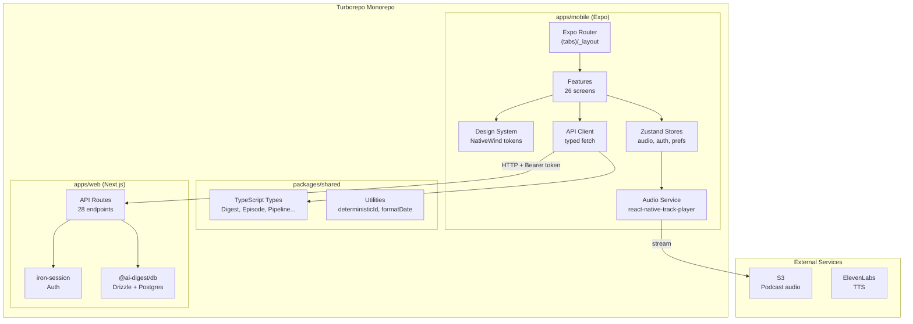
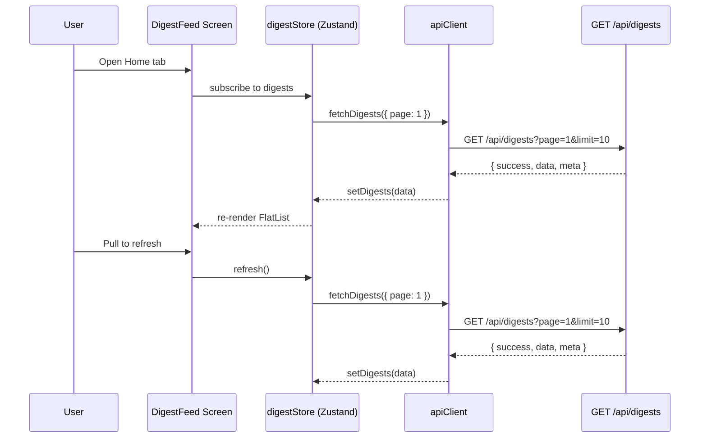
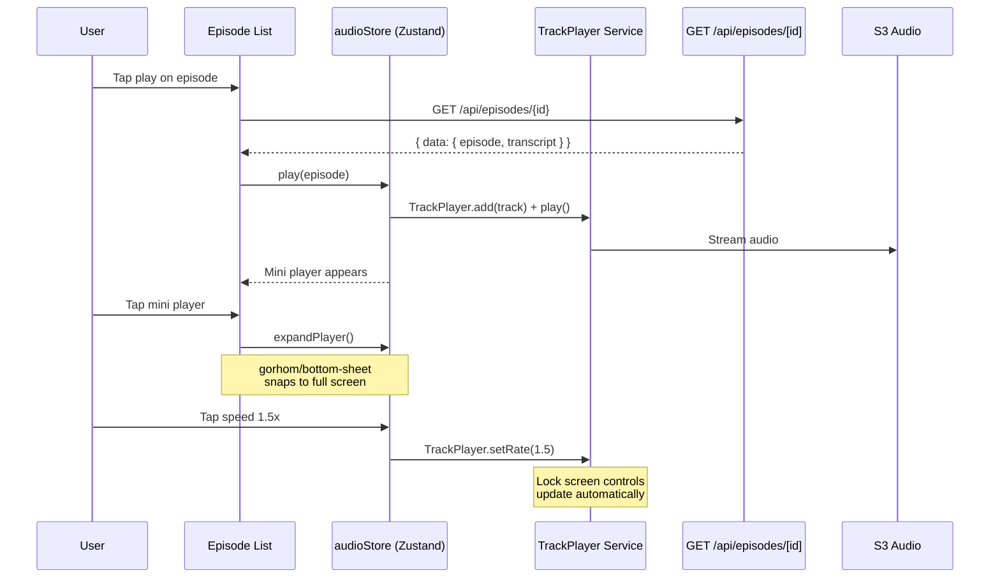
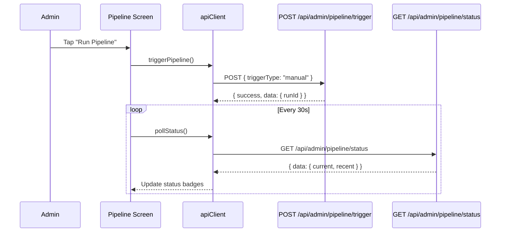
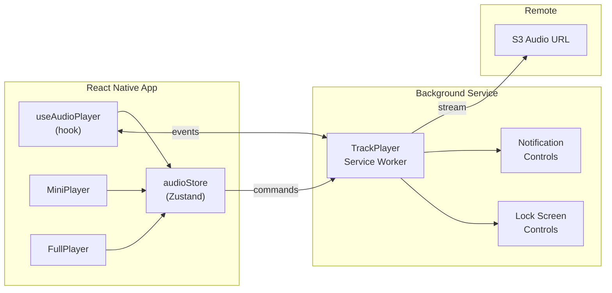

# Design: AI Digest Mobile App (Cyberpunk Dark Theme)

## Overview

Standalone Expo app at `apps/mobile` in the existing Turborepo monorepo. Consumes the Next.js web API at `/api/*` via a typed fetch client, reusing `@ai-digest/shared` types. NativeWind v4 for cyberpunk design tokens, Zustand for global state, react-native-track-player for background audio, gorhom/bottom-sheet for mini player, and Expo Router for file-based navigation with 5-tab layout.

## Architecture



## Data Flow

### Digest Feed Loading



### Podcast Playback (Mini Player -> Full Player)



### Admin Pipeline Trigger



## Components

### File Structure

```
apps/mobile/
  app.json                          # Expo config
  babel.config.js                   # NativeWind babel preset
  metro.config.js                   # Monorepo metro config
  tailwind.config.js                # NativeWind tokens
  global.css                        # CSS variable definitions
  index.ts                          # Entry point

  src/
    app/                            # Expo Router file-based routing
      _layout.tsx                   # Root layout (providers, fonts, splash)
      (auth)/
        login.tsx                   # Login screen
        register.tsx                # Register screen
      (onboarding)/
        _layout.tsx                 # Onboarding stack
        welcome.tsx                 # US-4: Welcome
        topics.tsx                  # US-5: Topic selection
        notifications.tsx           # US-6: Notification prefs
      (tabs)/
        _layout.tsx                 # Tab bar + mini player shell
        index.tsx                   # US-7: Home digest feed
        podcasts/
          index.tsx                 # US-9: Episode list
          [id].tsx                  # US-10: Full player (deep link)
        search.tsx                  # US-19: Search overlay
        newsletters/
          index.tsx                 # US-13: Newsletter archive
          [id].tsx                  # US-14: Newsletter reader
        profile.tsx                 # US-20: Profile & prefs
      digest/
        [id].tsx                    # US-8: Digest detail
      transcript/
        [episodeId].tsx             # US-12: Transcript view
      notifications.tsx             # US-23: Notification center
      summary.tsx                   # US-25: Weekly/monthly summary
      admin/
        _layout.tsx                 # Admin stack (requires admin role)
        config.tsx                  # US-15: Configuration
        sources.tsx                 # US-16: Source management
        pipeline/
          index.tsx                 # US-17: Pipeline monitor
          [runId].tsx               # US-18: Session detail
      error.tsx                     # US-22: Error screen

    design-system/
      tokens/
        colors.ts                   # Color constants + CSS var names
        typography.ts               # Font families, scale
        spacing.ts                  # 16px grid, radii
        shadows.ts                  # Neon glow definitions
        index.ts                    # Barrel export
      primitives/
        Text.tsx                    # Themed text (heading, body, mono)
        Button.tsx                  # Primary, secondary, ghost variants
        Card.tsx                    # Elevated surface + neon border
        Input.tsx                   # Text input with glow focus
        Badge.tsx                   # Status badge (cyan, magenta, green)
        Icon.tsx                    # Ionicons wrapper with size tokens
        Divider.tsx                 # Horizontal rule with glow
        Toggle.tsx                  # Switch with neon accent
        index.ts
      composites/
        DigestCard.tsx              # Feed card (title, source, summary, tag)
        EpisodeRow.tsx              # Episode list item with play button
        CategoryChip.tsx            # Horizontal scroll filter chip
        TopicChip.tsx               # Selectable topic (onboarding/profile)
        StatusBadge.tsx             # Pipeline status (running/success/failed)
        SettingsGroup.tsx           # Grouped settings section
        EmptyState.tsx              # Illustration + message + CTA
        index.ts
      effects/
        NeonBorder.tsx              # Animated neon glow wrapper
        Scanline.tsx                # CRT scanline overlay
        GlitchText.tsx              # Glitch animation text
        PulsingDot.tsx              # Live/active indicator
        index.ts
      layouts/
        ScreenLayout.tsx            # SafeAreaView + status bar + bg
        TabShell.tsx                # Tab bar + mini player container
        ModalLayout.tsx             # Bottom sheet modal
        index.ts

    features/
      digest/
        DigestFeed.tsx              # FlatList feed with pull-to-refresh
        DigestDetail.tsx            # Full article renderer
        DigestSummary.tsx           # Weekly/monthly view
      podcast/
        EpisodeList.tsx             # Sortable episode list
        FullPlayer.tsx              # Full-screen player controls
        MiniPlayer.tsx              # Persistent mini bar
        TranscriptView.tsx          # Synced transcript reader
        WaveformSeek.tsx            # Waveform-style seek bar
      newsletter/
        NewsletterArchive.tsx       # Issue list
        NewsletterReader.tsx        # Rendered issue content
      search/
        SearchOverlay.tsx           # Full-screen search
        SearchResults.tsx           # Grouped results
      profile/
        ProfileView.tsx             # User profile + prefs
        TopicEditor.tsx             # Topic chip selector
      admin/
        ConfigDashboard.tsx         # Settings groups
        SourceManager.tsx           # CRUD source list
        PipelineMonitor.tsx         # Run list + status
        SessionDetail.tsx           # Step-by-step log
      onboarding/
        WelcomeHero.tsx             # Value prop screen
        TopicSelector.tsx           # Grid of selectable topics
        NotificationSetup.tsx       # Push + email prefs
      shared/
        ShareSheet.tsx              # Native share invocation
        ErrorScreen.tsx             # Error with retry
        NotificationCenter.tsx      # Notification list

    services/
      api-client.ts                 # Typed HTTP client (fetch wrapper)
      api-endpoints.ts              # Endpoint definitions + types
      audio-service.ts              # TrackPlayer setup + control
      storage.ts                    # AsyncStorage helpers
      notifications.ts              # Expo Notifications setup

    stores/
      auth-store.ts                 # Auth state + token
      digest-store.ts               # Digest feed + detail cache
      audio-store.ts                # Audio player state (mirrors web)
      search-store.ts               # Search state + recent queries
      preferences-store.ts          # User prefs (topics, notifications)
      admin-store.ts                # Pipeline + sources state

    hooks/
      useApi.ts                     # Generic fetcher hook with loading/error
      useAudioPlayer.ts             # TrackPlayer event bridge
      usePullToRefresh.ts           # RefreshControl helper
      useDebounce.ts                # Debounced value (300ms for search)
      useReducedMotion.ts           # prefers-reduced-motion check
      useOnboarding.ts              # First launch detection

    utils/
      format.ts                     # Date, duration formatting
      colors.ts                     # Color manipulation (glow opacity)
      platform.ts                   # Platform-specific helpers
```

## Technical Decisions

| Decision | Choice | Rationale | Alternatives Considered |
|----------|--------|-----------|------------------------|
| Navigation | Expo Router v3 (file-based) | Convention over config; deep linking free; matches monorepo pattern | React Navigation manual (more boilerplate) |
| Styling | NativeWind v4 + CSS variables | Tailwind utility classes; runtime theming via `vars()`; design token parity with web | StyleSheet.create (no utility classes), Tamagui (heavier) |
| State management | Zustand | Minimal boilerplate; existing pattern in `apps/web`; works outside React tree for audio service | Redux Toolkit (overkill), Jotai (atomic but less familiar), React Context (re-render perf) |
| Audio playback | react-native-track-player | Background playback, lock screen controls, notification media controls, queue management | Expo AV (no lock screen controls, no background on Android) |
| Mini player | gorhom/bottom-sheet v5 | Smooth gesture-driven expand/collapse; compat with gesture-handler; proven Spotify-style pattern | PanResponder (scroll conflicts), react-native-reanimated raw (complex) |
| API auth | Bearer token (JWT-like) | Mobile apps cannot use httpOnly cookies; need new `/api/auth/login` to return token OR add token endpoint | Cookie-based (impossible on native), OAuth (overengineered for this) |
| HTTP client | Custom fetch wrapper | Lightweight; typed via generics + shared types; no extra dependency | Axios (extra dep), tRPC (requires server changes), React Query (evaluated below) |
| Data fetching | React Query (TanStack Query) + Zustand | React Query for server cache, deduplication, background refresh; Zustand for client-only state (audio, prefs) | SWR (less features), pure Zustand (manual cache invalidation) |
| Font loading | expo-google-fonts + expo-splash-screen | Keep splash until fonts ready; prevents FOUT; Expo-native integration | expo-font manual (more code) |
| Animations | react-native-reanimated v3 | 60fps native thread animations; gesture-handler compat; NativeWind animation support | Animated API (less performant), Moti (wrapper, extra dep) |
| Icons | @expo/vector-icons (Ionicons) | Bundled with Expo; matches requirements spec; 1000+ icons | react-native-vector-icons (needs linking), custom SVG (effort) |
| Storage | expo-secure-store (tokens) + AsyncStorage (prefs) | Keychain/Keystore for auth token; AsyncStorage for non-sensitive data | MMKV (faster but extra native dep for MVP) |
| Desktop responsive | react-native-web via Expo | Single codebase; breakpoint detection via useWindowDimensions; NativeWind responsive classes | Separate web app (code duplication) |

## Design System

### Color Tokens (CSS Variables)

```css
/* global.css */
:root {
  --color-cyber-bg: 10 10 15;           /* #0A0A0F */
  --color-cyber-surface: 18 18 26;      /* #12121A */
  --color-cyber-overlay: 26 26 46;      /* #1A1A2E */
  --color-cyber-cyan: 0 255 255;        /* #00FFFF */
  --color-cyber-magenta: 255 0 102;     /* #FF0066 */
  --color-cyber-green: 0 255 136;       /* #00FF88 */
  --color-cyber-purple: 139 92 246;     /* #8B5CF6 */
  --color-cyber-blue: 51 136 255;       /* #3388FF (AA adjusted) */
  --color-cyber-amber: 255 170 0;       /* #FFAA00 */
  --color-cyber-text: 255 255 255;      /* #FFFFFF */
  --color-cyber-text-secondary: 160 160 176; /* #A0A0B0 */
}
```

```javascript
// tailwind.config.js
module.exports = {
  content: ["./src/**/*.{ts,tsx}"],
  presets: [require("nativewind/preset")],
  theme: {
    extend: {
      colors: {
        cyber: {
          bg: "rgb(var(--color-cyber-bg) / <alpha-value>)",
          surface: "rgb(var(--color-cyber-surface) / <alpha-value>)",
          overlay: "rgb(var(--color-cyber-overlay) / <alpha-value>)",
          cyan: "rgb(var(--color-cyber-cyan) / <alpha-value>)",
          magenta: "rgb(var(--color-cyber-magenta) / <alpha-value>)",
          green: "rgb(var(--color-cyber-green) / <alpha-value>)",
          purple: "rgb(var(--color-cyber-purple) / <alpha-value>)",
          blue: "rgb(var(--color-cyber-blue) / <alpha-value>)",
          amber: "rgb(var(--color-cyber-amber) / <alpha-value>)",
          text: "rgb(var(--color-cyber-text) / <alpha-value>)",
          "text-secondary": "rgb(var(--color-cyber-text-secondary) / <alpha-value>)",
        },
      },
      fontFamily: {
        "heading": ["JetBrainsMono_700Bold", "monospace"],
        "heading-medium": ["JetBrainsMono_500Medium", "monospace"],
        "body": ["Inter_400Regular", "sans-serif"],
        "body-medium": ["Inter_500Medium", "sans-serif"],
        "body-semibold": ["Inter_600SemiBold", "sans-serif"],
        "mono": ["SpaceMono_400Regular", "monospace"],
      },
      fontSize: {
        "2xs": ["10px", { lineHeight: "14px" }],
        "xs": ["12px", { lineHeight: "16px" }],
        "sm": ["14px", { lineHeight: "20px" }],
        "base": ["16px", { lineHeight: "24px" }],
        "lg": ["18px", { lineHeight: "28px" }],
        "xl": ["20px", { lineHeight: "28px" }],
        "2xl": ["24px", { lineHeight: "32px" }],
        "3xl": ["30px", { lineHeight: "36px" }],
        "4xl": ["36px", { lineHeight: "40px" }],
      },
      spacing: {
        "0.5": "2px",
        "1": "4px",
        "2": "8px",
        "3": "12px",
        "4": "16px",     /* base unit */
        "5": "20px",
        "6": "24px",
        "8": "32px",
        "10": "40px",
        "12": "48px",
        "16": "64px",
      },
      borderRadius: {
        "card": "8px",
        "button": "12px",
        "pill": "24px",
        "full": "9999px",
      },
      boxShadow: {
        "neon-cyan": "0 0 10px rgba(0, 255, 255, 0.3), 0 0 20px rgba(0, 255, 255, 0.1)",
        "neon-cyan-strong": "0 0 15px rgba(0, 255, 255, 0.5), 0 0 30px rgba(0, 255, 255, 0.2)",
        "neon-magenta": "0 0 10px rgba(255, 0, 102, 0.3), 0 0 20px rgba(255, 0, 102, 0.1)",
        "neon-green": "0 0 10px rgba(0, 255, 136, 0.3), 0 0 20px rgba(0, 255, 136, 0.1)",
        "neon-purple": "0 0 10px rgba(139, 92, 246, 0.3), 0 0 20px rgba(139, 92, 246, 0.1)",
      },
    },
  },
};
```

### Typography Scale

| Level | Font | Weight | Size | Line Height | Usage |
|-------|------|--------|------|-------------|-------|
| H1 | JetBrains Mono | 700 | 30px | 36px | Screen titles |
| H2 | JetBrains Mono | 700 | 24px | 32px | Section headers |
| H3 | JetBrains Mono | 500 | 20px | 28px | Card titles |
| Body | Inter | 400 | 16px | 24px | Primary text |
| Body Medium | Inter | 500 | 16px | 24px | Emphasis |
| Body Small | Inter | 400 | 14px | 20px | Secondary text |
| Caption | Inter | 400 | 12px | 16px | Metadata, timestamps |
| Tag | Space Mono | 400 | 12px | 16px | Category tags, badges |
| Code | JetBrains Mono | 400 | 14px | 20px | Code blocks |

### Component Primitives

| Primitive | Variants | Key Props |
|-----------|----------|-----------|
| `Text` | heading, body, caption, tag, code | `variant`, `color`, `className` |
| `Button` | primary (cyan), danger (magenta), ghost, outline | `variant`, `size`, `loading`, `disabled` |
| `Card` | default, pressable, highlighted | `glow` (none/cyan/magenta), `onPress` |
| `Input` | text, email, password, search | `glowColor`, `error`, `label` |
| `Badge` | status (green/amber/magenta), tag (purple/blue) | `variant`, `label` |
| `Toggle` | default | `value`, `onValueChange`, `accentColor` |
| `Icon` | - | `name` (Ionicons), `size`, `color` |

## API Client Layer

### Auth Strategy (Critical Design Decision)

The existing web app uses iron-session httpOnly cookies. React Native cannot receive/send httpOnly cookies. Two options:

**Chosen: Add JWT token endpoint alongside iron-session.**

The existing `/api/auth/login` sets an iron-session cookie. We add a `X-Client-Type: mobile` header; when present, the login response also returns a `token` field (JWT signed with the same `SESSION_SECRET`). The mobile app stores this in expo-secure-store and sends it as `Authorization: Bearer <token>` on every request.

Server-side, a small middleware check: if `Authorization` header present, verify JWT and populate request context (skipping iron-session lookup). This is a **backward-compatible** addition -- web continues using cookies, mobile uses Bearer tokens.

```typescript
// services/api-client.ts

import type { ApiResponse } from "@ai-digest/shared";
import * as SecureStore from "expo-secure-store";

const API_BASE_URL = process.env.EXPO_PUBLIC_API_URL ?? "http://localhost:3000";

interface RequestConfig {
  method?: "GET" | "POST" | "PUT" | "DELETE";
  body?: unknown;
  params?: Record<string, string>;
  requireAuth?: boolean;
}

async function request<T>(
  path: string,
  config: RequestConfig = {}
): Promise<ApiResponse<T>> {
  const { method = "GET", body, params, requireAuth = false } = config;

  const url = new URL(path, API_BASE_URL);
  if (params) {
    Object.entries(params).forEach(([k, v]) => url.searchParams.set(k, v));
  }

  const headers: Record<string, string> = {
    "Content-Type": "application/json",
    "X-Client-Type": "mobile",
  };

  if (requireAuth) {
    const token = await SecureStore.getItemAsync("auth_token");
    if (token) {
      headers["Authorization"] = `Bearer ${token}`;
    }
  }

  const response = await fetch(url.toString(), {
    method,
    headers,
    body: body ? JSON.stringify(body) : undefined,
  });

  return response.json() as Promise<ApiResponse<T>>;
}

export const api = {
  // Public
  getDigests: (page = 1, limit = 10) =>
    request<Digest[]>("/api/digests", { params: { page: String(page), limit: String(limit) } }),
  getDigest: (id: string) =>
    request<Digest>(`/api/digests/${id}`),
  getLatestDigest: () =>
    request<Digest>("/api/digests/latest"),
  getEpisodes: () =>
    request<Episode[]>("/api/episodes"),
  getEpisode: (id: string) =>
    request<{ episode: Episode; transcript: Transcript }>(`/api/episodes/${id}`),
  search: (q: string, filters?: { source?: string; range?: string }) =>
    request<unknown[]>("/api/search", { params: { q, ...filters } }),
  subscribe: (email: string) =>
    request<Subscriber>("/api/subscribe", { method: "POST", body: { email } }),
  unsubscribe: (token: string) =>
    request<void>("/api/unsubscribe", { method: "POST", body: { token } }),

  // Auth
  login: (email: string, password: string) =>
    request<{ id: string; email: string; role: string; token: string }>("/api/auth/login", {
      method: "POST",
      body: { email, password },
    }),
  register: (email: string, password: string) =>
    request<{ id: string; email: string }>("/api/auth/register", {
      method: "POST",
      body: { email, password },
    }),
  logout: () =>
    request<void>("/api/auth/logout", { method: "POST", requireAuth: true }),
  getMe: () =>
    request<{ id: string; email: string; role: string }>("/api/auth/me", { requireAuth: true }),

  // Admin
  getStats: () =>
    request<unknown>("/api/admin/stats", { requireAuth: true }),
  getSources: () =>
    request<unknown[]>("/api/admin/sources", { requireAuth: true }),
  createSource: (data: unknown) =>
    request<unknown>("/api/admin/sources", { method: "POST", body: data, requireAuth: true }),
  updateSource: (id: string, data: unknown) =>
    request<unknown>(`/api/admin/sources/${id}`, { method: "PUT", body: data, requireAuth: true }),
  deleteSource: (id: string) =>
    request<void>(`/api/admin/sources/${id}`, { method: "DELETE", requireAuth: true }),
  triggerPipeline: () =>
    request<{ runId: string }>("/api/admin/pipeline/trigger", {
      method: "POST",
      body: { triggerType: "manual" },
      requireAuth: true,
    }),
  getPipelineStatus: () =>
    request<{ current: PipelineRun | null; recent: PipelineRun[] }>(
      "/api/admin/pipeline/status",
      { requireAuth: true }
    ),
  getPipelineRuns: () =>
    request<PipelineRun[]>("/api/admin/pipeline/runs", { requireAuth: true }),
  getConfig: () =>
    request<DigestConfig>("/api/admin/config", { requireAuth: true }),
  updateConfig: (key: string, value: unknown) =>
    request<void>(`/api/admin/config/${key}`, { method: "PUT", body: { value }, requireAuth: true }),
} as const;
```

### Server-Side Changes Required

One modification to `apps/web`:

1. **`src/middleware.ts`** — Add Bearer token validation: if `Authorization: Bearer <token>` header present, verify JWT, attach user to request context
2. **`src/app/api/auth/login/route.ts`** — When `X-Client-Type: mobile` header present, include `token` (JWT) in response data
3. **`src/lib/mobile-auth.ts`** — New file: JWT sign/verify functions using `SESSION_SECRET`

This is ~50 lines of server-side code. No database changes.

## Audio Architecture

### react-native-track-player Setup



### Service Worker Pattern

```typescript
// services/audio-service.ts

import TrackPlayer, {
  Capability,
  Event,
  RepeatMode,
  AppKilledPlaybackBehavior,
} from "react-native-track-player";

export async function setupAudioService() {
  await TrackPlayer.setupPlayer({
    maxCacheSize: 1024 * 50, // 50MB cache
  });

  await TrackPlayer.updateOptions({
    capabilities: [
      Capability.Play,
      Capability.Pause,
      Capability.SkipToNext,
      Capability.SkipToPrevious,
      Capability.SeekTo,
    ],
    compactCapabilities: [Capability.Play, Capability.Pause],
    android: {
      appKilledPlaybackBehavior: AppKilledPlaybackBehavior.ContinuePlayback,
    },
  });
}

// Registered in index.ts as background service
export async function playbackService() {
  TrackPlayer.addEventListener(Event.RemotePlay, () => TrackPlayer.play());
  TrackPlayer.addEventListener(Event.RemotePause, () => TrackPlayer.pause());
  TrackPlayer.addEventListener(Event.RemoteSeek, (e) => TrackPlayer.seekTo(e.position));
  TrackPlayer.addEventListener(Event.RemoteJumpForward, async () => {
    const pos = await TrackPlayer.getPosition();
    await TrackPlayer.seekTo(pos + 15);
  });
  TrackPlayer.addEventListener(Event.RemoteJumpBackward, async () => {
    const pos = await TrackPlayer.getPosition();
    await TrackPlayer.seekTo(Math.max(0, pos - 15));
  });
}
```

### Audio Store (Zustand)

```typescript
// stores/audio-store.ts — mirrors web pattern from apps/web/src/stores/audio-store.ts

interface AudioState {
  currentEpisode: Episode | null;
  isPlaying: boolean;
  currentTime: number;
  duration: number;
  playbackSpeed: number;
  activeSegmentIndex: number;
  transcript: TranscriptSegment[] | null;
  isExpanded: boolean;            // mini vs full player

  // Actions
  play: (episode: Episode) => Promise<void>;
  pause: () => Promise<void>;
  resume: () => Promise<void>;
  seek: (time: number) => Promise<void>;
  setSpeed: (speed: number) => Promise<void>;
  skipForward: (seconds?: number) => Promise<void>;
  skipBack: (seconds?: number) => Promise<void>;
  setTranscript: (segments: TranscriptSegment[]) => void;
  expandPlayer: () => void;
  collapsePlayer: () => void;
  close: () => Promise<void>;
}
```

Key difference from web store: all playback actions are `async` because they delegate to `TrackPlayer.*` methods, then update Zustand state. A `useAudioPlayer` hook subscribes to `TrackPlayer.addEventListener(Event.PlaybackProgressUpdated)` and pushes time updates into the store.

### Mini Player / Full Player State Sync

- Single `audioStore` is source of truth for all player state
- `MiniPlayer` component: rendered in `(tabs)/_layout.tsx` above tab bar, wrapped in `gorhom/BottomSheet`
- Snap points: `[64, "95%"]` — 64px collapsed (mini), 95% expanded (full player)
- `isExpanded` in store drives which UI renders inside the sheet
- Tap or swipe-up on mini player calls `expandPlayer()` -> animates to snap point 1
- Drag-down from full player collapses to snap point 0

## Stitch MCP Workflow

### Project Setup

```
1. create_project({ title: "AI Digest Cyberpunk Mobile" })
2. Store project name (projects/{id}) for all subsequent calls
```

### Prompt Template (Design System Prefix)

```
DESIGN SYSTEM — Cyberpunk Dark Theme
Background: deep black #0A0A0F. Elevated surface: #12121A. Overlay: #1A1A2E.
Primary accent: neon cyan #00FFFF. Secondary: hot magenta #FF0066.
Success: neon green #00FF88. Info: electric blue #3388FF. Tags: purple #8B5CF6. Warning: amber #FFAA00.
Text: white #FFFFFF primary, #A0A0B0 secondary.
Typography: JetBrains Mono for headings/labels (bold), Inter for body text (regular/medium).
Effects: Subtle neon glow borders (0 0 10px rgba(0,255,255,0.3)) on cards and active elements. Scanline overlay (repeating-linear-gradient, 2px, 5% opacity) on hero sections.
Spacing: 16px base grid. Corner radius: 8px cards, 12px buttons, 24px pills.
Touch targets: minimum 44px. OLED-friendly: near-pure-black backgrounds.
Platform: iOS mobile, status bar visible, safe area insets respected.

---

[SCREEN-SPECIFIC PROMPT HERE]
```

### Generation Order

| Phase | Model | Screens | Purpose |
|-------|-------|---------|---------|
| 1 — Anchors | GEMINI_3_PRO | Splash, Daily Digest Feed, Full Podcast Player | Establish design DNA (3 Pro generations) |
| 2 — Core | GEMINI_3_FLASH | Digest Detail, Mini Player, Tab Bar Shell, Episode List, Search | Build out P0 screens (5 Flash) |
| 3 — Features | GEMINI_3_FLASH | Onboarding (3), Newsletter (2), Profile, Notifications, Transcript | P1 screens (8 Flash) |
| 4 — Admin | GEMINI_3_FLASH | Config, Sources, Pipeline Monitor, Session Detail | Developer screens (4 Flash) |
| 5 — Edge | GEMINI_3_FLASH | Empty States (4), Error, Share, Summary | Supporting screens (7 Flash) |
| 6 — Desktop | GEMINI_3_FLASH (DESKTOP) | Desktop Dashboard, Desktop Admin | Responsive variants (2 Flash) |
| 7 — Email | GEMINI_3_FLASH (AGNOSTIC) | Email Newsletter Template | 600px inline CSS (1 Flash) |
| **Total** | | **26 first pass + 26 revisions** | **52 generations (13% of free tier)** |

### Screen-to-Implementation Mapping

Stitch outputs are **reference only**. Each generated screen maps to:
1. A route file in `src/app/`
2. Feature components in `src/features/`
3. Design system primitives in `src/design-system/`

Extract layout proportions, spacing, and component placement from Stitch screenshots. Implement all styling in NativeWind utility classes.

## TypeScript Interfaces

### Navigation Types (Expo Router)

```typescript
// Type-safe navigation params derived from file structure
// Expo Router infers these from the app/ directory

// Dynamic route params
type DigestDetailParams = { id: string };
type EpisodeParams = { id: string };
type NewsletterParams = { id: string };
type TranscriptParams = { episodeId: string };
type PipelineRunParams = { runId: string };
```

### API Response Types (extend from packages/shared)

```typescript
import type {
  ApiResponse,
  Digest,
  DigestItem,
  Episode,
  Transcript,
  TranscriptSegment,
  PipelineRun,
  PipelineStage,
  Subscriber,
  DigestConfig,
  SourceType,
} from "@ai-digest/shared";

// Mobile-specific extensions
interface DigestFeedResponse {
  digests: Digest[];
  meta: { page: number; limit: number; total: number };
}

interface EpisodeDetailResponse {
  episode: Episode;
  transcript: Transcript | null;
}

interface PipelineStatusResponse {
  current: PipelineRun | null;
  recent: PipelineRun[];
}

interface AuthResponse {
  id: string;
  email: string;
  role: "user" | "admin";
  token: string; // JWT for mobile
}

interface SearchResult {
  type: "digest" | "episode" | "newsletter";
  id: string;
  title: string;
  snippet: string;
  date: string;
  source?: SourceType;
}

interface UserProfile {
  id: string;
  email: string;
  role: "user" | "admin";
  topics: string[];
  notificationPrefs: {
    push: boolean;
    email: boolean;
    frequency: "daily" | "weekly";
  };
}
```

### Audio Player State

```typescript
interface AudioPlayerState {
  currentEpisode: Episode | null;
  isPlaying: boolean;
  currentTime: number;      // seconds
  duration: number;          // seconds
  playbackSpeed: 0.5 | 1 | 1.25 | 1.5 | 2;
  bufferedPosition: number;  // seconds
  activeSegmentIndex: number;
  transcript: TranscriptSegment[] | null;
  isExpanded: boolean;
  sleepTimerMinutes: number | null;
}

type AudioAction =
  | { type: "play"; episode: Episode }
  | { type: "pause" }
  | { type: "resume" }
  | { type: "seek"; time: number }
  | { type: "setSpeed"; speed: AudioPlayerState["playbackSpeed"] }
  | { type: "skipForward"; seconds: number }
  | { type: "skipBack"; seconds: number }
  | { type: "expand" }
  | { type: "collapse" }
  | { type: "close" };
```

### Design Token Types

```typescript
interface CyberTokens {
  colors: {
    bg: string;
    surface: string;
    overlay: string;
    cyan: string;
    magenta: string;
    green: string;
    purple: string;
    blue: string;
    amber: string;
    text: string;
    textSecondary: string;
  };
  spacing: Record<"xs" | "sm" | "md" | "lg" | "xl" | "2xl", number>;
  radii: Record<"card" | "button" | "pill" | "full", number>;
  fontFamily: Record<"heading" | "body" | "mono", string>;
  shadows: Record<"neonCyan" | "neonMagenta" | "neonGreen" | "neonPurple", string>;
}
```

## Error Handling

| Error Scenario | Handling Strategy | User Impact |
|----------------|-------------------|-------------|
| Network offline | Detect via `NetInfo`; show banner "No connection"; disable refresh | Sees cached data or empty state with retry |
| API 401 Unauthorized | Clear auth token; redirect to login screen | "Session expired, please log in again" |
| API 403 Forbidden (non-admin) | Hide admin tabs; show error if deep-linked | "Admin access required" error screen |
| API 404 Not Found | Show empty state with "Content not found" | Can navigate back or go home |
| API 500 Server Error | Show error screen (US-22) with retry button | "Something went wrong" + Retry CTA |
| API validation 400 | Show inline field errors from Zod details | Red text below invalid fields |
| Audio stream failure | TrackPlayer error event -> show toast "Playback failed" | Can retry or pick another episode |
| Audio buffer stall | Show loading spinner on seek bar | Brief buffering indicator |
| Font loading failure | expo-splash-screen stays visible; timeout after 5s -> use system fonts | Graceful degradation |
| Image load failure | Placeholder with cyber-themed gradient | No broken image icons |
| Search timeout | Debounce prevents rapid fire; 10s timeout -> "Search timed out" | Can retry search |
| Token expired (JWT) | Middleware returns 401; `api-client` intercepts, attempts refresh, else logout | Seamless refresh or re-login |
| Pipeline trigger fail | Toast with error message from API | "Pipeline trigger failed: {reason}" |
| Deep link invalid | Catch in root layout -> redirect to home | Lands on home instead of broken screen |

## Edge Cases

- **Mini player + keyboard**: When text input is focused (search, subscribe email), mini player hides behind keyboard. Solution: `KeyboardAvoidingView` in tab shell, mini player adjusts position.
- **Long episode titles**: Truncate with ellipsis in mini player (1 line), show full in full player (2 lines max).
- **Concurrent audio**: Only one episode plays at a time. Starting a new episode replaces current. No queue for MVP.
- **Empty transcript**: Some episodes may not have transcripts. Transcript button disabled, grayed out.
- **Admin on mobile**: Functional but optimized for quick checks, not deep management. Source drag-to-reorder uses `react-native-draggable-flatlist`.
- **Large digest**: Digests with 50+ items paginated; FlatList with `onEndReached` for infinite scroll.
- **Reduced motion**: All NeonBorder animations, GlitchText, PulsingDot, Scanline disabled via `useReducedMotion()` -> static fallbacks.
- **First launch detection**: `AsyncStorage.getItem("onboarding_complete")` — if null, route to onboarding. Set on completion.
- **Offline podcast**: No offline caching in MVP. If network drops mid-stream, TrackPlayer buffers up to 50MB cached audio.
- **Screen orientation**: Portrait-locked for MVP. Full player could support landscape in future.

## Screen Inventory

| # | Screen | Route | Priority | API Endpoint | Key Components |
|---|--------|-------|----------|-------------|----------------|
| 1 | Splash | `_layout.tsx` (root) | P0 | None | Scanline, PulsingDot, font loader |
| 2 | Onboarding Welcome | `(onboarding)/welcome` | P1 | None | WelcomeHero, Button |
| 3 | Onboarding Topics | `(onboarding)/topics` | P1 | None | TopicChip grid, Button |
| 4 | Onboarding Notifications | `(onboarding)/notifications` | P1 | POST /api/subscribe | Toggle, Input, Button |
| 5 | Home - Daily Digest Feed | `(tabs)/index` | P0 | GET /api/digests | DigestCard, CategoryChip, FlatList |
| 6 | Digest Detail | `digest/[id]` | P0 | GET /api/digests/[id] | Article renderer, Text (code), ShareSheet |
| 7 | Podcast Episode List | `(tabs)/podcasts/index` | P1 | GET /api/episodes | EpisodeRow, Badge |
| 8 | Full Podcast Player | `(tabs)/podcasts/[id]` | P0 | GET /api/episodes/[id] | WaveformSeek, speed selector, NeonBorder |
| 9 | Mini Player | `(tabs)/_layout` | P0 | (uses audioStore) | BottomSheet, play/pause, episode art |
| 10 | Podcast Transcript | `transcript/[episodeId]` | P1 | GET /api/episodes/[id] | TranscriptView, auto-scroll |
| 11 | Newsletter Archive | `(tabs)/newsletters/index` | P1 | GET /api/digests (newsletter type) | FlatList, subscribe toggle |
| 12 | Newsletter Reader | `(tabs)/newsletters/[id]` | P1 | GET /api/digests/[id] | WebView or rich text renderer |
| 13 | Search Overlay | `(tabs)/search` | P1 | GET /api/search?q= | SearchOverlay, CategoryChip filters |
| 14 | User Profile | `(tabs)/profile` | P1 | GET /api/auth/me | TopicEditor, Toggle, Button |
| 15 | Config Dashboard | `admin/config` | P1 | GET/PUT /api/admin/config | SettingsGroup, Input, Toggle |
| 16 | Source Management | `admin/sources` | P1 | GET/POST/PUT/DELETE /api/admin/sources | DraggableFlatList, StatusBadge |
| 17 | Pipeline Monitor | `admin/pipeline/index` | P1 | GET /api/admin/pipeline/status | StatusBadge, PulsingDot, auto-refresh |
| 18 | Pipeline Session Detail | `admin/pipeline/[runId]` | P1 | GET /api/admin/pipeline/runs | Step log, error details |
| 19 | Notification Center | `notifications` | P1 | (local + push) | FlatList, Badge, swipe-to-dismiss |
| 20 | Empty State: Digest | (inline) | P1 | None | EmptyState variant |
| 21 | Empty State: Podcast | (inline) | P1 | None | EmptyState variant |
| 22 | Empty State: Newsletter | (inline) | P1 | None | EmptyState variant |
| 23 | Empty State: Search | (inline) | P1 | None | EmptyState variant |
| 24 | Error / 404 | `error` | P1 | None | ErrorScreen, Button |
| 25 | Share Sheet | (modal) | P1 | None | ShareSheet (native) |
| 26 | Weekly Summary | `summary` | P2 | GET /api/digests (date range) | Charts, stats, toggle |
| 27 | Login | `(auth)/login` | P1 | POST /api/auth/login | Input, Button |
| 28 | Register | `(auth)/register` | P1 | POST /api/auth/register | Input, Button |
| 29 | Email Template | (separate HTML) | P2 | N/A | Inline CSS, 600px, dark-first |
| 30 | Desktop Dashboard | (responsive web) | P2 | Same as mobile | Sidebar nav, master-detail |
| 31 | Desktop Admin | (responsive web) | P2 | Same as mobile | Multi-panel layout |

Note: Screens 29-31 are out-of-app deliverables (email template = HTML file, desktop = responsive breakpoint in same codebase via react-native-web).

## Testing Strategy

### Functional Validation (Primary)

Per project mandate: **no mocks, no unit tests, no test doubles**. All validation through real systems.

| Validation Type | Method | Tool |
|-----------------|--------|------|
| Build verification | `npx expo run:ios` on simulator | Xcode Simulator |
| Screen rendering | Navigate to each screen, capture screenshots | Simulator + `xcrun simctl` |
| API integration | Start Next.js dev server + Expo dev server; make real requests | cURL + app interaction |
| Audio playback | Play episode on simulator; verify background playback | Simulator with audio |
| Navigation flow | Walk through onboarding -> tabs -> detail -> back | Manual on simulator |
| Admin features | Login as admin; trigger pipeline; verify status updates | Simulator + real API |
| Error handling | Kill API server; verify error screens render | Network disconnect |
| Accessibility | VoiceOver on simulator; contrast checker | Xcode Accessibility Inspector |

### Visual Regression (Playwright — Web Build)

For the responsive web build (`npx expo export:web`):

| Step | Action |
|------|--------|
| 1 | Build web bundle: `npx expo export:web` |
| 2 | Serve static: `npx serve dist` |
| 3 | Playwright navigates to each route |
| 4 | `expect(page).toHaveScreenshot()` captures baselines |
| 5 | Mobile viewport (375x812) + Desktop viewport (1440x900) |
| 6 | Mask dynamic content (timestamps, IDs) |
| 7 | Disable animations for deterministic snapshots |

### Evidence Capture Checklist

- [ ] Screenshot of each P0 screen on iOS simulator
- [ ] Screenshot of mini player persisting across tab switches
- [ ] Recording of audio playing in background (app backgrounded)
- [ ] Screenshot of lock screen controls during playback
- [ ] Screenshot of error state (API offline)
- [ ] Screenshot of empty states (no data)
- [ ] Screenshot of onboarding flow (3 screens)
- [ ] cURL output showing successful API calls with Bearer token

## Performance Considerations

| Area | Approach |
|------|----------|
| Feed rendering | `FlatList` with `getItemLayout` for fixed-height cards; `removeClippedSubviews` enabled |
| Image loading | `expo-image` with disk caching; placeholder blur hash |
| API response caching | React Query with 5-minute stale time for feeds, 30s for pipeline status |
| Bundle size | Tree-shake unused Ionicons; lazy-load admin screens via `React.lazy` |
| Audio buffering | TrackPlayer 50MB cache; buffer ahead 30s |
| Font loading | Load during splash screen; bundle subset of weights (only 400, 500, 600, 700) |
| Memory | FlatList `maxToRenderPerBatch: 10`; image `cachePolicy: "memory-disk"` |
| Startup time | Delay non-critical init (notifications, analytics) with `InteractionManager.runAfterInteractions` |
| NFR-4 compliance | Target < 2s feed load: API returns cached responses (Cache-Control: 300s); React Query serves stale-while-revalidate |

## Security Considerations

| Area | Approach |
|------|----------|
| Auth token storage | `expo-secure-store` (Keychain on iOS, Keystore on Android) — never AsyncStorage |
| Token expiry | JWT with 7-day expiry matching iron-session maxAge; refresh on 401 |
| API transport | HTTPS only in production; `EXPO_PUBLIC_API_URL` env var |
| Admin routes | Server validates admin role per request; mobile hides admin UI for non-admins but server enforces |
| Input validation | Zod schemas on login/register forms; server also validates (defense in depth) |
| Deep link injection | Validate route params in screen components; reject malformed IDs |
| Certificate pinning | Not in MVP; consider for production hardening |

## Existing Patterns to Follow

Based on codebase analysis:

1. **API response shape**: Always `{ success: boolean, data?: T, error?: string, meta?: {...} }` — mobile api-client must handle this envelope consistently
2. **Zustand store pattern**: Mirror `apps/web/src/stores/audio-store.ts` structure with same state shape + actions for parity
3. **Zod validation**: Server uses Zod; mobile forms should validate with same schemas where possible (import from shared or duplicate)
4. **Type re-export from shared**: `packages/shared/src/index.ts` barrel exports all types — mobile imports directly from `@ai-digest/shared`
5. **Error response pattern**: `{ success: false, error: "message" }` with HTTP status codes (400, 401, 403, 404, 500)
6. **Admin auth guard**: Server uses `requireAdminFromRequest()` — mobile must send valid admin Bearer token
7. **Rate limiting**: Server applies rate limits (60 req/min on search/episodes) — mobile should debounce and handle 429 responses
8. **Pipeline trigger format**: POST body must include `{ triggerType: "manual" }` — not `triggeredBy`
9. **Monorepo workspace pattern**: `pnpm-workspace.yaml` includes `apps/*` and `packages/*` — mobile at `apps/mobile` fits naturally
10. **Turbo task config**: Add mobile-specific tasks to `turbo.json` (dev, build, check-types)

## Unresolved Questions

1. **Server-side JWT support**: The login endpoint currently only sets iron-session cookies. Adding JWT token response requires a small server change (~50 LOC). Should this be done as a prerequisite task or part of mobile implementation?

2. **Newsletter data model**: The web app serves digests and episodes but newsletters seem to reuse digests (no separate newsletter table). Need to clarify: is a "newsletter" just a digest rendered as email HTML? If so, the newsletter archive screen shows digests filtered by those that were emailed.

3. **Push notification infrastructure**: Requirements mention push notifications (US-6, US-23) but no push server exists. This is marked out-of-scope in requirements. Should notification center be local-only (in-app generated) for MVP?

## Implementation Steps

1. **Scaffold Expo app** at `apps/mobile` with Expo Router, NativeWind, TypeScript
2. **Configure monorepo** — metro.config.js for symlink resolution, add to pnpm-workspace, turbo.json
3. **Install dependencies** — nativewind, expo-router, react-native-track-player, gorhom/bottom-sheet, zustand, expo-google-fonts, expo-secure-store, @tanstack/react-query
4. **Design token system** — tailwind.config.js, global.css, token constants
5. **Font loading** — expo-splash-screen + useFonts for JetBrains Mono, Inter, Space Mono
6. **Design system primitives** — Text, Button, Card, Input, Badge, Toggle, Icon
7. **Design system composites** — DigestCard, EpisodeRow, CategoryChip, StatusBadge, EmptyState
8. **Design system effects** — NeonBorder, Scanline, GlitchText, PulsingDot (with reduced-motion)
9. **API client** — typed fetch wrapper with Bearer token auth
10. **Server JWT support** — Add token generation to login endpoint, Bearer validation middleware
11. **Auth store + screens** — login, register, token persistence, auth guard
12. **Navigation shell** — 5-tab layout with cyberpunk tab bar styling
13. **Home feed** — DigestFeed with FlatList, pull-to-refresh, category filters
14. **Digest detail** — Full article rendering, share, bookmark
15. **Audio service** — TrackPlayer setup, background service registration
16. **Audio store** — Zustand store mirroring web pattern
17. **Mini player** — gorhom/bottom-sheet with snap points, tab bar integration
18. **Full player** — Seek bar, speed control, skip buttons, episode art
19. **Transcript view** — Synced segments, tap-to-seek, search
20. **Episode list** — Sortable list, play button per row
21. **Onboarding flow** — 3-screen wizard with topic selection
22. **Search overlay** — Debounced search, grouped results, filter chips
23. **Newsletter archive + reader** — Issue list, content renderer
24. **Profile screen** — Topic editor, notification toggles, sign out
25. **Admin screens** — Config, sources CRUD, pipeline monitor, session detail
26. **Notification center** — Local notification list
27. **Empty states + error screen** — 4 empty variants + error with retry
28. **Share sheet** — Native share integration
29. **Weekly summary** — Stats + trend charts (P2)
30. **Stitch design generation** — Generate all 26 screens for visual reference
31. **Desktop responsive** — Breakpoint-aware layouts for 1024px+ (P2)
32. **Email template** — Dark-first HTML email with inline CSS (P2)
33. **Visual regression baseline** — Playwright screenshots of web build
34. **Functional validation** — Build on simulator, walk all flows, capture evidence
